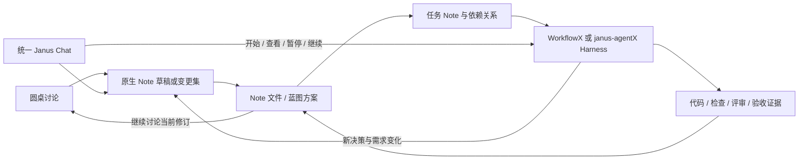

# 圆桌原生产出、统一 Janus Chat 与 Harness 实施闭环


## Problem

圆桌讨论、蓝图维护和工程实施需要连成同一个可追踪过程：讨论产出可直接维护的 Note，蓝图展示方案和关系，任务 Note 吸收执行与质量门禁的职责，结果回到原有资产。新标准将移除 Hybrid Tree 独立机制。janus-chat 需要继续作为日常助手，同时利用 janus-agentX 的能力理解和操作这一流程。蓝图内的 Janus 应成为同一个 janus-chat 的工程入口，避免维护两个近似但行为不同的助手。

通用身份、文件结构、分享边界、Wiki 导航和 WorkflowX 独立使用规则见 [统一 Note、蓝图与 Harness 标准](./2026-09-16-unified-note-blueprint-harness--1b210a76.md)。本提案只定义跨功能闭环，不重复定义上述规则。初始分析使用 2026-09-16 的工作树，包含已有未提交修改；下表保留当时的接点和断点。当前实现边界见下述实施状态及对应 implemented Note，不能把设计要求直接当成已发布能力。

### 当前实施状态与下一步

2026-09-18 的 [共享项目会话](./2026-09-18-project-conversation-controller--4ffa1606.md) 已将新 Note 蓝图入口接入主 Chat controller，共享消息、单 turn、停止、steering、模型、资源、问题及审批。维护任务只保留提案与审计，采用共享历史生成提案。旧维护生成与对话运行路径的退出及保留的结算能力见 [旧维护循环移除](./2026-09-18-legacy-loop-removal--b766003d.md)。

[任务合同采纳](./2026-09-18-task-contract-adoption--6b7c688e.md) 支持补全圆桌 action 草稿的 scope、AC、引用和验证步骤，显式转为 accepted 后开放执行准备。当前表单限单个 primary repo。集成用例通过共享执行内核运行真实检查命令，以评审 stub 形成正式结果，再从新 clone 重建完成状态及需求覆盖率；浏览器用例使用模拟 IPC/model，不能替代真实 Electron 或模型执行验收。

桌面 internal xdo 的 [实施轮次](./2026-09-19-desktop-task-implementation--958007ff.md) 从已采纳 task 读取固定合同和基线，使用范围受限的真实文件工具实施，再运行声明检查和自审、保存正式 receipt。失败检查在预算内驱动下一次实施及复验；取消暂停任务，verifying 重试只重跑验收。Ink 的 [宿主接线](../../../janus-agentX/.agents/notes/implemented/architecture/2026-09-19-ink-harness-host.md) 同时覆盖命令与普通消息，历史 Note 与标准 profile 校验由共享文件层统一。宿主保持对等，各自调用共享运行内核和契约校验。

CLI、Ink 与桌面的单任务 xdel/xflow 委派闭环见 [桌面模式实现](./2026-09-19-desktop-delegated-modes--fbac0251.md) 和其引用的共享策略。xdel 一次实施并自审，xflow 以独立只读评审形成最终回执，并在预算内修复。持久实施历史与构建后的 Electron 确定性模型测试覆盖执行、回执、收尾和重启恢复。下一阶段验证外部真实模型、跨机器 runner 编排、完整跨宿主场景等价以及版本化发行组合；多任务依赖调度仍需单独实施。三仓规则切换须等这些门禁满足；总账见 [S9 readiness](./2026-09-18-harness-s9-readiness--28ce4fe4.md)。

### 当前代码的接点和断点

实施先读 [实施契约与 Agent 交接](./2026-09-16-note-harness-implementation-contract--537de6bf.md)。字段与算法以 C1–C6 为准，实施依赖以 C8 为准；本文端口表表达能力分组，不另定义一套 API。

| 范围 | 已核实的实现 | 对设计的影响 |
|---|---|---|
| 圆桌执行 | [service.ts](../../src/main/roundtable/service.ts) 组装角色并调用 `generateText`；[runtime.ts](../../src/main/roundtable/runtime.ts) 用 LangGraph 调度，读工作区证据 | 现阶段不能把圆桌称为 `runChatTurn` 的模式；其角色调度可保留，但产出协议需要接入共享层 |
| 圆桌内容 | [events.ts](../../src/shared/roundtable/events.ts) 定义 facts、cards、hostDrafts、sourceEventIds；[parchment.ts](../../src/shared/roundtable/parchment.ts) 投影结论 | requirement/decision/solution/action 已有内容基础，但 pool 状态和 Note 生命周期不是同一概念 |
| 圆桌导出 | [export.ts](../../src/shared/roundtable/export.ts) 输出带 Round、Decisions、Source Index 的会议 Markdown；[roundtableExport.ts](../../src/renderer/src/components/janus/roundtableExport.ts) 用保存对话框写任意文件 | 当前结果既无 Note 身份也无目标图写入，不能通过改扩展名获得原生资产 |
| 圆桌持久化 | [store.ts](../../src/main/roundtable/store.ts) 保存 `roundtable-events.jsonl` 和本机上下文 sidecar | 会议日志适合恢复和溯源，不适合成为共享需求正文或唯一方案存储 |
| 普通 janus-chat | [chat-orchestrator.ts](../../src/main/llm/chat-orchestrator.ts) 调用 janus-agentX 的 `runChatTurn`；[janus-agent-ports.ts](../../src/main/llm/janus-agent-ports.ts) 装配宿主能力 | 共享引擎已存在，需要加资产与流程能力端口，而非再建立一套聊天引擎 |
| Chat 状态 | [JanusChatProvider.tsx](../../src/renderer/src/components/janus/JanusChatProvider.tsx) 提供按 conversationId 的 controller；[chat 契约](../../src/shared/ipc/janus-chat.ts) 只有消息、模型、attachedWorkspaceIds、toolTraces；[chat-store.ts](../../src/main/janus/chat-store.ts) 存会话快照日志 | 已有多会话基础，尚缺 Note 资源、工程意图、产物与实施关联；截断消息历史不能承担流程账本 |
| 蓝图助手 | [维护 service](../../src/main/janus/maintenance/service.ts) 自持 messages、session、abort、steering、trace，直接跑 agent loop；[BlueprintMaintenancePanel](../../src/renderer/src/components/blueprint/BlueprintMaintenancePanel.tsx) 自带输入与提案界面 | 统一要消除重复对话编排，保留有价值的变更集、证据重检、选择应用与撤销能力 |
| 共享引擎 | [chat-turn.ts](../../../janus-agentX/packages/janus-agent/src/orchestrator/chat-turn.ts) 提供会话、工具、召回、提问与 todo；[ports.ts](../../../janus-agentX/packages/janus-agent/src/ports.ts) 无资产及 Harness 专用端口 | 仅“底层调用同一个模型”不足以理解流程，需要可验证的上下文、工具和状态命令 |
| 工程流程 | [WorkflowX 派发契约](../../../WorkFlowX/.codex/skills/orchestrateX/modules/02-bus-payload.md) 依赖 Parent/Child 与验收来源 | 将其范围、依赖、派发与验收职责纳入 task Note，替换旧字段和强制文件规则 |

另外，[host-synthesis.ts](../../src/shared/roundtable/host-synthesis.ts) 包含基于关键词、去重和截断的确定性整理；摘要卡片不足以无损承接全部要求。产物构建必须读取被选中的完整 facts、用户约束和来源，不能只转存显示卡片。`session:ended`、`synthesis.final` 和 fact 的 `confirmed` 都不代表获得实现授权或通过工程验收。

## Proposal

各执行入口将结果写入同一 task Note 与正式 receipt，遵循[实施契约 C4](./2026-09-16-note-harness-implementation-contract--537de6bf.md#c4-收据覆盖率与落地)。圆桌、聊天和运行面板展示共享证据的当前有效性；未携带本地运行记录的资产不能自动接管活动任务。

### 一个资产体系及其执行证据

Note 是唯一需要人工与 Agent 持续维护的工程资产体系。证据和运行日志是附属记录，不拥有第二份需求、计划或执行状态：

| 对象 | 真源 | 职责与生命周期 |
|---|---|---|
| Note / 蓝图节点 | `.agents/notes/**/*.md` | 意图、需求、方案、决策及实施任务；界面、圆桌、聊天与终端共同维护，只有 task 类型承载 execution |
| 验收证据 | `.agents/evidence/<receipt-id>.json` | 绑定 Note/AC 与受验代码修订，支持蓝图计算已验证覆盖情况 |
| 会话和运行 | 本地 chat/roundtable 存储及 `.agents/.local/runs/` | 消息、角色发言、工具日志、线程和审批交互；可恢复，但不是需求和任务状态的另一份真源 |

同一个 requirement 可以由多个 task Note 分期实现，同一个任务可以覆盖多个需求的部分 AC。initiative 只在确有目标聚合需要时创建，任务无需父节点即可派发；不新增 plan 类型或独立计划身份。实施计划是选定任务与关系的投影视图。会议原始日志和测试输出保持附属记录，不强迫每条工具事件成为 Note。



图中的“证据回到 Note”表示更新已验证的实现事实及蓝图投影，不把运行日志追加进决策正文。蓝图应同时显示方案生命周期和实施状态：已采纳、未实施、实施中、部分验证、已验证、证据过期。单纯存在计划、结束会议或生成代码不能产生“已验证”标记。

### 圆桌直接产出原生资产

圆桌在创建或继续会议时可附加 Note URI、其文件哈希、相关仓库身份和当前读证据范围。用户可以从空议题开始，也可以从已有蓝图节点开始修订。没有选择资产目录时仍可讨论，产出在会议本地作为标准 Note 草稿暂存；选择项目或工程收件箱后才写入正式 `.agents/notes`。读取源码的许可不自动授权修改 Note 或执行代码。

会议中每个候选产物由 host 汇总器分配稳定 artifactId 和 Note ID。产物正文从创建时就符合目标 kind 的 Note 模板，draft 状态允许尚未填写的内容明确列为 Open questions。facts 与角色卡片提供来源，显示层羊皮纸可继续作为摘要视图；可交付内容的唯一正文是标准 Note 草稿，禁止再维护一份单独的“终稿方案 Markdown”。运行日志可以有专用导出，但界面必须把它标为会议记录。

| 圆桌内容 | 原生产物 | 约束 |
|---|---|---|
| 宽泛想法、疑问、尚未定界方向 | idea draft | 保留未决问题，不捏造已确认需求 |
| 明确用户目标、功能行为、修复要求 | requirement proposed，必要时由 initiative 组织 | 提供范围、非目标与 AC；未确认内容显式标注 |
| 技术方案、产品取舍、备选比较 | decision proposed | 必须保留替代选项、理由、代价和风险；不能把模型投票当作用户采纳 |
| 行动建议 | 相关 Note 的后续建议，或有独立价值的 task Note | 不在会议结束时直接开始执行任务 |
| 已有节点的新结论 | 对该 Note 的差异变更集 | 基于读取时哈希，不依据相似标题生成重复正式节点 |
| evidence、risk、question | 对应 Note 的证据、风险、未决问题段落或来源引用 | 有独立复用价值才拆节点；避免每句话都成为节点 |

标准产物包唯一结构见实施契约 C6。producer 记录生产者与源修订；artifacts 只保存候选 ID、operationId 和 sourceRefs；完整标准正文只存 changeSet.operations 的 afterMarkdown，预览由它派生。修改已有节点提供 URI 和 expectedHash。新节点 ID 由宿主分配并持久化，模型通过候选引用互连，不任意改写既有身份。

包是运送和预览载体，落盘后的真源仍为 Note 文件。changeSet.id + revision + operationId 构成操作幂等键；同一个已生成包重试保存不得复制节点。会议继续讨论时形成新的 bundle 修订与差异，已写出的 Note 保留 ID；先前源事实到产物的映射需持久保存。节点合并、拆分和不同源候选的去重需要显式关系或映射，不能仅凭文字相似度静默合并。

产物构建要校验选定需求、约束、风险及未决问题的覆盖：每条选定源事实对应一个产物段落/引用，或带理由的 excluded 项。UI 展示遗漏与矛盾，不能因当前摘要最多显示若干条就遗漏其余需求。draft 可以带未解决内容保存；转 proposed 必须满足对应模板，转 accepted 必须有已有授权或明确的采纳动作。记录确认所针对的具体修订，源内容变化后不能复用旧确认。

结束会议只冻结本轮讨论，不自动采纳、归档旧决策或启动实现。已有“整理并保存方案”的授权可直接保存 draft/proposed；“采纳该方案并开始实施”的明确授权可在前提满足后连续完成，不机械重复询问。未授权的重大新取舍保留 proposed。跨仓库包按仓库展示目标与成功状态，部分保存失败后继续重试未应用操作；不能把整个包标为已保存，也不能通过重试覆盖其他人修改。

来源应足以支持独立理解：Note 保留必要论据、仓库内相对代码路径与哈希，可选来源标识放 `extensions.workflowx.provenance`，不把私人聊天或本机绝对路径带入共享。私有 event/card ID 只提供“有来源、当前不可访问”的提示，不能成为理解决策所必需的正文。分享时只输出明确选中的资产与证据，原始会议对话不自动共享。

### task Note 吸收 Hybrid Tree 的职责

所有可维护对象采用 `harness-note/1` 与 `note://<repo-id>/<note-id>`。不生成独立 Parent/Child 文件、plans 目录、plan URI 或计划 schema。取消的是额外机制与重复正文；范围、依赖、固定验收依据、独立评审和修复上限仍是执行门禁。

| 原职责 | Note 中的归属 | 减少重复的规则 |
|---|---|---|
| 整体目标、范围和完成标准 | requirement 或按需创建的 initiative | 不为每次执行再抄一份目标说明 |
| 技术方案与约束 | decision；通过 governed-by 引用 | 任务不内联决策正文 |
| 实施拆分 | 独立派发与验收所需的 task Note | 单任务无需包装节点；小步骤留在任务正文清单 |
| 范围和验证方法 | task 正文与 work.scope/acceptanceRefs/verification | 引用需求 AC；只写任务独有条件，不重复需求原文 |
| 前置工作与覆盖关系 | task 的 depends-on、implements、parent | 同一关系只写一次；反向任务清单从图计算 |
| 状态、固定基线和验收引用 | task 的 execution 元数据 | 正文不重复状态；UI 和运行时均读取该字段 |
| 自审、评审、返修与集成问题 | 任务结果摘要、收据及必要的任务/决策修订 | 完整日志本地保存；跨任务问题更新受影响任务，不另建持久 Integration Note 体系 |

task 是有界交付项：正文写当前有效范围、AC 引用、验证方法及结果摘要；实现目标由 implements 指向 requirement，独有的工程任务也可拥有自己的 AC。没有必要为机械小改新建 requirement/decision/initiative 三件套。xdo 可直接处理已有资产并记录验证，按持久价值决定是否新建任务；xdel/xflow 至少有一篇可派发 task Note，不要求父节点或固定深度。

`execution` 仅在准备实施时出现，拟包含 mode、state、baseline、attempt、receipts、closeout、可选 blocker。baseline 固定当前任务 work、范围/AC/Verification、目标仓库及 implements/depends-on/governed-by 关系的哈希，以及目标 AC、适用决策与依赖结果哈希；排除 execution 自身，避免写状态改变自身基线。attempt 是当前尝试编号，历史检查与失败结论存不可变收据，完整对话和工具日志在本地。没有共享日志时仍能从任务正文和收据理解目标、结果与阻塞原因。

```yaml
# task Note 的局部示例；目标 URI 与哈希为占位说明，落盘须替换为有效值
kind: task
lifecycle: accepted
relations:
  - type: implements
    target: note://<repo-id>/<requirement-id>
    criteria: [AC-1, AC-2]
execution:
  mode: xdel
  state: queued
  baseline:
    taskContractHash: <sha256>
    inputs:
      - uri: note://<repo-id>/<requirement-id>
        criteria: [AC-1, AC-2]
        contentHash: <sha256>
  attempt: 0
  receipts: []
  closeout: commit-required
```

任务关系定义目标与依赖，baseline 只是执行时固定的版本，不是第二份可编辑关系。收据包含 Task URI、attempt、taskContractHash、受验代码文件/哈希及实际检查与评审结论；不以含 execution 的整篇任务哈希作完成依据，否则追加收据将使自身失效。普通保存冲突检查仍使用整文件 expectedHash，两种哈希的用途必须分开。精确哈希算法与输入基线见实施契约 C3；局部 YAML 示例省略执行必填的 work，不能直接作为完整模板。

状态走 queued -> running -> verifying -> done，失败且在预算内则增加 attempt 后回 running，否则 blocked；支持 paused/cancelled。执行前必须 lifecycle=accepted、范围可验证、依赖满足且获授权。done 要求当前基线的必要验证有效，xflow 还要求独立评审；手改 done 不会自动生成这些证据。验收后有回归时显示证据失效，为新的修复范围创建 task Note 并使用 derived-from 连接原任务，不抹掉已完成任务的历史结果。

同一交付范围的返修保留 task ID 并新增 attempt；目标或范围有实质变化时重新定界并更新 baseline，旧收据保持原样但不再证明新范围。完成任务只允许修订定位错误等非合同信息；改变已完成任务的交付合同必须新建任务。需要长期保存的取舍形成或更新 decision，不追加在 task 的执行流水账中。

质量验证与 Git 落地分别记录。`execution.closeout` 仅声明策略 `commit-required` 或 `working-tree-authorized`，后者须有用户授权依据；不持久化 recorded 布尔状态。是否已提交由 Git 检查推导：寻找包含相同任务合同、验收收据和受验代码内容的提交，并确认相关工作树内容没有漂移。提交前显示“验证通过，待落地”，提交失败仍如此；不得预先写入已提交。内容 done 与流程完成分开计算。提交 SHA 只在可重建索引或本地运行记录中缓存，无需追加第二次提交。无 Git 目录下 commit-required 无法收口，应明确提示或按用户授权改用工作树策略。

拆分不是每个大任务强制生成树。优先让多个 task 直接 implements 同一 requirement，用 depends-on 表示调度。只有存在独立的端到端集成验收时才建立集成 task，引用必需任务并保留自己的验收职责；它不能仅因子任务全 done 而自动 done。parent 用于可视化组织，不暗含调度或验收。initiative 的进度只从 AC、任务和证据推导，没有另一份可写 execution。

需求依赖和任务调度使用同一 depends-on 关系类型；任务启动时必须解析任务自身及其需求前置条件，明确由其他 task 或已有有效证据满足。不能为了运行方便复制出 plans/dependsOn 数组。派发描述由 Task URI、Goal Refs、Acceptance Refs、Scope、Verification、Mode 与固定版本生成；失败修复包是这些事实的最小传输快照，不另建手工维护的执行文档。

从蓝图发起实施的拟定过程如下：

1. 固定目标 Note、采纳修订、适用决策、AC 和仓库集合；解析本机 checkout，展示已有活动任务。只读分享快照不能直接修改原项目。
2. 选择 xdo/xdel/xflow 及执行宿主：外部 Codex/Claude 终端或内置 janus-agentX。根据当前授权准备范围和验证；用户已明确模式时不重复选择。
3. xflow 补齐未决需求并确认 Ready Summary，随后完善 task Note 与依赖；xdel 定界后生成或复用一篇可派发 task；xdo 按持久价值决定是否创建任务，均无 Parent/Child 前置要求。
4. 发出带幂等启动键的执行请求。返回 Task URI/run ID 后，蓝图和 janus-chat 展示同一运行，不分别创建后台任务。
5. 完成确定性检查、自审或独立评审后写收据，更新任务 Note。代码、已实施决策和入口引用按 WorkflowX 原子提交规则处理；保存提案本身不隐含提交或推送。
6. 蓝图据固定范围的有效证据更新覆盖情况，给出实现、测试、过程文件入口。方案变化或回归可以回到圆桌或聊天，形成新修订和下一次实施。

任务合同、依赖或目标 AC 变化使当前任务基线过期，执行进入 blocked，重新定界与授权后才可更新基线继续，禁止用旧 AC 验收。第一版按固定合同哈希保守判定，不对排版变化推断语义等价。当前受验文件在评审后被改动时同样使证据失效，单凭 Git HEAD 不足以覆盖脏工作树。

同 checkout、同任务 Note 只能有一个活动执行拥有者。内置引擎用本机 lease/run ID 与短时持久化锁约束，重启需重检再认领；外部纯文档流程不承诺对任意终端强互斥。切换执行宿主时先停止或确认原执行已结束，再接管该任务；打开另一个界面不构成接管。跨仓库 task 各自就地保存，用共同需求或按需 initiative 聚合，协调器从 Note 图读取依赖；运行结果明确部分完成，不要求另建协调 Parent。

### 蓝图助手统一为 janus-chat

产品上只保留一个 Janus Chat 能力入口，可在助手页、蓝图侧栏和实施面板展示。蓝图原有维护面板中的对话输入、模型选择、消息流、提问、steering、取消和工具追踪由共享 JanusChat 组件与 controller 承担；变更集、差异选择、证据和撤销保留为嵌入对话的资产操作卡或独立详情面板。不能通过简单改标题，把两套 loop 和 conversation store 留在底层。

拟扩展会话上下文如下；这是宿主校验后的结构，不能直接信任 renderer 传来的路径和权限：

```typescript
interface EngineeringContext {
  domain: 'personal' | 'project'
  intent: 'assist' | 'discuss' | 'maintain' | 'implement'
  noteRefs: Array<{ uri: string; expectedHash?: string }>
  scope: 'selected' | 'subtree' | 'view'
  viewRef?: { ownerRepoId: string; viewId: string }
  repoIds: string[]
  taskRefs?: string[] // note:// URI，选中的实施任务；不另设计划身份
  workflow?: { mode: 'xdo' | 'xdel' | 'xflow'; standardVersion: string }
}
```

conversationId 标识对话，roundtableSessionId 标识会议，Task URI 标识实施资产，runId 标识一次执行，bundleId 标识一次产物包；它们互相关联但不可混用。taskRefs 是 noteRefs 中选作执行目标的 task 子集，必须由宿主校验，不能扩大资源范围。资源范围是主进程从 URI、repo ID 和当前授权解析出来的能力集合，`intent` 只表达目的，不直接授予工具。`sourceTag` 继续用于来源统计，不能当作资源域或授权判断的唯一条件。

从蓝图节点点击“与 Janus 讨论”时，默认创建或恢复与该目标绑定的项目会话，显示节点、仓库和范围标签。已经显式附加多个节点的同一项目会话可继续使用；个人会话不会因用户看了一眼蓝图而自动转换成项目会话。会话绑定采用显式附加和固定修订，鼠标选中另一个节点不偷偷替换正在运行的上下文；用户可选择把新节点加入下轮讨论。

不同界面展示同一个 conversationId 时共享消息和运行结果，每个会话最多一个活动 turn，并由主进程执行约束；多个入口不能重复发起同一 turn。不同 conversationId 拥有独立的资源、模型选择、取消和 steering 目标。审批与提问需带 conversationId、runId、requestId、操作范围及修订，过期回答不能批准后来的请求。关闭侧栏只卸载展示，不默认停止工程运行；“停止回复”和“停止实施”分别呈现，停止实施等待工具取消或记录未能中断的外部进程状态。

会话消息列表可以压缩，产物引用、任务关联、待处理问题和批准记录必须由主进程持久化，不能因现有 200 条消息或 48 条 trace 上限丢失。聊天存储可以仍驻应用本地，各类 Note 驻项目目录；二者不互相复制正文。删除聊天记录不会删除已保存 Note，清空显示不重置活动工程任务。

个人助手仍默认使用 assist：回答、个人召回与已有工具照常运行，不强制生成 Note 或开工程计划。当用户明确讨论项目、维护方案或要求实施时，才读取工程导航与所需规范，并接入资源工具。原聊天中一般的授权工作区操作可以保留，但对已有 harness 管理的目标，不能经通用 edit 工具绕过任务完成门禁、Note 生命周期或正在进行的资产事务。

内置维护会话的工具集合应只开放授权的资产变更服务与只读源码工具，不暴露任意 shell 写入。内置实施会话的 Note 写入也应经过领域校验；通用文件工具对受管资产路径转交该服务或拒绝，不能把工具名称过滤当作完整保护。实施所需命令仍可能修改工作树，因此每次关键状态转换都重读资产与代码，检查基线和收据，拒绝接受绕过服务伪造的完成状态。此约束保证受管流程的认定规则，不承诺对任意外部终端或未隔离进程实施文件系统沙箱。

当前 janus-chat 工作树通过 `sourceTag === 'janus-chat'` 触发个人 capture，且有带工作区的 episode 写入路径。统一蓝图入口后必须改用显式 domain/资源域控制召回和采集：项目与圆桌内容进入工程域，个人正文与偏好不随项目分享，也不因为共享了 JanusChat 组件而收进个人事件。个人到工程的上下文传递只携带用户指定的信息，不能复制整段私人历史。具体记忆管线仍由既有知识域方案负责。

### janus-agentX 如何理解并执行流程

共享引擎拟按请求解析已支持的标准 profile，加载最小导航规则、所需模板与当前目标契约，再按权限注入工具。让模型“知道 harness”应表现为它能查询资产、解释当前门禁、生成标准产物并请求合法状态转换，而非把整份 WorkflowX 文档永久塞入每个聊天 system prompt。

拟在 `ChatTurnPorts` 之外或作为可选分组加入以下框架无关端口，具体工具定义由共享包维护：

| 端口/工具组 | 拟定操作 | 宿主责任 |
|---|---|---|
| Profile/Context | resolveProfile、resolveContext、readTemplate | 固定标准版本，识别来源域和授权资源；不支持时禁止写入并解释限制 |
| Artifact | search、read、neighbors、prepareChangeSet、validate、apply | 校验 URI、文件哈希、关系与授权；返回明确 applied/conflict/invalid 等结果 |
| Task（Artifact 的类型操作） | prepareTasks、read、validate、apply | 对 task Note 与关系使用同一资产服务，固定 AC 与决策基线；不增设独立计划存储，不因创建任务自动执行 |
| Execution | start、status、pause、resume、cancel、requestReview | 中立内核保护状态机、幂等、执行拥有者；CLI 宿主与桌面 xdo 宿主各带自己的命令运行器与评审轮次，互不调用 |
| Discussion | start/continue/status 圆桌及 prepareArtifacts | 圆桌服务继续负责多角色调度，输出共享 ArtifactBundle；其他宿主可声明不可用 |

底层共享定义使用领域类型，不携带 Electron、React 或窗口对象。JanusX 主进程提供文件根、模型、个人/工程召回和桌面交互适配；janus-agentX CLI 提供 Node 文件、终端交互和执行适配；纯 WorkflowX 用文档与宿主代理实现同一产物和验收契约。缺少圆桌并不影响 Note 或基础实施流程，圆桌是可选的讨论生产者。

蓝图维护的会话执行应改为调用共享 `runChatTurn` 及上述受限工具组；原 service 剩余的变更集应用、哈希重检、审计和撤销职责迁入资产服务或成为其适配器。原 `respond` 循环与会话 Map 应退出，不能只用统一 UI 包住旧 loop。`propose` 应输出与圆桌及 CLI 相同的 NoteChangeSet，渲染器仅展示并提交选择，不直接决定授权或改文件。

圆桌第一阶段保留现有 LangGraph/runtime 与角色模型调用，接入统一资产读取和产物服务即可。它无需为了闭环强行变成普通单轮聊天。后续若复用 agent-core 的调用、取消和预算原语，应保持多角色状态机与产出契约不变；不把整个 roundtable 桌面实现搬入 agent-core。共享产物和工具语义优先于所有功能强制使用同一个函数。

内置 harness 的中间资产统一为标准 Note 草稿或变更集：需求、决策、想法和任务按 kind 区分；拆分修改任务关系，返修更新该任务的 attempt、阻塞摘要与收据引用。校验结果为 receipt，模型消息为本地 run 日志。圆桌与内置 harness 输出相同 Note 时由同一校验器接受、蓝图直接打开，不依赖生产者专用导入器。持续线程、自动修复和独立 evaluator 遵循相同 xdo/xdel/xflow 规则，聊天入口不自动启用完整 xflow。

### UI 与事件闭环

| 界面 | 调整后的交互 |
|---|---|
| 圆桌成果区 | 展示标准 Note 卡片、正文和未决问题；操作为保存草稿、更新已有节点、查看差异、打开蓝图；保留独立的会议记录导出 |
| 蓝图节点详情 | 方案正文、关系、源码、来源摘要、实施历史分开展示；方案维护使用同一个 Janus Chat；实施层可折叠 |
| 蓝图“开始实施” | 显示目标修订、关联仓库、模式、执行宿主、已有活动任务、验证要求与缺口；有足够授权时直接执行准备好的任务 |
| Janus Chat | 同一消息组件呈现 Note 卡、变更卡、任务集合和运行卡；顶部明确资源域与范围，支持从个人助手进入明确的项目会话；任务集合仅引用 Note，不持有计划副本 |
| 实施详情 | 展示任务 Note、代码检查、评审及修复次数；提供打开原文件、终端、暂停和继续，不另外维护执行状态 |

领域事件拟包括 artifact.prepared/applied/conflicted、run.started/paused/finished、verification.recorded；任务变更属于 artifact 事件，不另设 plan 事件。所有事件有 eventId、关联 ID、持久化修订和仓库范围；文件写入成功后才发布 applied。通知丢失后重扫文件与读取持久化操作记录即可恢复，不能依赖某个 UI 一直订阅来推进状态。聊天与圆桌消息压缩不影响上述记录。

Note 应用事务与 Chat 存储不做跨存储原子承诺。应用端以 operationId 记录写入结果，聊天卡片引用操作记录；若文件已写成功而发送通知失败，重试查询同一操作并显示结果，不能再创建资产。运行完成事件也只负责通知，任务 Note 与 receipt 才决定持久结果。外部终端写文件由 watcher 扫描反映，不虚构为已通过内置流程的事件。

无论用户从圆桌、蓝图、聊天或 CLI 进入，都应能够回答四个问题：方案在哪份 Note；本次实现由哪些任务 Note 承载；依据哪个修订和授权；完成由哪些证据支持。用户无需了解 session/operation 等内部字段，界面以方案、实施和验证结果呈现它们。

### 三仓库交付责任

以下为责任分组；实施依赖和启用时机统一遵循实施契约 C8 的 S1–S9。

| 责任组 | 所属与主要落点 | 交付与门禁 |
|---|---|---|
| 1 | WorkFlowX 的标准目录、noteX、派发契约与双端入口 | 固定 Note/Receipt/Bundle 契约，将 Hybrid 职责映射到 task 并移除 hybrid-template、Parent/Child 强制字段和检查；先通过无 Janus 环境用例 |
| 2 | janus-agentX 的 harness-core、Note 文件适配器、轻量 CLI | 共享序列化、产物包、幂等应用、任务读取与验收校验，fixtures 覆盖跨生产者一致性 |
| 3 | JanusX 的 roundtable service/events/parchment/export 与成果界面 | 原生 Note 草稿与差异保存，来源覆盖检查，圆桌到蓝图直达；不要求先完成内置执行引擎 |
| 4 | janus-agentX 的 ports/chat-turn 与 JanusX 的 chat IPC/store/controller | 增加受验证的工程上下文、资产/任务能力、持久化关联和领域隔离；共享组件不混会话 |
| 5 | JanusX 蓝图维护 service/store/panel | 统一 janus-chat 对话链，保留变化预览、哈希校验和撤销；删除重复维护对话 loop，补齐旧维护功能的等价验收 |
| 6 | WorkFlowX 终端交接、JanusX 启动入口、janus-agentX harness | 蓝图发起外部或内置实施，维护任务 Note，证据回流；模式和权限不能被入口绕过 |
| 7 | 三仓库规则分发、打包与联动用例 | 按固定版本矩阵启用新标准，同步 AGENTS.md、CLAUDE.md、skills、agents、Claude commands；不做旧格式兼容 |

第一条端到端验证用例应是：在圆桌讨论“蓝图分享”需求，保存 requirement 与 decision，蓝图继续修改并采纳，从节点用 xdel 或 xflow 发起一个小范围实施，外部终端维护任务 Note，检查通过后写收据，蓝图显示有效覆盖。随后用内置 harness 重跑等价 fixture，确认产物结构一致；不是通过两次修改同一生产代码来验证。

本轮的三篇 proposed Note 是设计交付，不创建执行任务，也不启用新规则。进入实施时应按以上契约切分工作并保持三仓库的版本对应；不需要用户为了审查设计先安装任何增强组件。

## Alternatives considered

| 方案 | 优点 | 未选择原因 |
|---|---|---|
| 不改流程，保留圆桌 Markdown 导出，手动复制到蓝图 | 改动最小，所有现有操作仍可用 | 需求、方案和来源被复制，节点身份不稳定，无法自然回流实施结果 |
| 所有消息、工具日志与任务内容都塞进同一篇方案 Note | 单文件操作最少 | 高频记录污染方案，难以独立派发与验收；选用同一 schema 的不同 kind，任务是独立资产，日志仍是附属记录 |
| 保留独立 Hybrid Tree 或新建同义的 plan/child 格式 | 能直接复用旧模板 | 重复目标、AC、索引和生命周期；task Note 已覆盖实施职责，额外文件体系增加维护负担 |
| 仅将蓝图 Janus 改名或复用聊天组件 | 视觉与交互能较快统一 | 独立 loop、会话、审批和写入路径仍然分叉，取消/权限/恢复缺陷继续重复维护 |
| 一个全局 janus-chat 会话自动跟随选中节点 | 用户不用选择会话，上下文连续 | 私人历史与项目内容混用，运行中选中变化会改变目标，跨入口取消容易影响错误任务 |
| 圆桌结束自动批准并执行所有行动 | 操作最少，自动化程度最高 | 会议终稿不表示需求完整、实现授权或工程验收，模型建议可能直接变成越界代码修改 |
| 所有圆桌调用立即迁入共享聊天编排 | 只有一条模型调用路径 | 多角色调度和普通对话职责不同，扩大改造范围并拖延原生产物闭环；先共享资产与契约即可满足目标 |

推荐共享资产、对话能力与执行契约，同时保留不同领域的状态拥有者。额外成本是产物、会话和任务的关联及失效处理，但它们直接承担重试不重复、共享不泄露和验收不漂移的必要约束。

## Acceptance criteria

- [ ] 圆桌输出的 idea/requirement/decision 与聊天、harness 产出的同类 Note 通过相同 fixtures 和 schema 校验，无专用格式转换；源事实覆盖报告能发现遗漏及矛盾，失败时不生成虚假的完整方案。
- [ ] 圆桌结束不会自动采纳或开始实施；显式“保存方案”的授权可保存草稿，显式“采纳并实施”在前提满足时连续推进，不重复请求同一授权。未决要求保持可见。
- [ ] 同 bundle/operation 重试、应用成功但通知丢失、会议继续生成新修订、跨仓库部分失败均不产生重复节点或覆盖外部编辑；对应源到 Note 的身份映射可恢复。
- [ ] 不生成独立 Parent/Child、plans 目录、plan schema/URI；全部需求、方案与实施任务通过同一 Note schema 校验。单任务 xdel/xflow 无包装父节点也可执行，多个任务仅在独立派发或验收需要时拆分。
- [ ] task Note 独占其 execution 状态，需求可由多次任务分期实现；聊天和蓝图只投影结果。Task URI、目标 AC、决策、仓库、基线和收据可追溯，重启不依赖聊天全文。
- [ ] 整文件冲突哈希与 taskContractHash 分别验证：写 execution/追加收据不使任务自失效，修改 Scope/AC/Verification 则必须过期。重试保留 ID、attempt 增加；已完成任务的新范围创建新 task，旧证据不改写。
- [ ] 蓝图可选择外部终端或内置执行，同一启动请求重试只创建一次 run；缺少 checkout、目标过期、授权不足或已有执行拥有者时给出具体结果，不能静默开始另一份实现。
- [ ] xdo 无需强制新建 task，xdel 不自动引入 evaluator，xflow 固定修订评审且最多一次默认自动修复；task done、closeout、decision implemented、需求已验证覆盖分别由各自条件决定。集成验收不能由任务数量或 parent 关系自动推断通过。
- [ ] 目标 AC 或相关代码在等待评审时变化会使验收过期；无关 Note 变化不使所有运行停转；todo 全部完成或模型说“已完成”不能替代 receipt。
- [ ] 蓝图维护采用 janus-chat controller 和共享 chat-turn；原自持维护对话 loop 退出。现有选择应用、证据过期、删除确认、撤销冲突、steering 和取消能力有等价用例。
- [ ] 同 conversationId 在助手页与蓝图同时打开只有一个活动 turn；不同会话的模型、资源、消息、取消、steering 和问答不串线。切换选中节点不改变活动请求的范围。
- [ ] 关闭面板不误停实施；停止回复与停止实施行为明确；聊天压缩、清空或删除不移除方案或任务 Note，也不丢失待处理审批和持久运行引用。
- [ ] 项目会话与圆桌不因 sourceTag 或共享组件而写入个人记忆；分享 Note/Bundle 不含私人聊天、绝对路径、认证数据和本地终端标识，私有来源不可访问时正文仍可理解。
- [ ] 原生 fixtures 在纯 WorkflowX、可选 wfx-notes、JanusX 和内置 harness 四个环境产生语义一致的资产与过程记录；工具缺席和校验失败按通用标准分别处理。
- [ ] 针对既有 `roundtable-export/host-synthesis/store`、`janus-chat-conversations/store`、`blueprint-maintenance-*` 和 `janus-agent-ports` 测试补足上述领域用例；新增端到端场景覆盖圆桌保存、蓝图修订、实施启动、证据回流与重启恢复。

## Risks

圆桌文本转换为结构化产物可能误判意图或遗漏限制，因此结构正确还不等于方案正确。来源覆盖检查、保留未决项及采纳具体修订应共同约束产出；普通摘要展示不能承担完整性保证。

统一聊天可能扩大原助手的写能力。必须由可信宿主根据 domain、目标、操作类型与授权解析工具集合，不能只靠提示词让模型自律。蓝图中的聊天可直接讨论方案，但写代码必须走选定执行范围和相应质量门禁。

统一资产后容易把每个步骤都拆成 task，或强迫用户先建 initiative。默认应直接使用目标与最少的可执行任务，小步骤留在任务内部。只有 task 拥有 execution，任务列表由图生成，聊天只持有引用；不能以新增计划卡为由再保存独立计划正文或状态。

现有聊天与维护服务在取消、模型预算、记忆采集和工具许可上存在不同实现。统一需要逐项验证行为，不能以“都用了 agent-core”推断等价；尤其当前工作树中的个人记忆改动需要在实施时重新检查，避免覆盖并行开发成果。

跨进程与跨仓库执行只能在受管写入和受支持宿主范围内保证互斥及恢复。纯终端任意裸写仍按基础标准的边界处理；跨仓库部分失败应保持可见，不自动撤销其他仓库已提交的代码。

该闭环涉及较多产品入口，应以原生产物链和清晰状态拥有者为第一验收目标。圆桌角色算法、全新聊天视觉、多人实时协作及完整持久子线程可以独立推进，不能成为“圆桌产物能直接进入蓝图”的隐藏前置依赖。
