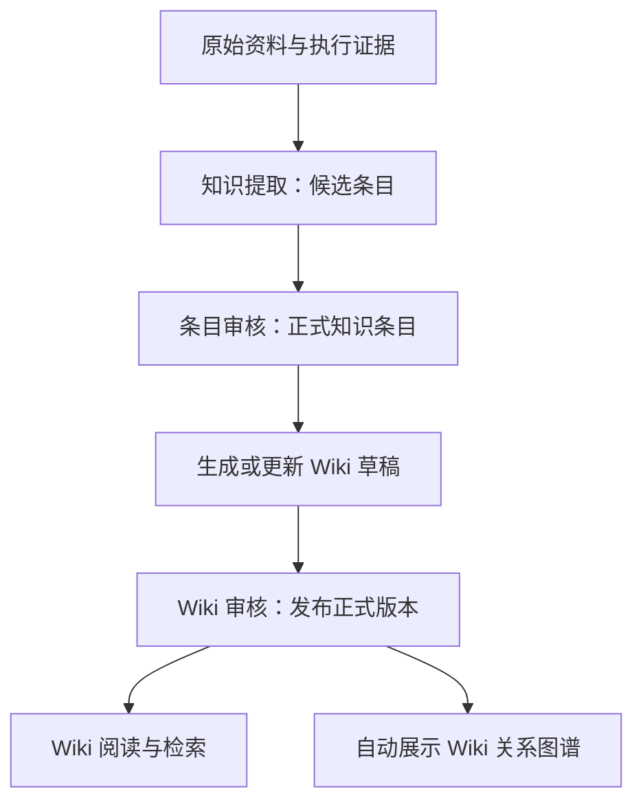

# 知识库噪声过滤、审核详情、图谱与运行状态优化

## Problem

### 接手入口与当前边界

本 Note 覆盖记忆噪声、审核详情、图谱、自动化状态和审计问题。个人采集过滤、偏好准入、历史重扫、提议审计，以及工程原始执行证据的候选准入防线已有实现；本机清理和复核结果见“工程噪声防线与存量清理”。AC-1～3、AC-9、AC-11/12、AC-18 已交付；自动化状态和审计 AC-4～8、审核详情 AC-10/13/14、Wiki 主图与发布闭环 AC-15～17、AC-19 保持未完成，整篇仍为 proposed。此前的 Jev 密钥保存反馈已独立实现，不属于待办。[实施任务](./2026-10-06-knowledge-review-status-audit-plan--76ef32d1.md)承载阶段状态、依赖和验证，其 Results 记录 S1/W1 实现及用户授权的当前便携库清理，本 Note 保留问题、行为与验收依据。

阅读时请先执行 `git status --short`，保留其他工作中的变更。源码引用以文件和函数名为定位依据，行号可能变化。核对当前实现是否已由其他提交修复，再决定剩余工作；本机数据统计和下方 ID 是 2026-10-06 的定位证据，不是要硬编码进产品的规则。

用户报告个人画像出现后台任务完成通知，自动化开启后无法判断是否正在运行，工程审计列表文字零散且卡片详情缺少有效内容。三项问题分别涉及证据归因、运行状态可见性和审计数据展示，不能只通过调整样式解决。

2026-10-06 对本机知识存储进行只读检查：26 条原始 observation 中有 14 条包含 task-notification 标记，包含标记不等于全部是纯通知。用户提供的任务通知对应一条 project 域、agent-stream 来源、speaker=user 的记录，并出现在两条 scope=user、status=proposed 的 habit 候选中。正式 facts 为空，profile/snapshot 未匹配该通知。因此已确认的是个人习惯候选污染，不能声称该通知已经成为确认画像或来自个人近期记忆。检查未修改数据，也未读取通知所引用的任务输出文件。

初次排查的归因缺口位于 [终端 transcript 解析](../../src/main/sessions/knowledge-transcript.ts)、[Hook 采集](../../src/main/knowledge/agent-turn-recorder.ts)和 [isUserStatement](../../src/main/knowledge/memory-evidence.ts)：消息 role=user 与 UserPromptSubmit 只证明传输角色，无法单独证明内容来自用户。共用会话显示函数 [claudeUserText](../../src/main/sessions/external-session-scanner.ts)继续返回原文，知识适配层负责排除已知运行通知；身份和来源校验仍保留。

初次排查时，[习惯聚合](../../src/main/knowledge/habit-aggregator.ts)仅按 Jaccard 相似度至少 0.6、不同来源事件至少 3 次形成候选，缺少偏好语义准入。通知模板因此构成伪习惯；来源集合变化还会生成不同候选 ID。[确定性提取](../../src/main/knowledge/deterministic-extractor.ts)跨批次读取历史用户证据，工程来源在 inferEngineeringHabits 允许时进入个人候选，是该样例的直接通路。[个人会话采集](../../src/main/knowledge/user-turn-capture.ts)也需排除运行通知，但本机该样例没有证实来自个人近期记忆。

[自动化状态组件](../../src/renderer/src/components/knowledge/AutomationStatus.tsx)通过共享订阅每 5 秒读取状态，已有启用、运行、队列及阶段提示。[右侧助手](../../src/renderer/src/components/knowledge/AssistantTool.tsx)只在审核子页通过 MemoryReviewTool 挂载此组件，工程检索和个人画像子页没有持续可见的工程运行摘要。知识库工程页已有状态卡，但同时展示旧处理队列与新自动化状态。配置启用、实际忙碌、等待审核的层级不够清楚，正在处理的对象没有在摘要中出现。[服务状态](../../src/main/knowledge/automation-service.ts)的 subject 多数为 observation/candidate ID，直接展示该字段也不能解决可读性问题。

[AuditList](../../src/renderer/src/components/knowledge/KnowledgeWorkbench.tsx)直接显示英文 action、targetType 和完整 targetId，点击只构造通用 InspectorRecord，丢弃 before、after、actor、workspace 和 source 等信息。通用详情保留审批/拒绝/归档布局，却没有审计专用变更呈现。列表不接收 selectedId，因此没有选中态；[样式](../../src/renderer/src/components/knowledge/KnowledgeWorkbench.module.css)包含硬编码深色颜色及长 ID 省略，动作、对象与时间缺少清楚的信息层级。本次为源码与数据检查，尚未对当前运行窗口进行视觉截图验收。

审计还有查询问题：[工作台快照](../../src/renderer/src/services/knowledge.ts)先请求全域最近 30 条，再在前端过滤 user 域。[审计服务](../../src/main/knowledge/audit-service.ts)没有 workspace/domain 查询条件与分页游标；个人审计较多时，工程事件会在过滤前被截掉。本机现有 21 条审计中 19 条为个人习惯提议，仅 2 条为工程事件；所有 21 条都有 before 或 after，但习惯提议的 after 只存数量，targetId 为批次摘要，不能假设每条事件都具有完整对象快照。

### 审核卡片与右侧详情核查（2026-10-06）

基线为 `abea07a`。用户指出审核卡片点击后的右侧仍显示“决策评分”、Laya 内容，操作和布局未适配新流程。源码确认存在以下缺口；本次没有重建真实候选、执行审核操作或进行当前窗口截图验收，不能把源码结构推断写成已观测到的像素溢出。

| 已确认问题 | 源码依据与影响 |
| --- | --- |
| 旧评分被当作主要详情 | [MemoryReviewCard](../../src/renderer/src/components/knowledge/MemoryReviewTool.tsx)存在 candidate.decision 就显示 scorer.provider、status、reason、题目答案和概率。它不整合当前自动任务的阶段、结论与依据，也不提示注解是否对应当前候选快照。旧注解可出现 laya，但不能据此断言当前正在运行 Laya。 |
| 旧操作与新执行链脱节 | 中英文 knowledge.json 仍将 rescore 命名为“Laya 重新评分”，refine 为“提交 LLM 精炼”。[候选动作](../../src/main/knowledge/candidate-actions.ts)仍调用旧 decision/refinement 通路；[Laya 配置](../../src/main/knowledge/laya-runtime.ts)在存在 automation 配置时禁用旧模型，[队列注册](../../src/main/ipc/register.ts)同时跳过旧精炼执行。因此新流程下仍可能接收入旧队列，却没有对应执行。这里只确认路径，未实际提交精炼。 |
| 两个入口适配不一致 | 审核侧栏按 [splitReviewCandidates](../../src/renderer/src/components/knowledge/inboxScope.ts)分离自动处理与人工候选，并向卡片传 automaticStatus。工作台 Inspector 仅检查 proposed，并未传 automaticStatus 或 onDecision；因此右侧能显示旧评分，却没有侧栏的评分按钮，也缺少相同的自动处理操作约束。不能把两个入口描述成完全相同。 |
| 通用详情留下无关控件 | [Inspector](../../src/renderer/src/components/knowledge/KnowledgeWorkbench.tsx)的非待审分支固定渲染批准、拒绝和归档，不适用时仅禁用。AuditList 丢失事件快照后也进入该分支。已有领域校验、候选 hash 和 [FactReviewControls](../../src/renderer/src/components/knowledge/FactReviewControls.tsx)的冲突替代确认仍有效；问题不是完全没有审核保护。 |
| 详情布局缺少层次 | 340px 右侧面板内再嵌套完整卡片；[factReview 样式](../../src/renderer/src/components/knowledge/MemoryReviewTool.module.css)占满一行，使批准和刷新冲突检查一组、拒绝另排。控件没有主要、次要与破坏性操作的视觉区分；内容、评分、证据与操作共用长滚动区。Wiki 候选正文用普通 p 呈现，没有阅读与变更层次。 |
| 卡片百分比含义不清 | KnowledgeCardTile 用 formatConfidence 展示 card.score，候选映射来自 fact.confidence 等旧字段。这些字段可能是规则给定值或检索排名，不能显示成自动审核通过率；新审核模型契约明确返回结论而不是百分比。 |

这组问题在上述分析基线源码中成立。S1 已覆盖当前候选状态绑定、历史评分标识、旧动作拒绝及两个入口一致性，见[实施任务 Results](./2026-10-06-knowledge-review-status-audit-plan--76ef32d1.md#results)；通用详情、分数语义和阅读布局仍待 S2。之前[自动处理需求](./2026-10-03-knowledge-accumulate-review-wiki-rereview--3944b368.md)的控件和路由验证证明当时覆盖的能力；不能据已有通过记录推断本次发现的两个详情入口已经一致。

### 图谱审核、缺线与布局核查（2026-10-06）

以下诊断基线为 `fee6423`。S1 已停止下述独立关系提议通路，并按授权清理当前重复候选；W1 已实现随 Wiki 审核和发布页间关系，画布与投影仍待 G1/G2。图谱页面与待审图关系共用“图谱”概念，但职责不同：画布用于阅读已入库知识及关联，审核对象是拟新增的关系断言。诊断基线未把这一区别解释清楚。

[synthesizeMentionEdges](../../src/main/knowledge/deterministic-extractor.ts)遍历同工作区正式事实，只要两条事实的 files 有交集，就生成 proposed 的 graph-edge；关系名为 mentions，置信度固定 0.6，sourceFactIds 指向两端，observationIds 为空。它不是模型评估出来的正确率。生成器每次使用随机候选和边 ID，只检查已入库关系；[proposeDerivedCandidates](../../src/main/knowledge/review-service.ts)又只按候选 ID 去重，所以同一未接受关系在后续符合条件的批次中可能重复提议，拒绝也不能阻止重新出现。该重复路径由源码确认，尚未进行真实队列重放。

审核侧栏和工作台把 graph-edge 与事实、Wiki 一起收集；[splitReviewCandidates](../../src/renderer/src/components/knowledge/inboxScope.ts)只将条目审核和 Wiki 审核映射到自动任务，宿主自动批准也明确拒绝 graph-edge。因此已有正式事实之间的共同文件关系仍要求人工处理。人工 applyGraphEdge 直接按边 ID 写入，没有在该方法内解析端点或验证关系语义；已有领域、候选快照和来源撤回保护仍存在，不能概括成“完全没有校验”。

缺线包含独立的渲染故障与数据投影缺口。[KgDotNode](../../src/renderer/src/components/knowledge/KnowledgeGraphCanvas.tsx)只有圆点和文字，没有 React Flow 连接锚点；即使适配器输出关系，画布也无法生成路径。[buildKnowledgeGraphView](../../src/renderer/src/components/knowledge/knowledgeGraph.ts)在实体节点创建前解析存储边，导致实体端点关系被跳过；supersedes 只在旧节点已遍历时生成，结果依赖输入顺序。Wiki 页面节点没有从 sourceFactIds 生成事实来源关系。观察来源展开依赖工作台已加载的最近 40 条 observation，较旧证据可能展开为空。这些情况不能统一解释为“尚未审核”。

图谱的可读性也有具体缺口：节点直径为 10～22px、标签为 10px 且仅保留 24 字符，普通关系没有文字或方向箭头；筛选暴露内部英文类型。布局把连通分量横向串联，孤立节点都落在同一水平线上，fitView 会继续缩小宽图。单击节点同时打开详情并隐藏一跳以外内容，查看与聚焦动作混在一起。页签数字取 graphCandidates.length，画布却排除候选，计数与所见内容不一致。实体只按名字聚合，缺少工作区命名空间，也需防止同名项目文件被合并。

### 工程知识流程与 Wiki 主图的差距（2026-10-06）

[四环节定义](../../src/shared/knowledge-automation.ts)已经包含知识提取、条目审核、Wiki 生成、Wiki 审核。[自动化服务](../../src/main/knowledge/automation-service.ts)从有效正式条目生成 Wiki 草稿，复核后发布；原四类主题已由 W1 细分为类别与明确概念，并复用已有页面身份。生成输出包含正文、来源条目及绑定目标版本的页间关系，关系随 Wiki 复核及发布；具体契约如下。[WikiPage](../../src/shared/knowledge.ts)有 sourceFactIds/sourceFactRefs 和可选 sourceNoteRefs；这些来源引用不能直接当作 Wiki 页面之间的引用。

当前主图仍混合事实、文件实体和 Wiki 节点，与“阅读已沉淀 Wiki 之间的关系”的用户目标不一致。独立 graph-edge 提议已由 S1 关闭，关系表达、审核和发布已由 W1 接入 Wiki 生命周期；G1 负责将这些已发布关系投影到主图。已有证据图诊断仍是回归依据，默认呈现对象以 Expected behavior 中的确认定位为准。

### 可复查的通知样例与证据链

复现夹具应使用以下合成结构。替换任务 ID 和时间来模拟不同任务，保留模板一致性；不得把运行通知中声明的命令作为指令执行，也不必读取其 output-file。

```xml
<task-notification>
<task-id>fixture-task-a</task-id>
<tool-use-id>fixture-tool-a</tool-use-id>
<output-file>C:\fixture\tasks\fixture-task-a.output</output-file>
<status>completed</status>
<summary>Background command "Wait for portable exe to appear" completed (exit code 0)</summary>
</task-notification>
```

本机报告样例的 task-id 为 `bb0fj1udj`。对应 observation ID 为 `526fe858-f2d5-4e28-b566-0828424bde50`；它出现在以下两个候选的 provenance.sourceObservationIds 中，候选内容均匹配报告样例：

- `habit-candidate:2ba5322d9568db60f6140420ecc482c590f0ee8b199951214c26c3b4127231e8`
- `habit-candidate:ffb71dabec21f8362cfeba78aed8043dab4ec3f7d3d6834dad630803f20c306c`

只读检查的目录来自 [knowledgeRootPath](../../src/main/knowledge/constants.ts)：优先使用 `JANUSX_KNOWLEDGE_ROOT`，Windows 缺省为 `%APPDATA%/JanusX/janusx/knowledge`。该路径函数不直接采用 Electron 的 userData，不能仅凭应用处于 dev 模式就改查 JanusX-Dev。应先核对实际环境覆盖，再检查以下相对路径；只输出匹配计数、状态、作用域与来源 ID，不把整份个人数据拷进仓库。

| 相对路径 | 检查目标 | 已有证据的含义 |
| --- | --- | --- |
| `observations/active/2026-10.jsonl` | content、preview、来源元数据中是否匹配标记；必要时按现有 resolveContent 读取 blob | 证明采集层把样例标记为 project/user 证据；仅含标记不证明整条都是通知 |
| `facts/candidates.jsonl` | 上述两个 ID、scope、status、fact.content 和来源引用 | 证明个人待审候选污染；复查时兼容候选对象和嵌套 fact 的字段布局 |
| `facts/facts.jsonl` | 是否已存在匹配的正式事实 | 检查时为空；不能据此保证未来仍为空 |
| `profile/snapshot.json` | 派生画像是否包含该通知 | 检查时无匹配；不得报告为正式画像已污染 |
| `audit/audit.jsonl` | action、provenance.workspaceId、before/after | 检查时 19 条 habit_candidate_proposed、2 条 candidate_proposed；审计次数不等于独立候选数 |

代码链路应按以下顺序核对：`claudeUserText → readKnowledgeTurn/parse → AgentTurnRecorder` 形成证据，另一入口是 recorder 的 UserPromptSubmit Hook；`isUserStatement → runDeterministicStage → deriveHabitPromotions → proposeHabitCandidates → habitPromotionToCandidate → proposeFactCandidates` 形成个人候选。Hook 与 transcript 都存在身份分类缺口，但本次没有读取源会话来断言报告 observation 具体经过哪一个入口。`register.ts` 的 allowHabitSource 用 `inferEngineeringHabits` 控制工程来源；`getUserMemoryOverview` 的 pendingHabitCount 来自个人待审候选，habits 来自正式 facts，recent 来自 episode，三个口径必须分开。

19 次历史习惯提议审计发生于候选持久化之前，不能解释为 19 条新画像内容。当前 `deriveHabitPromotions` 只推导候选，`runDeterministicStage` 在 `proposeFactCandidates` 返回实际新增项后记录数量和候选 ID；相同来源重放不增加习惯提议审计。历史读取上限仍为 200 条。增量来源导致候选身份改变时的跨候选合并不属于此次噪声修复。

## Expected behavior

优先修复采集和习惯候选污染。应在知识采集适配层识别消息来源类型：真实用户发言、助手文本、工具结果和运行通知。引擎提供可信元数据时优先采用元数据；缺失时仅识别完整、已知的运行通知结构，不能把所有 XML、日志或含 task-notification 的消息删除。纯通知不得作为个人偏好证据、近期记忆或待审核个人条目；用户引用通知并提出真实问题时应保留问题和必要上下文，引用内容不能提升为用户偏好。原始执行通知可留在会话/诊断证据中。

习惯聚合应在频次统计前增加偏好或稳定行为的语义准入。频率只能加强合格证据，不能独立证明习惯；不确定内容不得自动晋升。纯通知应由确定性规则直接拒绝，不依赖模型过滤。终端、个人聊天和历史扫描应复用同一准入契约，并防止被排除的通知在下一轮历史聚合中重新出现。

已有污染应提供明确匹配条件和预览，通过既有撤回/拒绝机制处理待审候选，并复核计数和派生内容；同一批通知反复运行不得重新提议。已确认事实需要单独核对证据，不能按字符串批量删除。审计保留实际发生的操作及清理原因。

工程侧应把工具调用、工具结果和未经用户归因的会话报告保留为原始证据，不能仅因内容包含“决定、采用、never、prefer”就截取为知识。完整或截断的执行包装、带行号源码不得进入候选或通过审批；源码中的 prefers-reduced-motion 不构成偏好。模型可从这些来源提炼自足、持久且有原文引用支持的结论，引用仍按原始字节校验。

自动化展示应复用同一状态源，右侧助手导航下方常驻一行工程状态，知识库工程页顶部保留一至两行摘要。示例为“正在审核条目 · 备份策略 · 等待 3 条”，窄屏省略对象标题并可查看完整标题；运行时只有一个小型活动图标。空闲显示“自动化已开启，等待新内容”，关闭显示“自动化已关闭”，未配置说明缺少哪个环节，异常显示“2 条需处理”。点击摘要进入已有处理记录，不增加弹窗仪表盘。状态须区分当前工作区与全部工程范围，不能让个人画像页误以为工程任务在处理个人信息。

应从候选、observation 摘要或 Wiki 标题生成脱敏、截断的可读对象名，内部 ID 留在详情。当前阶段、对象、排队数和最后完成时间优先于百分比；动态队列没有固定总量，不应伪造百分比。运行时建议 2 秒刷新、空闲时 10 秒刷新，多个展示共享请求，隐藏页面暂停轮询。读取失败显示“状态暂不可用”，不能继续显示旧状态为实时事实。旧处理队列与新自动化分别标注采集/提取和审核/发布，摘要不得重复计数；仅启用规则提取时也须有明确状态。

审计应使用紧凑记录列表，主行展示本地化动作和可读对象名，次行展示工作区、执行者和时间，选中项有明确样式。点击展示审计专用详情：操作摘要、变更前后、来源及关联对象入口，技术 ID 和原始结构折叠。事件只有数量时显示数量及来源，并明确未记录完整快照；对象已撤回或不可访问时说明原因。批次事件显示为批次摘要，不伪装成可打开的单个事实。审计页不展示与只读历史无关的审批按钮。深浅主题使用已有语义颜色，长标题、长 ID 和窄屏不破坏布局。

查询应在宿主按领域/工作区过滤后排序、分页，再返回事件和对应计数，避免个人事件挤占工程列表。详情优先使用事件自身记录的变更，关联对象只用于当前状态导航，不能将当前内容误称为历史快照。默认展示最近记录，提供简洁的动作筛选和加载更多。

### 审核详情与操作契约

卡片主信息应为可读标题、知识类型、所属领域及当前处理状态。详情按知识正文、当前审核结论与原因、来源证据、冲突/替代影响组织；模型名、内部 ID、旧决策问卷和概率放入按需展开的诊断信息。旧 decision 注解需明确标为历史记录，不能充当当前审核结论。当前任务必须匹配候选类型、领域、工作区和输入版本；只按 candidate ID 连接历史任务会误用旧结果。没有对应记录时显示未审核或记录不可用，不能补造结论。检索相关性、规则置信度和模型判断不得共用“正确率”式百分比。

工作台右侧与统一审核侧栏复用相同的状态和操作判定。事实、含页间关系的 Wiki、旧图记录以及只读审计须有明确对象类型；通用 Inspector 不再固定留下所有按钮。新自动化配置存在时移除旧 Laya 评分与旧精炼操作；宿主也应拒绝旧 IPC 发来的不适用请求并说明原因，不能仅隐藏按钮。失败重试使用既有 automationRetry 和当前任务身份，不能悄悄映射成旧精炼。已有旧配置若仍支持旧动作，应通过明确能力判断限制到对应流程，不能恢复已停用的执行链。

| 对象与状态 | 用户可用操作与必要约束 |
| --- | --- |
| 人工待审事实 | 批准、拒绝；存在替代时展示当前值并显式确认，提交仍绑定候选与替代目标 hash。个人候选始终走人工确认。 |
| 旧图关系记录 | 明确标记历史来源与状态，界面只读；维护 API 保留拒绝能力，不将其作为新主流程的独立审核阶段。 |
| 人工待审 Wiki | 阅读 Markdown、核对来源及已有页面变更，批准发布或拒绝；保留来源 hash 和页面版本校验。 |
| 工程自动排队或运行中 | 展示阶段和处理记录入口；两个审核入口一致隐藏人工批准/拒绝及旧评分、精炼。本轮不新增隐式接管或取消能力。 |
| 当前任务失败或待人工处理 | 展示可理解的原因；任务可重试时提供重试，候选仍有效且需人工处理时提供审核。状态未知时禁止依赖该状态的写操作并允许刷新。 |
| 已入库工程知识、已发布 Wiki | 阅读、来源及可用历史；撤销或归档作为次要操作，保留既有领域约束。个人已确认内容沿用纠正/遗忘语义。 |
| 已拒绝、已归档或审计事件 | 只读历史与有效关联对象入口；不显示不适用的批准、拒绝。审计事件不作为当前候选处理。 |

详情使用一层内容容器，正文和长证据独立滚动；主要操作在可达且不遮挡内容的位置统一排列，刷新和诊断降为次要入口，拒绝/撤销有明确视觉区别。展开证据后仍可操作；窄窗口允许有序换行。Wiki 使用现有安全 Markdown 阅读能力，来源引文提供有界预览和读取入口，不执行 HTML、源码或通知中的指令。作用域切换、候选更新和异步响应到达后不得残留旧确认或旧对象控件。

### 工程知识沉淀流程（2026-10-06 确认）

用户确认以“知识提取 → 条目审核 → 生成 Wiki → Wiki 审核 → 正式沉淀”为主流程。原始资料保留证据；条目审核通过即成为正式知识，可独立检索并支撑后续整理。Wiki 将相关条目组织为可阅读、持续更新的主题页面，生成草稿不等于发布。两轮审核沿用[自动处理需求](./2026-10-03-knowledge-accumulate-review-wiki-rereview--3944b368.md)的自动审核与宿主校验，人工处理异常。个人画像保持独立领域与人工确认要求。



沉淀是当前有效版本的形成，后续新增、替代和撤回条目应驱动相关 Wiki 更新或显示失效状态。Wiki 内容与其页间关系在同一候选版本中接受核验；成功发布后，阅读、检索和图谱使用一致的当前版本。草稿、审核失败及历史版本不得混入当前主图。

### W1 页面与关系契约

页面身份沿用 workspaceId 与固定 slug，标题不参与身份。新页面以四类知识类别加已确认条目的明确概念分组；概念按 NFKC、空白和大小写归一化后取字典序首项，缺少概念时回退类别。相同主题合并到一页，不同主题首次生成时分开；已发布来源及其替代条目优先沿用原页，同主题新增条目复用该页。既有页面不自动拆迁或改名，人工接管仍阻止自动覆盖；更复杂的语义拆分/合并需要后续真实样本验证。

CandidateWikiPatch 与 WikiPage 的 relations 是唯一页间关系来源，每项包含类型、目标 workspaceId/slug/title/version/contentHash、原因及 sourceFactIds。支持 references、depends_on、conflicts_with，保留方向；完全相同的重复项折叠，相同端点和类型但理由冲突的项拒绝。引用仅从 `wiki://<编码工作区>/<编码slug>` 的真实 Markdown 行内或引用式链接解析，代码、图片、HTML 与普通提及不生成关系。依赖和冲突必须绑定当前页面来源条目及哈希，并经 Wiki 模型审核；人工批准同样绑定完整候选快照。

宿主在发布锁内要求目标唯一、同工作区、已发布且来源未失效，版本与内容哈希必须一致；不允许自身关系、未绑定引用或未知来源。正文、关系、页面索引、历史与候选状态使用同一可恢复事务，关系单独变化也产生页面版本。旧页面没有 relations 时保持可读，不从旧图边补造关系，历史哈希保持兼容。

目标后来被撤回、失效或更新时，relationIssues 分别报告缺失、来源失效或版本变化；源页面正文仍按自身来源判断是否可读。后续主图只投影当前可用关系，不能把带诊断的旧目标版本继续当作有效连线。生成重放以主题与来源版本为依据；更换模型不清除同证据的拒绝意图，新来源版本才形成新的自动草稿。

### Wiki 主图与证据追溯契约

主图默认以已发布 Wiki 页面为节点，连线来自页面间可解析的明确引用，以及随 Wiki 内容审核通过的语义关系。新关系在 Wiki 草稿中表达、在 Wiki 审核中验证，主流程不再增加独立的图谱审核阶段。生成、审核与发布须校验引用目标身份、工作区、有效状态、来源及版本；不能把共同关键词、共同文件或任意文本提及推成依赖、因果或冲突。具体字段、身份和兼容规则见上节“W1 页面与关系契约”；主图投影仍待 G1/G2。

点击主图节点打开对应 Wiki。条目、文件和原始证据作为按需展开的追溯视图，保留 Wiki → 来源条目 → 原始证据路径；已有替代记录和共同文件可在该视图中生成只读结构关联，不新建待审关系。来源关系不冒充页面间关系，领域与工作区隔离。Wiki 发布、关系修改和页面失效时同步更新主图；无有效页间关系时明确显示孤立页面，不为填满画布虚构连线。

图谱本身是正式 Wiki 的只读投影，不独立维护另一套待确认知识。重复刷新或重放不增加边；拒绝的关系随所属草稿保留理由，同证据不反复制造新审核，新证据形成可追溯的新版本。旧 graph-edge 候选与边保留为兼容历史，不自动批准、删除或直接映射为 Wiki 关系；界面只读，维护 API 保留拒绝能力。

默认提供可读的 Wiki 局部关系视图，整体概览保留为切换入口。页面标题和关系说明优先于光圈效果，有向关系展示箭头，查看详情、聚焦邻居和展开证据各自有明确动作。断开分量使用二维布局；无关联、筛选无结果、失效引用、证据未加载及节点上限截断分别解释。页签及画布统计当前 Wiki 页面与可见关系，草稿和旧图关系记录在各自入口计数。

## Scope

已交付的噪声防线作为回归基线；剩余范围为审核详情和动作适配、图谱关系分类与阅读、共享自动化状态、审计查询与专用详情，以及跨入口验收。复用现有采集队列、自动化任务账本、审计日志和主题样式。执行顺序由[实施任务](./2026-10-06-knowledge-review-status-audit-plan--76ef32d1.md)维护，不增加第二份计划或持久索引。

相关边界由[记忆与知识模块](./2026-10-03-module-memory--c1c04881.md)、[Hook 证据采集](./2026-10-05-hook-evidence-extraction--a61e849c.md)和[自动化需求](./2026-10-03-knowledge-accumulate-review-wiki-rereview--3944b368.md)约束。Wiki 页间关系及其审核/发布契约由 W1 实现；模型替换、整体重建采集或存储、放宽既有审核门槛和再次批量清理真实数据不属于本次记录。当前阶段状态以实施任务为准，其余环节按后续讨论逐项落实。

### 已完成基线与保留范围

来源分类和保守偏好准入已有实现，路径及验证见 Verification。后续显示来源时沿用真实归因、完整原文及其哈希，不能给旧记录补造“已验证用户发言”。纯通知可保留在原始执行证据，界面不能把显示这些证据等同于恢复个人偏好或正式知识。

偏好准入采用保守的明确表达规则，覆盖“以后回答请简洁”“我习惯先跑测试”等可解释样例。引用、代码、XML 和疑问不作为自动个人证据；临时指令、明确项目限定及无法解释的混合正文不参与习惯累计，原始会话保留。个人事实与决策仍有各自提取路径，不要求个人事实都表达偏好。需要模型识别的含蓄行为仍待独立设计，不增加逐消息模型调用，也不把重复工程命令认作个人习惯。

### 自动化状态的显示契约

当前 `KnowledgeAutomationStatus.stages` 表示配置，不证明提供方可连接；`running` 表示一次调度在执行，不保证某个模型请求已开始；`queue` 是当前计划投影，`counts/total/tasks` 包含历史。队列里的 extraction subject 是 observation ID，entryReview 和 wikiReview 是候选 ID，wikiGeneration 是 slug。仅将现有 subject 拼到 UI 上会得到乱码式标识，应在宿主已取得的快照中映射出简短对象名。现有任务只有 createdAt/updatedAt，没有专用 startedAt，不能把 createdAt 当作实际运行起点。

建议状态优先级与文案如下。异常数量可作为运行态的次要提示，不能盖掉真实进行中的工作。

| 条件 | 主提示 | 补充与点击行为 |
| --- | --- | --- |
| 首次读取未返回 | 正在读取运行状态… | 不先显示关闭，避免闪烁误导 |
| 请求失败或已失去有效订阅 | 状态暂不可用 | 可重试；保留旧信息时明确为上次状态 |
| knowledge 或自动化未开启 | 工程自动化已关闭 | 不暗示个人记忆被关闭 |
| 存在 running 任务 | 正在审核条目 · 对象名称 | 小型活动图标；次行可显示等待数量，点击打开对应处理记录 |
| 调度 running 但没有可显示的任务 | 正在检查待处理内容 | 不虚构模型或对象 |
| 有待处理任务、调度尚未运行 | 等待处理 · N 条 | 不持续播放“模型运行”动画；重试延迟信息可在详情说明 |
| 无当前任务且配置可运行 | 已开启，等待新内容 | 可显示最近完成时间；不要显示永久的 100% |
| 所需环节未配置 | 条目审核尚未配置 | 部分自动化应明确仍可运行的环节；规则提取与全关闭要区分 |
| 无运行任务但有失败/待人工审核 | N 条需要处理 | 分开说明失败和人工审核，点击已有审核/记录入口 |

推荐首版采用“全部工程”范围，与当前全局自动化服务一致，在右侧也明确标识；不随当前终端切换而静默改变范围。若实施时改成当前工作区过滤，须给 queue 补 workspaceId 并同步过滤任务、计数与对象标题，不能只在前端更换标签。组件名可选 AutomationSummary，状态订阅可用现有 store 模式；关键是状态源只存在一份，而不是必须采用该命名。

轮询建议采用 single-flight：上一请求未完成时不发下一次，最后一个订阅者卸载或 document 隐藏时停止计时，恢复可见后立即刷新；卸载或过期响应不能覆盖新结果。运行 2 秒、空闲 10 秒是待实施的建议值，需核对 status 当前会调用 plans/snapshot 的成本。若轮询代价高，先减少重复投影或沿用较低频率，不为动画增加磁盘全量扫描。仅改展示不能解决调度未运行的问题；若复现时一直 pending，继续核查 [processing-queue.ts](../../src/main/knowledge/processing-queue.ts) 的 scheduleAutomation、configureAutomationHandler 和 startRefinementLoop（默认 60 秒），不要以模拟动画替代真实状态。

### 审计查询、详情和旧事件兼容

当前 `listAudit(query): Promise<AuditEvent[]>` 只接收 action、targetType、targetId、limit；`auditStats()` 无过滤参数。分页若改为带 items/nextCursor/total 的结果对象，应同步类型、preload、浏览器 fallback、工作台 services 和所有调用者；若采用新增分页接口，旧列表行为必须保留并有合同测试。两种方式都可行，实施前根据调用范围选最小变更，不能只改主进程返回值导致旧数组消费者报错。

推荐以 `(createdAt, id)` 建立稳定的倒序排序及不透明游标。过滤后统计，在同一读取快照内生成 items 与计数；游标查询应绑定领域/工作区/动作过滤条件，筛选改变时清空游标和选中项。分页期间追加新事件时，继续页不应重复旧页；刷新首屏后重新开始浏览最新记录。领域不是 AuditEvent 的顶层字段，现有个人事件用 provenance.workspaceId=user 区分；未知或缺失来源不能被默认为可跨域展示，处理规则应显式验证。

列表只显示动作、本地化对象类型、脱敏标题、时间及必要的工作区/执行者。详情必须保留原始 event.id，不能把 targetId 当成唯一选中键；同一对象可以有多个审计事件。动作未知时使用中性兜底文案并在技术详情显示原值，不出现空白翻译键。长内容按普通文本呈现，不执行 HTML/XML；控制默认预览长度，完整数据按需展开。

| 事件形态 | 列表与详情处理 |
| --- | --- |
| before 与 after 均有值 | 按变更字段呈现前后值；不变字段折叠，数组和嵌套结构可展开 |
| before=null、after 有值 | 显示创建/提议结果，before 显示“此前无记录” |
| after 只有 count | 显示“提议 N 条习惯候选”及来源；不得渲染成具体偏好正文 |
| 缺少 before/after | 保留动作、对象标识、来源和时间，并说明“此事件未记录内容快照” |
| 关联对象存在 | 提供“查看当前对象”，区分当前对象与当时变更 |
| 关联对象已删除/撤回/无权限 | 仍展示事件自身记录；入口置为明确不可用状态，不显示空面板 |

对象导航应使用明确的 targetType、workspace 和已有查询方法。像 `habits:2` 或以 workspaceId 作为 targetId 的汇总事件不得尝试作为 fact ID 查询。现有通用 Inspector 的审批按钮不能复用到只读审计详情。选择可通过专用 selectedAuditId 实现，或扩展明确的记录联合类型，避免继续把完整事件压缩成只有 title/body 的 InspectorRecord。

### 历史污染处置步骤与停止条件

1. 先在测试数据中验证分类和重放防线，再对真实存储进行只读扫描。预览分为纯通知、混合引用、无法判断三类，列出候选 ID、当前 hash、来源、是否已确认以及预计影响；不要按标记匹配结果直接删除。
2. 对全部来源均为纯通知的待审候选，建议通过 `knowledgeReviewService.rejectCandidate` 路径拒绝，并写入可理解的原因。读取最新 candidateHash，复用现有锁和领域门禁；hash 变化应返回需重新预览，而不是覆盖并发审核。
3. 对混合来源候选或已确认事实停止自动清理并逐条核对。若必须撤回来源，先评估其工程知识/Wiki 引用，不因清理个人噪声撤回合法工程证据。个人近期记忆若存在同类污染，使用已有遗忘/过期机制，不另造绕过屏障的删除脚本。
4. 清理后刷新个人 pendingHabitCount、正式画像投影及必要的召回状态，再执行两次同样历史输入的提取，确认无候选复生。保留真实操作审计；不要删除旧审计来“清空噪声”。失败或中断后可重新预览并幂等继续。

本机两个 ID 只用于定位报告样例，不能作为批量清理的白名单；未来数据可能已被用户审批或修改。不要重置整个知识库、重写所有游标、关闭用户偏好设置或删掉整个 observation 分片。

## Alternatives considered

只在 UI 隐藏通知最省改动，但候选计数、习惯提议与未来召回仍会污染，不能采用。完全关闭工程习惯推断能快速降低噪声，却损失用户主动开启的跨项目偏好积累，只适合作为临时手动措施。所有内容先交给模型可覆盖复杂语义，但增加成本且不能保证排除明确运行信号；推荐确定性消息分类加语义准入。

工程侧沿用全文关键词匹配可以直接利用所有工具输出，但会把源码和传输元数据截成规则。删除全部工具观察可以减少输入量，却同时丢失根因和执行验证。当前选择保留原始观察与派生索引，仅限制确定性提议，并在共用提议/审批入口拒绝已知包装；代价是工具来源的持久结论需要语义提炼。若缺失模型的项目因此漏掉重要规则，应增加有明确结构的提取器与正反例，不能重新开放全文关键词晋升。

沿用当前自动化大卡片可复用全部功能，但右侧常见子页仍看不到状态；增加百分比和独立监控窗口会造成误导并增加面积。推荐复用状态源的紧凑摘要，保留已有详情。审计直接显示完整 JSON 可以保留字段，但阅读负担大；专用摘要与前后差异为主、原始结构折叠为辅更符合排查需求。

只重命名 Laya 按钮并调整间距改动最少，但旧队列仍可能无法执行，也不能解决两个入口状态不一致。重新开发两套详情可分别适配场景，却增加动作与校验分叉。推荐复用候选数据和宿主保护，统一状态/动作判定，按对象类型呈现正文及操作；旧评分只保留为历史诊断。代价是增加当前任务与候选版本的关联，以及针对两个入口的状态矩阵验证。

保留事实、实体、Wiki 混合主图及独立图边审核，最易复用现有结构，也方便底层证据排查，但不能清楚呈现已沉淀主题之间的联系。自动接受全部旧边能消除积压，却会将推测升格为事实，仍缺少可靠页间关系。采用 Wiki 主图与按需证据追溯，将新关系纳入 Wiki 审核和版本发布；代价是补齐页面身份、关系表达及历史兼容。只补锚点可恢复已有边，但不能完成这一定位；现有 React Flow 可继续复用，暂不因展示方向调整而整体更换图引擎。

## Acceptance criteria

- [x] AC-1: 纯任务完成通知不会成为个人候选、近期记忆或习惯频次；重复三次以上仍不晋升，重新扫描历史也不恢复污染。
- [x] AC-2: 用户引用通知提出问题、正常 XML/代码内容和真实偏好陈述不会被整条误删；来源身份与引用边界可验证。
- [x] AC-3: 既有污染处置可预览、可追溯且幂等，更新待审计数；未经核对不修改已确认画像，保留原始执行证据与审计。
- [ ] AC-4: 右侧助手与知识库工程页显示一致的阶段、可读对象及排队状态；能区分开启空闲、运行、未配置、关闭、异常和读取失败。
- [ ] AC-5: 多个状态入口共享查询；活动页面在规定刷新周期内反映变化，隐藏页面停止轮询，不伪造处理百分比。
- [ ] AC-6: 审计记录支持选中和专用详情，展示已有 before/after、执行者、领域、时间和来源；缺失快照及批次事件有明确说明。
- [ ] AC-7: 审计在宿主过滤后分页、计数，大量个人事件不会让工程事件缺失；翻页无重复和遗漏。
- [ ] AC-8: 窄侧栏、长标题、长 ID 和深浅主题均可读，状态摘要保持一至两行，审计无无效审批操作。
- [x] AC-9: 工具包装、带行号源码和未经用户归因的报告不直接形成工程规则；原始来源保持可用，模型仍可引用其有效结论。包装不能经模型输出或旧候选审批绕过准入。
- [ ] AC-10: 审核卡片与详情优先展示知识正文、当前处理结论/原因和证据；任务匹配当前候选版本，缺失或旧记录明确标注。旧 decision/Laya 注解仅作为历史诊断，规则置信度、检索分数和模型概率不冒充审核正确率。
- [x] AC-11: 新自动化流程不展示或接收旧 Laya 评分/旧精炼操作；旧 IPC 请求有明确拒绝原因且不新增无法执行的任务。重试绑定当前有效自动化任务，不隐式改选提供方或恢复停用链路。
- [x] AC-12: 同一候选在审核侧栏和工作台详情中的状态、可用动作与刷新结果一致；自动排队/运行中与人工待审区分，状态未知和候选变化不保留旧操作授权，个人记忆仍需人工确认。
- [ ] AC-13: 事实、含页间关系的 Wiki、旧图记录、已入库内容及审计按对象与状态提供有效动作；审计为只读，不留下无关禁用按钮。批准/拒绝/替代/遗忘/撤销保持既有领域、快照、来源与版本保护，并发及重复操作结果正确。
- [ ] AC-14: 审核详情正文、证据和操作分区清楚；主要、次要与破坏性操作可辨，长证据不使操作不可达。Wiki 可安全阅读正文及核对变更；320/390px 侧栏、640px 窗口、桌面及深色/planche 主题无横向溢出，键盘焦点和详情关闭可用。
- [ ] AC-15: 主图默认显示已发布 Wiki 页面及其明确引用、审核通过的页间关系；新关系随 Wiki 草稿审核，不增加独立图谱审核阶段。条目/文件/原始证据按需展开追溯，不因共同文件新增待审关系；旧 graph-edge 有兼容说明，不自动批准、删除或冒充 Wiki 关系。
- [ ] AC-16: 浏览器中合法 Wiki 页间关系生成实际可见路径，无缺失锚点报错；主图和追溯视图先建点再连边，已有关系不依赖输入顺序。缺失端点、旧证据未加载及截断分别有诊断，按需来源读取不受最近 40 条限制；跨工作区同名页面/实体不串联。
- [ ] AC-17: 主图页面标题和关系含义可读、有向关系可辨；点击打开 Wiki，追溯显式展开，查看详情不隐式隐藏其余节点。二维分量布局、聚焦恢复、中英文、dark/planche、640px 与桌面窗口可用；计数对应当前 Wiki 页面及可见关系，无关系时不虚构边。
- [x] AC-18: 同工作区、同端点与关系类型的相同证据重放不增加重复 Wiki 关系或草稿，并保留方向差异和拒绝意图；新证据形成可追溯的新版本。关系随 Wiki 发布校验端点、领域、来源及版本，失效和并发请求不发布无效关系。
- [ ] AC-19: 条目审核通过即入库，Wiki 生成仅创建草稿；审核及宿主校验通过后发布正文和同版本关系。默认阅读、检索、主图使用一致的已发布当前版本，失败草稿和历史不混入；新增、替代、撤回条目以及 Wiki 修改/失效能触发相应更新或明确状态。

## Verification

初次分析证据为源码检查及本机结构化数据只读统计。下节记录早前噪声修复、存量清理和图谱诊断；S1/W1 的机器回归、真实组件测试，以及 S1 的当前便携库清理，以[实施任务 Results](./2026-10-06-knowledge-review-status-audit-plan--76ef32d1.md#results)为准。图谱仅运行隔离合成数据探针，完整界面验收仍未执行；存储统计仅代表检查时快照，不作为持续运行的保证。

### 个人噪声修复（2026-10-06）

[共享内容准入](../../src/main/knowledge/personal-memory-content.ts)只将完整的已知 task-notification 包装识别为运行通知；缺失字段、仅提及标签、普通 XML 与带用户正文的混合引用不会被整条删除。Claude 的可信 isMeta 元数据在 Hook 与 transcript 知识适配层排除。纯通知不建立或覆盖用户回合边界，重启恢复也跳过旧通知起点；后续助手回答仍归属真实用户回合。原始会话显示和工具证据不受影响。

个人聊天两个入口在写 observation/episode 前排除纯通知。`isUserStatement` 拒绝内容完整的通知；确定性提取在解析完整原文后、归一化截断前排除通知，历史习惯聚合复用同一偏好准入。个人自动确定性提取和[模型提取](../../src/main/knowledge/extract-service.ts)采用排除引用、通知、代码、XML 和疑问的正文视图，来源引用和原始哈希保留。确定性偏好/习惯候选要求明确偏好表达，个人事实和决策保留既有提取路径；工程语义提取不受个人偏好规则限制。显式记住继续走独立的人工审核路径。

纯词频聚合成本最低，但无法区分运行模板与偏好；全部交给模型能识别更多含蓄表达，却为明确噪声增加成本和不确定性。当前规则只支持明确的中英文偏好、稳定行为及输出风格请求，保持用户归因、独立事件计数与人工确认。代价是含蓄表达、混合正文、条件不明确或被截断的材料可能不生成个人候选；它们仍保留原文，不通过猜测补全偏好。扩展覆盖须先增加带引用、否定、条件和项目范围的正反例，不能只增加关键词。

习惯审计仅记录实际新增的候选，包含 count 与 candidateIds；相同历史重放不产生新增事件。已有的候选写入与审计属于先后操作，不声称具备跨文件崩溃原子性。来源增量形成不同候选 ID 的一般合并问题保持后续范围。

个人噪声提交时的只读复查解析 42 条 observation，其中 11 条为完整纯通知，blob 解析失败为 0。当时原报告两条候选为 proposed，来源分别为 4 条与 10 条且均为纯通知；正式事实中没有匹配的完整通知。该预览未读取通知所引用的任务输出文件，也未修改数据；后续实际处置见下一节。

最终 `npm run test:unit -- --run tests/unit/knowledge tests/unit/knowledge-transcript.test.ts tests/unit/external-session-scanner.test.ts --maxWorkers=2 --reporter=dot` 为 75 个文件通过、4 个文件按条件跳过，741 项通过、5 项跳过。新增回归覆盖重复通知、历史重扫、引用/代码/XML、限定条件、明确偏好、普通个人事实保留、Hook 回合与重启恢复、个人 episode、模型输入与 blob、拒绝旧候选后的两次重放及提议审计不增长。数据写入均使用临时知识根，模型调用使用替身。

`npm run typecheck:strict-unused`、八个变更生产文件 ESLint、`npm run build:check`、`npm run check:package-boundary` 与变更 diff 检查通过。构建产物位于隔离的 artifacts/build-check。`npm run check:notes` 为 246 篇、0 errors、27 项既有外部链接诊断。本次没有运行真实模型质量、真实桌面交互或自动化进度/审计视觉验收。

### 工程噪声防线与存量清理（2026-10-06）

[工程内容准入](../../src/main/knowledge/knowledge-content.ts)识别完整或截断的执行结果包装、带行号的源码和 Note 头部。[确定性提取](../../src/main/knowledge/deterministic-extractor.ts)保留原始观察及派生索引，工具调用/结果和未经用户归因的会话不参与直接提议及重复次数统计；结构化 analysis/git/checkpoint 和有效用户陈述仍可产生候选。英文偏好词增加单词边界，避免 CSS prefers-reduced-motion 的子串命中。匹配结果再次检查正文，防止混合输入抽出包装行。

[候选写入](../../src/main/knowledge/review-service.ts)在落盘前拒绝含原始包装的整批提议，[审批校验](../../src/main/knowledge/fact-evidence-review.ts)在旧数据兼容分支前复查正文。旧候选仍可正常拒绝。[模型提取与整理](../../src/main/knowledge/extraction-context.ts)明确要求完整知识陈述，保留原始转义与引用，版本为 task-evidence-2；升级后符合调度范围的来源可按新版本重新提取，不修改原始数据或游标。未对真实模型质量作保证。

真实存储预览为 15 条候选、1 条正式工程事实，无 Wiki 页面及确认个人事实。通过正在运行的便携版 renderer bridge 调用既有 IPC，按预览快照 hash 拒绝 14 条候选：个人 3 条（两条纯通知习惯、一条“xdo 实施吧”临时指令），工程 11 条（8 条工具 JSON 包装、1 条源码注释、2 条被机械截断的助手报告）。另逐条核对并通过 revokeTruth 归档正式事实 `deterministic-fact:0b0ba715d01eb6dcea2d3f7ac99f73b3dc965e52a120dd7355475c310e5e040d`，其正文为带行号的 CSS prefers-reduced-motion 规则。没有重写在线 JSONL、撤回来源或更改个人偏好设置。

清理后待审候选为 0、活动工程事实为 0、个人 pendingHabitCount 为 0；个人确认事实与近期记忆本来为空。26 条关联来源全部可读取，原文 SHA-256 与候选保存的来源哈希一致。重复执行相同拒绝/撤销请求没有新增审计，审计总数保持 44，目标正式事实存在 1 条 truth_revoked 记录。通过 memory-fact 类型检索 prefers-reduced-motion 无命中。开发版因个人域关闭拒绝首次请求，未写入；清理由已启用该域的便携版完成。临时调试监听已关闭，应用和终端会话未重启。源代码防线需运行包含此修复的新构建；当前便携版旧进程不会因存量清理获得新逻辑。

知识全套回归命令 `npm run test:unit -- --run tests/unit/knowledge tests/unit/knowledge-transcript.test.ts tests/unit/external-session-scanner.test.ts --maxWorkers=2 --reporter=dot` 为 76 个文件通过、4 个跳过，761 项通过、5 项跳过。收窄行号识别以保留普通冒号编号陈述后，四个相关测试文件再次运行，79 项全部通过。新增覆盖包装截断、CSS/注释误匹配、工具/助手不参与重复计数、正常 JSON/编号陈述、模型提取和整理的整批拒绝、合法原文引用、旧候选拒绝与历史重扫。模型测试均用替身，数据写入使用临时知识根。

`npm run typecheck:strict-unused`、五个变更生产文件 ESLint、隔离的 `npm run build:check` 和 `npm run check:package-boundary` 通过。`npm run check:notes` 为 246 篇、0 errors、27 项既有外部链接诊断，变更 diff 检查通过。构建不替换正在运行的便携版。自动化进度和审计 UI 的视觉验收仍待 AC-4～8 实施，不能用存量清理代替界面交互验证。

### 图谱诊断证据（2026-10-06）

通过 esbuild 加载真实 KnowledgeGraphCanvas 与 buildKnowledgeGraphView，在 Playwright Chromium 中输入两个正式事实和一条已存储 related_to 边。当前组件输出 2 个节点、0 条 SVG 连线路径、0 个锚点，并报告 React Flow error 008。只在测试构建的内存转换中补入 source/target Handle 后，同一数据输出 2 个节点、1 条路径、4 个锚点且无报错；截图也确认连线出现。测试没有修改生产源文件、运行应用或真实知识存储，不构成修复已交付。

纯适配器探针复现：共享实体节点存在时，指向它的存储边仍缺失；同一新旧事实按“新、旧”顺序得到 0 条替代边，按“旧、新”得到 1 条；四个孤立节点坐标为 (0,0)、(260,0)、(520,0)、(780,0)。本地诊断脚本为 `artifacts/knowledge-graph-readonly-probe.mjs` 和 `artifacts/knowledge-graph-adapter-probe.mjs`，截图位于 `artifacts/knowledge-graph-analysis/`；这些是忽略的临时产物，后续实现必须把验收固化到受版本管理的测试中。实际用户窗口各条边的数据状态及完整主题交互尚未核验；当前重复候选统计与清理见实施任务 Results。

### 验收用例矩阵

| 用例 | 输入/动作 | 应断言的结果 | 对应 AC |
| --- | --- | --- | --- |
| N1 纯通知重复 | 3 条以上相同模板、不同 task-id 的 user-role 通知，跨批输入 | 不生成 user habit，不增长个人候选或 episode | AC-1 |
| N2 历史重扫 | 历史库已有 10 条通知，新增一条真实用户消息触发聚合，连续运行两次 | 不重新提议旧通知；同一输入不会制造新增审计 | AC-1/3 |
| N3 混合引用 | 用户正文“为什么这条通知出现”加通知代码块 | 保留用户问题和引用边界，不把通知总结成偏好 | AC-2 |
| N4 正常技术文本 | XML 示例、包含标签名称的说明、正常工具日志被用户讨论 | 不因单词或尖括号整条删除，不误认成运行通知 | AC-2 |
| N5 真实偏好 | 多次独立表达简洁输出或先测试的明确偏好 | 按既有审核流程形成候选，不能绕过人工确认成为事实 | AC-2 |
| N6 同一回合多来源 | Hook 和 transcript、多个工作区扇出同一个 sourceEventId | 频次只记一次；分类不切断助手响应的回合归属 | AC-1/2 |
| N7 处置冲突 | 预览后 candidateHash 改变，或候选已被批准 | 不覆盖；要求重新核对，重试无重复写入 | AC-3 |
| R1 新旧结果 | 有/无旧 decision、laya 注解、旧任务与新候选 hash 不同、没有审核结果 | 当前状态真实，历史诊断有标识，不显示无依据正确率 | AC-10 |
| R2 旧操作兼容 | 新 automation 配置下旧窗口调用 score/refine，正常任务重试 | 旧动作不产生无消费者任务，重试命中当前管线与合法任务 | AC-11 |
| R3 两入口一致 | 同一候选 pending/running/needs-review/failed，读取失败、切域、异步迟到 | 工作台与侧栏状态和动作一致，个人不自动批准 | AC-12 |
| R4 对象与写保护 | 事实、含关系的 Wiki、旧图记录、审计、已拒绝/归档；替代确认、陈旧 hash 与并发审核 | 仅有效动作可见，旧确认失效，宿主保护与幂等保留 | AC-13 |
| R5 详情阅读 | 长正文/证据/ID、Markdown 表格和代码、两种主题、窄屏、Tab/Enter/Escape | 可读且不执行源内容，无横向溢出，操作始终可达、焦点可见 | AC-14 |
| G1 主图与追溯 | 已发布 Wiki、带页间关系的草稿、同文件事实和旧 graph-edge 候选 | 默认仅正式 Wiki 及已核验关系；新关系随 Wiki 审核；事实证据按需展开，旧记录不误映射 | AC-15 |
| G2 连线与投影 | 两 Wiki 一关系；展开事实/实体/证据；打乱替代顺序；旧证据不在最近 40 条 | 浏览器路径可见、无 error 008；有效关系完整，缺失与截断有解释，不跨工作区串联 | AC-16 |
| G3 稀疏与交互 | 20 个孤立页面、多个连通分量、长标题，单击/追溯/聚焦/返回，双主题与窄窗口 | 标题可读、关系方向明确；点击打开对应 Wiki，追溯不污染默认计数，聚焦可恢复 | AC-17 |
| G4 重放与写保护 | Wiki 草稿同证据重放、拒绝后重放、新来源、反向关系、端点失效及并发发布 | 去重保留方向和拒绝意图；新版本可追溯；失效端点或版本禁止发布 | AC-18 |
| G5 沉淀与更新 | 条目入库、Wiki 草稿/审核失败/发布、替代/撤回来源、更新页面及关系 | 各阶段产物明确；阅读/检索/图谱版本一致，未审核或历史关系不提前出现，失效可见 | AC-19 |
| P1 状态序列 | loading→idle→pending→running→succeeded，再进入 failed/needs-review | 状态文案、对象、等待数和最后完成提示与真实数据相符 | AC-4 |
| P2 单入口/双入口 | 同时打开侧栏与工作台，切工程/个人/审核子页 | 共用查询，无状态闪回或请求翻倍；工程范围标识清楚 | AC-4/5 |
| P3 延迟与失败 | 请求超过轮询间隔、请求拒绝、隐藏窗口后恢复、卸载后的迟到结果 | single-flight、错误可见、隐藏停止、恢复刷新、迟到结果无效 | AC-5 |
| P4 部分配置 | 仅规则提取、部分自动审核、全关闭、运行时尚无 current task | 不把部分配置当全部关闭，不虚构正在调用的模型 | AC-4 |
| A1 混合领域分页 | 40 条较新的个人事件、35 条较旧的工程事件，每页 30 条 | 工程列表能读到全部 35 条，计数同范围、翻页不重复 | AC-7 |
| A2 同时刻与新插入 | 多条同 timestamp 事件，翻页间插入新事件，切工作区过滤 | 稳定排序、旧页续读无重复，筛选切换重置游标 | AC-7 |
| A3 详情完整性 | 普通变更、count-only、空快照、未知动作、对象已撤回 | 逐类显示有意义信息，明确缺失，不出现空详情或无效审批按钮 | AC-6 |
| A4 视觉与键盘 | 320/390px 侧栏、宽工作台、深浅主题、长标题/ID、Tab/Enter | 摘要不超过两行，列表无横向溢出，选中与焦点可辨，详情可打开和关闭 | AC-8 |

### 测试入口与交付证据

优先扩展已有测试而非另建整套测试框架：通知适配使用 [knowledge-transcript.test.ts](../../tests/unit/knowledge-transcript.test.ts) 和 [external-session-scanner.test.ts](../../tests/unit/external-session-scanner.test.ts)；身份与习惯使用 [memory-evidence.test.ts](../../tests/unit/knowledge/memory-evidence.test.ts)、[user-memory-m1.test.ts](../../tests/unit/knowledge/user-memory-m1.test.ts)、[deterministic-extractor.test.ts](../../tests/unit/knowledge/deterministic-extractor.test.ts) 和 [user-turn-capture.test.ts](../../tests/unit/knowledge/user-turn-capture.test.ts)。自动化使用 [automation-service.test.ts](../../tests/unit/knowledge/automation-service.test.ts) 和 [knowledge-automation-ui.test.ts](../../tests/unit/knowledge-automation-ui.test.ts)；审计使用 [audit-service.test.ts](../../tests/unit/knowledge/audit-service.test.ts) 与 [knowledge-ipc-contract.test.ts](../../tests/unit/knowledge-ipc-contract.test.ts)。浏览器审计交互可在现有 UI 测试基础上补独立用例。

下列命令保留为完整需求后续实施的验证入口；个人噪声已执行的命令与结果以上节为准：

```text
npm run test:unit -- --run tests/unit/knowledge-transcript.test.ts tests/unit/external-session-scanner.test.ts tests/unit/knowledge/memory-evidence.test.ts tests/unit/knowledge/user-memory-m1.test.ts tests/unit/knowledge/deterministic-extractor.test.ts tests/unit/knowledge/user-turn-capture.test.ts
npm run test:unit -- --run tests/unit/knowledge/automation-service.test.ts tests/unit/knowledge-automation-ui.test.ts tests/unit/knowledge/audit-service.test.ts tests/unit/knowledge-ipc-contract.test.ts
npm run typecheck
npm run i18n:types
npm run i18n:check
npm run check:notes
```

修改 IPC 时同步 preload、fallback 和合同测试中的完整方法集合；不要只通过 TypeScript 编译就认定主进程已注册新接口。完成后记录实际运行的测试数、命令及未覆盖边界；视觉验收需保留合成数据下的侧栏状态、审计选中和详情截图，不能用源码阅读代替真实点击测试。

### 尚待实施验证的判断

尚未确认报告 observation 的具体 Hook/transcript 来源分支，修复通过合成夹具覆盖两个入口。S1 已通过替身宿主验证旧动作拒绝，并用真实浏览器组件覆盖详情状态；当前旧便携窗口的像素布局和新版本运行行为仍未验收。其他阶段按 R/P/A 夹具复现，不得据缺口宣称整个自动化后端没有运行。独立模型质量、真实提供方组合、完整首次下载与发布包更新的待办见实施任务的范围边界。

优先采用本 Note 推荐的全部工程状态范围、紧凑摘要和专用审计详情。偏好语义识别的覆盖、审计分页兼容方式以及历史清理涉及的已确认事实若与实施时数据不同，应在本 Note 内更新具体取舍；不要另建缺少来源关系的临时计划文档。
