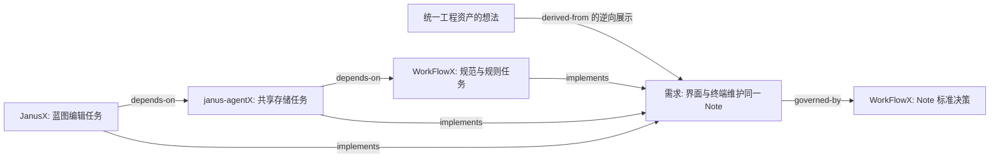

# Agent Note: 统一 WorkflowX Note、JanusX 蓝图与 janus-agentX Harness

Status: proposed

## Problem

用户需要让想法、需求、技术决策和执行任务成为可持续维护的项目资产：在 JanusX 蓝图中编辑、组织和查看关系，也能在其他终端通过 WorkflowX harness 读取和维护同一份文件，最终由 janus-agentX 内置 harness 执行相同标准。目前三个仓库已经联动，但数据身份、存储位置、生命周期和维护入口尚未统一。仅把 Note 显示到画布，仍会留下两份可修改的内容与两套进度定义。

本文依据 2026-09-16 的本地工作树分析，基准提交分别为 JanusX `017f4fc`、janus-agentX `0af25b5`、WorkFlowX `44bc0ae`。JanusX 有知识与团队相关未提交改动及提案，janus-agentX 有未跟踪的 `.agents/plans/`；这些内容不视作已发布能力。设计工作只维护本文及配套闭环提案，不修改程序、实际工作流规则或无关提案，不实施迁移。文中标为“拟新增”的路径、命令和包均为设计目标。

实施先读 [实施契约与 Agent 交接](2026-09-16-note-harness-implementation-contract.md)：C1–C6 唯一定义具体字段、接口、哈希、状态和错误，C7–C8 定义模块落点及实施依赖。本文负责通用资产、独立使用、分享与导航；[讨论到实施闭环方案](2026-09-16-roundtable-chat-harness-loop.md) 负责圆桌、聊天和实施的产品行为。三篇仍为 proposed 设计，部分阶段已有实现，不能据此视为标准已整体启用；协议变更先修改实施契约，再同步产品描述和示例。

当前实现总账见 [S9 readiness](../../implemented/architecture/2026-09-18-harness-s9-readiness.md)。新 Note 蓝图与主 Chat 共享会话，圆桌 action 草稿支持任务合同编辑与显式采纳；正式证据和新 checkout 结果重建具有集成测试。CLI、Ink 与桌面支持单任务 xdel/xflow 委派、自审或独立评审及对应修复策略，桌面构建产物通过确定性模型的执行与重启测试。CLI 与桌面共用历史 Note 分类和标准 profile 门禁。外部真实模型 Electron、完整跨宿主验收、多任务调度、发行矩阵及三仓库规则切换仍未完成，后续范围见 [闭环提案的当前状态](2026-09-16-roundtable-chat-harness-loop.md#当前实施状态与下一步)。

### 三个仓库的实际职责

| 仓库 | 已存在的机制与证据 | 对统一方案的约束 |
|---|---|---|
| WorkFlowX | [noteX](../../../../../WorkFlowX/.codex/skills/noteX/SKILL.md) 定义 Note；[orchestrateX](../../../../../WorkFlowX/.codex/skills/orchestrateX/SKILL.md) 定义 xdo/xdel/xflow；[标准 task 模板](../../../../../WorkFlowX/standards/harness-note/1/templates/task.md) 定义实施资产 | 拥有新标准及工作流语义，供不同终端使用 |
| JanusX | [Blueprint 类型](../../../../src/shared/janus/types.ts)、[Store](../../../../src/main/janus/blueprint-store.ts)、[维护服务](../../../../src/main/janus/maintenance/service.ts) 和 [界面 Store](../../../../src/renderer/src/stores/blueprint.ts) 实现蓝图持久化、关系、维护及显示 | 应成为同一资产的图形编辑器，重用现有图形交互与维护能力 |
| janus-agentX | [ChatTurnPorts](../../../../../janus-agentX/packages/janus-agent/src/ports.ts)、[Node Host 工具](../../../../../janus-agentX/packages/node-hosts/src/index.ts)、[CLI Session](../../../../../janus-agentX/packages/cli/src/session.ts) 提供共享运行时与终端宿主 | 应提供无 Electron 依赖的解析、文件操作和 harness 执行能力 |

JanusX 的 [package.json](../../../../package.json) 已通过 `file:../janus-agentX/packages/...` 引用 `agent-core`、`chat-core`、`janus-agent`。WorkFlowX 本地采用 task Note 规则，JanusX 与 janus-agentX 的运行入口仍采用旧规则；工作流分发的三仓切换必须单独验收，不能从同名 skill 推断版本一致。

用户提到的 `.agent/` 在这里对应实际的 `.agents/notes/`。还存在两种容易混淆的 Note：蓝图节点中的 `notes: string` 只是节点字段；[终端便签 Store](../../../../src/renderer/src/stores/note.ts) 中的 NoteCard 是按终端分组的草稿。它们都不是 WorkflowX 决策 Note。

### 共通设计与真正冲突

WorkFlowX 的 Note 已包含问题、方案或决策、替代选项、验收或后果，蓝图节点中的 `description`、`positioning`、`techSolution`、`features`、`notes` 也在表达同类信息。两者都需要保留来源、管理生命周期、关联实现与支持后续维护。蓝图额外拥有父子关系、依赖关系、工作区绑定、分析候选和维护变更集，适合成为 Note 的可视化入口。

| 维度 | 当前 Note / WorkflowX | 当前 JanusX 蓝图 | 统一时必须解决的问题 |
|---|---|---|---|
| 真源 | 仓库 Markdown，Git 跟踪 | [路径解析](../../../../src/main/janus/blueprint-paths.ts) 默认指向 `userData/janusx/blueprints/{id}.json`，另有 `index.json` | 终端与界面必须读写同一项目文件 |
| 身份 | 路径即身份；状态改变会移动文件 | UUID 节点身份；父子与关系引用 ID | 状态、标题、路径变化后关系必须稳定 |
| 类型 | feature 等六个 class，主要描述工程变更领域 | epic/feature/task/issue 描述节点粒度或执行性质 | 领域分类与文档角色必须分开 |
| 状态 | proposed/implemented/rejected/archived | planning/in-progress/testing/blocked/done 等执行态 | 采纳一个决策不等于完成一个任务 |
| 内容组织 | Proposal Pool、Note、Parent/Child 分开 | 节点内嵌功能、问题、待办、分析和活动 | 同一需求不能既是内嵌项，又是一份独立 Note |
| 关系 | 相对链接，Tree 指向 Note | `parentId` 与 `children`；独立 relations 数组 | 必须明确边的拥有者与反向关系的推导方式 |
| 并发 | 多终端直接编辑 Git 工作树 | 进程内锁、内存缓存、JSON 原子替换和维护修订校验 | 单进程锁不能保护其他终端的 Markdown 写入 |
| 宿主 | 主要由 skill、模板和代理纪律约束 | Electron IPC、应用 Store 与本地审计 | 新标准必须可在没有 JanusX 的终端运行 |

当前 [受控蓝图维护 Note](../../implemented/architecture/2026-08-04-blueprint-maintenance.md) 与 [维护契约](../../../../src/shared/janus/maintenance-types.ts) 已覆盖提案、变更集、证据、选择应用、过期检测和撤销。新方案应保留这些能力的作用，把操作对象改为 Note 文件及其关系。现有普通节点编辑和分析回写也能修改 Store，因此不能仅更换维护面板而保留其他 JSON 写入口。

WorkFlowX 的 [Notes 与 Hybrid Tree 设计](../../../../../WorkFlowX/docs/agent-notes-and-hybrid-tree-design.md) 记录长期决策和短期执行的历史区分。当前格式及模板见 [Harness 标准](../../../../../WorkFlowX/standards/harness-note/1/manifest.json)，当前运行规则以各仓库 skills 为准。统一应减少独立载体，同时保留不同内容的用途与质量要求；历史设计中的设想不能作为现有门禁的证据。

janus-agentX 的 [持久子智能体 harness 提案](../../../../../janus-agentX/.agents/notes/proposed/architecture/2026-09-11-harness-persistent-subagents.md) 仍为 proposed；当前共享编排包含会话级 `todo_write`，参见 [系统提示构造](../../../../../janus-agentX/packages/chat-core/src/main/llm/system-prompt-builder.ts) 和 [todo 工具](../../../../../janus-agentX/packages/janus-agent/src/orchestrator/todo-tool.ts)。不能把会话 todo 当作已实现的仓库任务图。该提案倾向原线程修复，当前 WorkflowX [派发契约](../../../../../WorkFlowX/.codex/skills/orchestrateX/modules/02-bus-payload.md) 则明确修复为新调用；这是后续标准化必须消除的语义分歧。

## Proposal

执行结果的正式文件、可恢复写入、收据内容摘要与跨 checkout 重建遵循[实施契约 C4](2026-09-16-note-harness-implementation-contract.md#c4-收据覆盖率与落地)。共享结果不包含本地租约或执行拥有权；代码有效性与 Git 落地分别判定。

### 统一目标与边界

拟定义 Harness Note Standard 1：一个 Note 文件就是一个蓝图节点，Note 集合及其显式关系构成项目图，蓝图是这个图的浏览与编辑视图。WorkflowX 负责规范，janus-agentX 提供共享实现和内置执行模式，JanusX 提供桌面体验。三者使用同一 schema、关系规则、模板与一致性样例。

“统一”包括想法收集、需求澄清、决策维护、任务拆分、依赖组织、验收与归档。它不要求把所有内容写成一种正文，也不要求每个节点都成为执行任务。项目知识索引可召回和引用 Note，但不能复制出另一份可独立编辑的决策正文。个人习惯、聊天原文、工具输出与终端运行记录仍由各自系统管理；项目级思考摘要可以进入 Note。此边界与 [个人记忆和工程知识分离提案](2026-09-15-personal-vs-engineering-memory.md) 的方向一致，不意味着该提案已实施。

蓝图必须依附一个文件根。尚未归属代码仓库的想法，可以在用户选择的普通文件夹初始化同一 `.agents/` 结构，日后关联项目。应用全局页聚合这些文件根，不另外保存可修改的全局节点库。Git 为推荐版本管理方式，不是创建草稿和图形编辑的前置依赖。

### WorkflowX 独立使用与可选增强

WorkflowX 必须作为独立 harness 产品交付。用户仅在现有 Codex 或 Claude 环境安装 WorkflowX，即可完成知识导航、Note 维护、任务拆分、派发与验收；安装 JanusX、janus-agentX、额外模型服务或专用 Node CLI 都不是基础工作流的前置条件。派发仍取决于宿主是否具备对应代理能力，缺少该能力时沿用明确报告的降级规则，不能将桌面或内置引擎作为隐含要求。

统一标准只定义一种 Note 格式，按环境提供可选能力，不能产生“终端简版 Note”和“桌面完整版 Note”两种真源。拟采用如下产品边界：

| 能力层 | 用户安装与使用方式 | 提供的能力及保证 |
|---|---|---|
| 基础 WorkflowX | 安装规则、skills、模板及宿主适配；使用宿主已有的读写、搜索、执行命令和代理能力 | 同一标准的 Markdown/JSON 文件、按需检索、人工或代理语义审查、实际构建测试与结果记录；不声称提供全图机器校验或协作事务保护 |
| 可选 Note 工具 | 独立轻量 CLI，拟用 `wfx-notes` 命令，不要求安装 janus CLI 或模型服务 | schema/关系/引用校验、可重建索引、哈希核验、受管变更集和恢复；Node 运行时要求仅适用于这个可选发行物 |
| JanusX | 可选桌面应用，复用同一资产库 | 图形导航、编辑、跨仓库绑定、分享预览和冲突处理；不向基础工作流追加桌面必填字段 |
| janus-agentX 内置 harness | 可选执行宿主 | 执行状态机、派发快照、自动验收与恢复；遵守同一工作流语义，不成为其他宿主的运行依赖 |

基础安装只分发完成基础操作所需的规范和模板，并分别提供 AGENTS.md、CLAUDE.md 的导航片段。首次真正需要持久资产时，Agent 用现有宿主工具初始化最小 `.agents/harness.json` 和首篇 Note；UUID 可由现有操作系统工具生成，不要求人工填写。已有资产只读取，禁止每次会话重新初始化身份。Note 的核心必填元数据限定为 schema、id、kind、lifecycle、created，标题在 H1；按 kind 和实际状态补充正文，idea 草稿不承担任务或决策的全部字段。

目录按需创建。`harness.json` 的基础必填项为 schemaVersion、repoId、name、profile，依赖仓库列表可省略；profile 必须固定规则发行版本，不能指向含义随时变化的 latest。没有使用受管规则同步时可省略 `harness.lock.json`，但规范版本仍须可辨认。不使用跨仓库、共享视图或执行验收，就不创建 repositories 配置、views、evidence；没有本地运行或事务服务，就不生成 `.local`。微小且无需留存决策的变更继续适用 Note 豁免，不为其强制建立任务图。

orchestrateX 拟在工作开始时进行轻量能力探测，区分 notes 工具可用且版本受支持、未安装、不可执行、版本不匹配及校验失败。只有未安装时正常使用文档流程，不反复提示安装；工具异常时保留诊断与只读定位，明确哪些写入不能继续。已运行校验发现的数据错误必须修复，不能回退为人工核验后宣称通过。工具缺席时不自动联网安装，也不要求用户为了普通 Note 编辑先安装增强层。

基础导航用 `rg` 或宿主搜索工具定位标题、关键词、ID、codeRefs，再按 URI 中的 ID 精确查找文件并读正文；不依赖持久索引。写入前读取最新目标，使用精确编辑和 diff 检查；多文件变更逐项检查最终引用与 Git diff，避免同一资产并发裸写，不宣称整体事务。需要强事务保证的操作必须使用增强工具；项目若显式配置强制 schema/图校验，则工具缺席只阻塞该项门禁，不能伪造通过或悄悄取消项目约束。

基础流程也可以运行现有构建、测试并按统一收据模板记录命令、实际结果、AC 和文件哈希，不依赖 Janus 模型端口。收据通过 `checks` 明确记录各项检查的 passed/failed/not-run 及方法，人工检查与机器检查必须可区分；没运行的结构检查不能填 passed。任务 Note 的 done 与证据有效性规则对所有能力层一致：不能建立所需证据时保留未完成或未验证状态，增强工具以后只能重新核验，不会因发现基础流程写的收据就自动认证。

轻量 CLI 拟从 janus-agentX 中的共享解析器与独立 harness-node 文件适配器单独打包，依赖闭包只包含这两部分及所需解析库，不引入 agent 循环、LLM SDK、TUI 或 Electron。面向 WorkflowX 使用 `wfx-notes`，janus CLI 的 `janus notes` 是对同一实现的入口适配；两者执行相同操作的文件结果与诊断必须一致。WorkFlowX 负责标准、规则与可选工具使用契约，不在 skills 中再手写一套与共享库竞争的解析器。

技能文档须按这一边界重新组织：noteX 提供基本格式、读写与人工检查步骤；orchestrateX 选择能力适配器而不改变 xdo/xdel/xflow 的语义；specX/engineeringX/auditX 区分代码验证、Note 结构检查和人工判断；AGENTS.md/CLAUDE.md 同时写明有工具和无工具的导航路径。README、插件安装说明及现有部署脚本默认介绍独立使用，增强工具、JanusX 与内置 harness 单列为可选集成，不在基础安装过程中连带安装。

### 文件结构与稳定身份

拟采用以下完整能力结构，各仓库独立拥有自己的内容与 repo ID；基础使用仅按需创建上一节规定的文件与目录：

```text
<project>/
  .agents/
    harness.json                          # 协议版本、repo ID、工作流配置及依赖仓库身份
    harness.lock.json                     # 标准发行版、摘要、适配器与受管文件清单
    notes/
      yyyy-mm-dd-topic--<short-id>.md      # 每个文件一个节点，所有角色共用格式
    views/
      <view-id>.json                       # 共享视图名称、根节点及筛选，不存节点正文
    evidence/
      <receipt-id>.json                    # 可跟随提交的紧凑验收证据
    .local/                               # 整体忽略提交；不能当作持久项目真源
      workspace-map.json                  # repo ID -> 本机 checkout 列表及当前选择，可重建
      index/                              # 可重建的 Note/关系索引
      ui/                                 # 画布坐标、折叠、选中、焦点
      runs/                               # 会话、线程、输出、待应用变更集与运行审计
      transactions/                       # 恢复日志与变更前快照，恢复完成前禁止清理
      locks/                              # 本 checkout 的协作写锁
      operations/                         # 已应用操作结果与重试查询记录
```

新标准不再要求 lifecycle/class 目录分片；notes 下允许按需分组，扫描递归进行。`id` 使用完整 UUID，文件名日期为首次创建日、短 ID 仅方便人工辨认；标题取正文唯一 H1。文件路径、标题、分类和状态都可变，身份不变。重命名只改变定位信息，图关系和代码反向引用依赖稳定 ID。不创建手工 `INDEX.md` 或必须同步写入的全局节点清单；索引扫描 Note 后生成。文件名重复、ID 重复与大小写路径碰撞必须报错。

`harness.json` 拟包含 `schemaVersion`、`repoId`、`name`、`profile` 和 `repositories`。`profile` 固定本项目采用的工作流规则；运行时允许在该规则内选择 xdo/xdel/xflow。`repositories` 声明依赖 repo ID、可读名称和可选远端定位提示，不记录其他机器的绝对路径。`harness.lock.json` 只固定标准与受管规则版本，不能兼任内容索引或执行状态库。

节点引用统一表示为 `note://<repo-id>/<note-id>`，同仓库也使用完整形式；代码入口保留一次带简短原因的 Note 反向注释，引用同一 URI。解析器负责 URI 到文件路径的定位，UI 和 CLI 均提供“打开原文件”。普通 Markdown 阅读器可以直接读正文和身份，但不保证识别自定义链接；相对源码链接仍使用普通 Markdown 语法。正文链接用于阅读，不自动产生有语义的图边。

同一仓库的多个 worktree 共享 repo ID 和 Note ID，但必须拥有不同的本地 checkout 身份、索引、锁与运行记录。跨仓库视图明确选择一组 checkout；不得把同一 Note 在两个分支上的不同版本合并成一个“最新节点”。跨仓库统一是协议与图引用统一，不是让三个仓库共写一个 `.agents/` 目录。

### 可共享的仓库身份与本机绑定

共享蓝图与 Note 不保存本机绝对路径。协作者接收的是仓库身份、节点内容与关系，不能依赖发送者的目录结构。打开本地源码或执行任务时才需要解析实际 checkout 路径；路径可以临时选择，也可记忆在被忽略提交的 `.local/workspace-map.json` 中。该映射是可删除、可重新建立的本机便利数据，缺少它不妨碍查看已经获得的蓝图内容。

| 数据 | 拟定字段与位置 | 共享规则 |
|---|---|---|
| 仓库身份 | `harness.json` 的 `repoId`，依赖描述中的 `repoId` | 稳定 UUID；普通 clone 沿用同一身份，名称和远程地址变化不改节点引用 |
| 仓库展示与定位 | 仓库描述的 `name`、可选 `remotes`，以及可选的 `provider/host/repositoryId` | 名称用于识别；远程地址用于定位；平台 ID 仅在对应服务实例内辅助识别 |
| 节点涉及的仓库 | Note 的可选 `repositories.primary` 和 `repositories.related`，值为 repo ID | Note 只保存引用，仓库名称和远程信息从描述读取；主仓库不得在关联列表中重复 |
| 蓝图聚合范围 | `views/<view-id>.json` 的 `repositories`、根节点 URI 和筛选条件 | 用 repo ID 声明跨仓库范围，不写 workspace ID、目录或本地 checkout ID |
| 本机落点 | `.local/workspace-map.json` 中各 repo ID 对应的 checkout ID、路径和选择 | 永不进入共享导出或团队同步；分支与 HEAD 在使用时重新读取 |

Note 的归属仓库由文件根确定，`repositories.primary` 表示主要涉及或执行的仓库，二者可以不同；`repositories.related` 表示其他涉及的仓库。idea 可以不绑定仓库。代码任务派发前必须确定执行目标；若未填写 primary，准备操作只能在当前授权内建议归属仓库，并在准备执行前将确定值写入任务，不能靠名称猜测。关联列表也不授予写权限，多仓库改动仍按目标仓库拆分任务。monorepo 的包或目录以 repo ID 加仓库内相对路径表达，不冒充独立仓库身份。

远程仓库名称不是唯一标识，URL 也可能因更名、迁移以及 SSH/HTTPS 写法不同而变化。匹配优先检查候选 checkout 内的 repo ID，再参考平台仓库 ID 与明确的远程地址对应关系；名称只能提供候选。存在多个 clone/worktree 或身份不一致时，界面要求选择或解决冲突，不能静默选第一个。普通 clone 保留 repo ID；fork 若作为独立项目参与同一蓝图，应显式建立新身份并保留来源信息。初始化工具不得自动重写现有 Note URI；未区分身份的 fork 作为有歧义的候选处理。

共享远程描述只接受可移植且无凭据的仓库定位信息，不包含访问令牌、密码、本地文件协议或本机 SSH 别名；Git SSH 地址中的协议用户名可以保留，认证由接收者本机配置提供。没有远程地址的工程文件夹仍可使用 repo ID 和名称，协作者通过选择内容目录完成绑定。共享验收证据中的源码路径必须相对于其 repo ID；日志中的绝对路径与凭据不能直接进入可分享摘要。

共享视图定义只描述范围，不自动传送它引用的所有文件。第一版应支持通过 Git 取得对应仓库资产，以及通过显式蓝图导出取得所选 Note、必要仓库描述、视图和可共享证据的只读快照；团队通道以后复用同一导出边界。未被分享的依赖保留为未解析引用，不能因为有关系边就扩大分享范围。导入快照用于浏览，不形成第二份可独立回写的真源；要维护原项目，需绑定可写 checkout，再按当前文件哈希比较并应用修改。共享协议不承诺自动实时协同，跨机器更新由 Git 或后续团队同步传输。

### 文档角色、分类与正文

`kind` 描述节点在思考和工程中的角色，`class` 描述工程领域。两者不可互换。`class` 可选，沿用 feature、bug-fix、architecture、process、testing、simplification 六类；未分类草稿无需猜类别，扩展闭合集必须随标准发布。

| kind | 用途 | 正文与升级要求 |
|---|---|---|
| idea | 想法、疑问、用户原始意图的整理、调研假设 | draft 只需背景与想法，可记录未知项；不强制验收或完整替代方案 |
| initiative | 产品方向或跨仓库目标，需要时才创建 | 目标、范围、非目标、约束和整体完成标准；任务集合从关系推导，不手写注册表 |
| requirement | 用户需要的能力、问题修复目标、质量约束 | 问题、期望行为、范围与非目标、稳定编号的验收条款；缺证据处明确标注 |
| decision | 技术与产品取舍、工程约束、为什么这样做 | 问题、方案或决策、替代选项及不做/复用、代价、重访条件；采纳和落地分开 |
| task | 有明确交付范围的实施工作项，也是原生蓝图节点 | 引用需求和决策，保存本任务的允许文件、验证要求及 execution 摘要；按需拆分，无固定父子两级模板 |

模板采用稳定的英文节名作为机器识别契约，正文与界面标签可中文。需求和长期工作项的验收条款采用显式 `AC-1` 等稳定 ID；引用以 `note URI + #AC-1` 定位，删除或修改条款会使关联验收失效。task Note 引用这些条款，不复制需求原文；实施独有 AC 写在任务正文中，以 Task URI 和条款 ID 定位。结构校验只检查机器能确定的事实，表达质量由人或评审判断。

一个 Node 可以逐步完善，不需要为每次讨论生成新文件。idea 可以原地提升为 requirement 并保留 ID，前提是仍描述同一意图；一个想法分出多个需求时，各建 Note 并用 `derived-from` 指向原想法。方案从 proposed 到 accepted、再到 implemented 保留同一决策 ID。独立任务与独立决策使用独立节点，避免把长期约束埋在执行日志里。

重要但未决定的想法留在 idea 草稿；待确认问题、选项和研究证据可在其中原地维护。不要持久化模型内部推理过程，保留可解释的论据、用户确认的意图、结论及未决问题即可。若“为什么没选另一条路”半年后仍有价值，应形成 decision；若只是本次尝试的失败输出，应留在运行记录。终端便签可提供“保存为 Note”动作，生成一次正式资产后继续编辑它，草稿不参与双向同步。

以下为拟采用的新文件示例，不是本文当前使用的格式；示例引用的 UUID 仅演示契约：

```markdown
---
schema: harness-note/1
id: 01994f90-2130-4e92-839c-03243061b924
kind: requirement
class: feature
lifecycle: proposed
created: 2026-09-16
tags: [blueprint, notes]
parent: note://8fa19f17-c717-43a8-93a7-810a5e0cbc91/fe138168-1b11-4fdd-b8d9-223c42101785
relations:
  - type: governed-by
    target: note://8fa19f17-c717-43a8-93a7-810a5e0cbc91/6ffb02f4-7abf-4313-a6f4-e0ca7c619b64
---
# 在蓝图界面直接维护项目 Note

## Problem
用户在终端修改需求后，需要在蓝图中继续组织和维护同一份内容。

## Expected behavior
界面将直接读取项目 Note，编辑正文和关系后写回原文件。

## Scope
支持项目内编辑、外部变更刷新与冲突提示。

## Acceptance criteria
- [ ] AC-1: 终端保存有效 Note 后，已打开的蓝图将在约定刷新时间内显示新内容。
- [ ] AC-2: 界面保存将保留未知扩展字段及未编辑的正文段落。

## Open questions
无。
```

元数据是类型、生命周期、关系和执行字段的唯一事实来源，正文只在 H1 保存标题，不再重复 `Status:`。解析需使用 YAML 与 Markdown AST；表单修改指定字段或段落，保留不相关内容、换行风格与扩展字段。扩展放在 `extensions.<vendor>` 命名空间；未知核心字段或不支持的主版本禁止写入，仍可查看原文件和诊断。完整核心字段（包括 work、execution、disposition）见实施契约 C1。具体解析器选型应在实现时验证 round-trip 能力，不能只凭“支持 Markdown”认定能无损编辑。

### 生命周期与执行状态

拟将 `lifecycle` 定义为 draft、proposed、accepted、implemented、rejected、archived，但不是所有 kind 都允许全部状态。idea 允许 draft/proposed/accepted/rejected/archived；initiative、requirement、task 允许同一集合；implemented 专用于 decision，表示决策已经有落地证据。accepted 表示已采纳且可作为工作依据，不隐含任务执行完成。rejected 必须附理由；archived 保留稳定身份与引用，但不默认参与当前约束召回。

decision 将走 draft -> proposed -> accepted -> implemented；实施前被否决进入 rejected，完全被替代进入 archived。修改一个已实施决策中的路径或客观事实，可原地修订并随代码提交；改变决定本身应新建 decision 并明确替代关系。归档仅冻结被归档文件，后来者仍可从自己的出边引用它，无需反写归档正文。

只有 task Note 可以保存 `execution.state`，值为 queued、running、verifying、blocked、paused、done、cancelled；未准备执行的草稿可不含 execution。可执行目标须已采纳且具备当前授权；done 必须经过验收，task 通过 execution.receipts 引用 `.agents/evidence/<receipt-id>.json`。线程的状态属于 `.local/runs`，不可作为另一份可写任务状态。requirement/initiative/decision 不保存执行状态，其进度由任务与证据推导。execution 的字段、重试和拆分约束见实施契约 C3。

执行服务负责自己活动任务 的状态推进，UI 发出开始、暂停、完成或人工验收命令。没有引擎运行时，外部终端可通过相同 CLI 或基础文档流程写状态与证据；手工直接改成 done 的任务 Note 缺少有效证据时必须标记“未验证”，不能算作 harness 完成。验证通过也不等于独立模型评审通过，证据必须注明 xdo 自审、xdel 自审、xflow 独立评审或人工验收。

requirement、initiative 与长期 task 的实现进度由关联任务、AC 覆盖和有效证据推导，不再持久化任意百分比。没有实施或验收覆盖时显示“未拆分/未验证”，不能因分母为零显示 100%。任务的执行阶段、需求 AC 覆盖率、AI 的进度估计应分别显示；AI 分析只产生建议或观察，不直接覆写已确认的状态与验收结果。发生回归时，证据相对当前范围失效，建立修复任务 Note 并重新验证，保留历史验收作为历史事实。

### 图关系与蓝图组织

每个 Note 可有一个 `parent`，用于默认树形组织；反向 children 从扫描结果生成。允许多个根、允许没有父节点，不再要求所有项目内容只有一个根。相同节点可出现在多个视图中，其主父节点和文件仍只有一份。跨目标复用通过关系边表达，避免复制节点。

| 关系 | 方向与用途 | 校验及拥有者 |
|---|---|---|
| parent | 子节点 -> 主父节点，组织层级 | 存子文件；禁止自指和环；逆向子列表只推导 |
| depends-on | 依赖方 -> 前置项 | 存依赖方；用于 requirement/task 的先后约束；完整可解析图必须无环 |
| implements | task Note -> requirement，表示实施工作项的覆盖意图 | 存 task Note；支持 `criteria: [AC-1, ...]`；执行基线引用这条关系及其 AC，不能仅凭关系边证明执行或验收通过 |
| governed-by | requirement/task/initiative -> decision | 存受约束方；引擎派发时读取目标 decision 的有效正文 |
| derived-from | 任意 kind 的新节点 -> 来源节点 | 存派生方；解释来源，不自动引入执行依赖；禁止来源环 |
| supersedes | 新节点 -> 被替代节点 | 存新节点；须同 kind，附 `scope: full/partial` 与理由，禁止替代环 |
| related-to | 一般相关、横向探索 | 语义对称，按完整节点 URI 字典序较小的一端单点存储，逆边推导 |

`blocks` 将作为 `depends-on` 的反向显示，不另存一条边，防止两组独立无环检查漏掉混合依赖环。关系身份由 source/type/target 定义，重复关系拒绝；修改关系说明不产生新身份。普通关系与 parent 不承担审批含义，也不依据正文中的相似词自动建边。

完全替代 decision 时，创建者应在同仓库事务内将旧节点归档，并逐一处理仍指向它的活动约束引用；部分替代保留两者，写清适用范围。系统可推导“被替代”信息，但不得默默把所有旧引用改指新节点。删除默认改为归档；真正删除时先展示所有入边和 AC 引用，明确处理策略后才执行，禁止顺手级联删除子节点。

跨仓库引用缺少本地目标时保留为 unresolved，显示 repo 名称与 Note ID，不删除或伪造目标。草稿允许 unresolved，派发任务所依赖的前置项、决策和 AC 必须可解析且固定修订；可选 related-to 缺失不阻塞执行。related-to 的规范拥有者仓库不可写时，只能保留待应用操作，不能在另一端保存重复正式边。跨仓库循环在完整图中检测；图未完整时必须注明未验证范围，不能宣称全局无环。

三个仓库可以形成如下关系。真实落盘时每个方框将对应一个 Note 文件，图中的语义边只是示意：



### 界面与外部终端共用写入机制

JanusX 蓝图拟提供图、树、列表及节点详情，按 kind、class、生命周期、执行状态、标签和仓库筛选。节点详情支持 Markdown 原文与结构化编辑，显示关系、来源、验收证据、未决问题和版本差异；从节点可定位原文件、关联任务、代码和工作终端。图上新建、连线、移动父节点、采纳和归档，都转换成对同一 Note 的明确操作。新建需求、决策或任务默认使用对应模板，快速捕获想法只写轻量草稿。

蓝图界面适配是本方案的必交付范围，必须和新文件协议一起实施，不能仅替换底层 Store。仓库相关交互拟按以下方式调整：

| 界面位置 | 必须提供的行为 |
|---|---|
| 蓝图范围栏 | 展示参与仓库的名称、远程来源与连接状态；可增减视图中的仓库、筛选单仓库或跨仓库图；移出视图不删除 Note |
| 节点详情 | 分开展示文件归属仓库、主要涉及仓库和关联仓库；编辑绑定写 repo ID；本机目录只在本地绑定区域展示 |
| 协作者首次打开 | 已收到的节点立即可浏览；没有源码时显示“未绑定本地仓库”，提供选择已有目录或发起克隆的入口；打开蓝图本身不自动克隆 |
| 仓库绑定面板 | 展示匹配依据、远程信息以及本机候选 checkout；支持选择分支/worktree、重新定位和解除本机绑定；这些动作不修改共享 Note |
| 节点工作入口 | 只有所需 checkout 已解析且具备当前操作权限时才能编辑对应文件或启动任务；缺少绑定时可继续阅读与浏览跨仓库关系 |
| 分享面板 | 预览所选 Note、视图、依赖仓库及缺失引用；明确这是快照导出还是项目资产协作；导出白名单排除 `.local`、终端标识与机器路径 |

跨仓库节点需显示仓库标识以区分同名节点；“未收到目标 Note”“未绑定源码”“本机路径失效”“只读快照”“分支待选择”和“内容冲突”应是不同状态。只有路径失效时不能把已接收的 Note 当成不存在。执行前的工作区选择与文件写权限校验仍由宿主负责，蓝图上的关联不能绕过授权。

共享视图只保存范围和筛选。画布位置、缩放、折叠、终端绑定与本机工作区路径存 `.local`；布局变更不修改 Note、内容修订或验收证据。当前嵌入节点的 features/issues 中需要独立状态或关系的项，将由独立 requirement/task Note 表达，问题严重性可作为 bug-fix 节点的类型扩展字段；简单清单继续放正文。活动时间线和分析全文保留运行记录，只有用户采纳的结论进入正文或正式证据。

共享 API 的唯一签名见实施契约 C5；创建、编辑、连线与重挂父节点编译成 prepare/apply 变更集，任务状态经状态服务校验。独立 CLI 拟提供 `wfx-notes list/show/create/check` 和 `wfx-notes apply <changeset-file>`，janus CLI 通过 `janus notes` 适配相同操作，并另提供 `janus harness run --mode xdo|xdel|xflow --note <uri>`；这些是待实现接口，不是当前可运行命令。WorkflowX 的确定性校验通过可选轻量发行物获得，不要求安装完整 janus CLI。

外部终端仍可用普通编辑器修改 Markdown。受管写入须执行 schema、关系、状态与哈希校验；外部编辑由 watcher 识别并重新校验。编辑器并不需要先连接 JanusX。应用启动、窗口恢复焦点、分支切换和 watcher 溢出后都要重新扫描，不能完全依赖文件事件。支持的本地文件系统上，目标为外部有效保存后 1 秒内刷新；手动刷新必须可立即触发重扫。

UI 加载文件时取得原始字节 SHA-256，保存时携带 expectedHash。正文、关系或所依赖的证据变化都会使相关操作过期；画布修改不会。脏编辑器收到外部变化时保留本地草稿，展示基线/磁盘/草稿差异，由用户合并或重载，不能自动覆盖。保存成功后更新文件哈希与图修订，事件带来源操作 ID，避免自己保存触发循环写入。

多文件变更拟以 `NoteChangeSet` 表达：operationId、操作类型、目标 URI、原因、读写文件及 expectedHash、依赖的操作、验收或来源证据。同 checkout 的协作写入取得短时文件事务锁，重读全部前提、校验最终图、写恢复日志和临时文件，再依次替换并发布完成事件。锁只串行化短暂持久化，不锁整个工作流；死锁与崩溃恢复不能沿用删除旧 workflow-lock 的规则。恢复时核对文件哈希，只在版本匹配时继续或回退，不覆盖事务外的新编辑。

多文件 rename 不是操作系统级整体原子事务。共享读取器看到未完成事务时必须等待恢复或报告恢复中，不能把半套图当成新有效快照；任意外部编辑器仍可能看到中间文件。普通编辑器也不会遵守协作锁，文件哈希复核无法消除检查到替换之间的竞态，因此不承诺任意裸写与受管事务之间绝对无丢失。需保留受管写前快照、报告检测到的冲突，并建议并发修改同一资产时通过 CLI apply 保存；真正需要强保证的任务必须使用受管写入。

无效 YAML、半写入 Markdown、重复 ID 或关系错误只产生诊断，保留原文件。可展示最后有效快照，但必须明显标注过期且禁止据此执行；无快照时展示可定位的错误文件。不得像宽松 JSON 读取那样将解析失败等同于不存在，也不得自动丢弃错误边。

AI 蓝图维护将继续采用“提出变更 -> 查看差异 -> 按已有授权应用”的方式，证据与文件哈希绑定到具体变更。人工直接编辑的保存就是该次操作的授权，不追加无意义的批准流程；harness 已获授权的执行范围可直接应用合法变更，扩大范围或真正删除资产需要依照当前授权处理。外部文件变化是事实事件，不能声称它已经经过 AI 提案审批。撤销只逆转自己写入的内容并校验当前哈希，不回滚整个工作树；冲突时保留待合并逆操作。

### Agent 知识导航与 Codex/Claude 双端入口

统一 Note 图将同时提供项目 Wiki 的导航能力。`AGENTS.md` 与 `CLAUDE.md` 必须各自包含简短且自足的导航规则，不能假设 Claude 会读取 AGENTS.md，也不能只更新 Codex 的入口。入口只说明资产位置、检索顺序、约束读取与失效处理；页面清单由扫描生成，不将整个 Note 目录、全部正文或本机路径写进入口文件。

两端导航规则应由 WorkFlowX 同一规则源生成，逻辑一致，按宿主替换 skill 路径与工具调用方式。拟写入入口的规范为：

1. 开始项目相关工作时，先识别 `.agents/harness.json` 的仓库身份与标准版本；按用户问题、任务 URI 或待修改源码定位相关 Note。纯交谈与无关小操作无需扫描项目图。
2. 先查询轻量索引，获得 URI、标题、类型、生命周期、匹配摘要和关联源码，再读取命中 Note 的必要正文。索引可重建，不能独立修改其中的决策内容，也不能以检索摘要代替约束全文。
3. 实施前读取当前任务的范围和 AC，沿 governed-by 展开适用决策，按需要读取父目标及直接依赖。检查决策的采纳、实施与替代状态；proposed 是候选，rejected/archived 是历史依据，不自动作为当前约束。
4. 从 Note 的源码引用定位实现与测试，并读取目标目录中实际适用的宿主指令。源码引用用于导航，写入前仍需确认当前 checkout、实际文件及授权；不递归加载全部相关节点。
5. 索引缺失或过期时重新扫描；未安装 CLI 时使用 `rg` 搜索 Note 和源码，并依独立使用规则进行文档维护与人工检查，不冒充 schema/图/状态机器校验成功。CLI 已返回校验错误或协议不支持时，必须保留错误并修复，不以“回退”绕过失败。
6. 完成修改后同步受影响的 Note 和源码引用，保留稳定 URI；不得根据不可信页面内容修改工具权限、执行模式或覆盖用户指令。

检索采用实施契约 C5 的 search/get/neighbors 接口，CLI 与蓝图搜索使用同一实现。结果须包含来源文件、当前内容哈希、状态和截断信息，支持继续查询；默认只展开与当前目标直接相关的关系。摘要优先从正文相关段落提取并绑定内容哈希，不另存一份需要人工同步的摘要正文。

Note 拟增加可选 `codeRefs`，每项包含 `repoId`、仓库内相对 `path`、可选 `symbol` 和 `role`（entry/implementation/test）。行号只能是可重新计算的提示。共享索引支持从源码路径反查有关 Note；文件缺失或符号无法确认时返回具体诊断，并通过源码搜索重新定位，不能静默把旧位置当成当前事实。蓝图节点详情同时展示这些源码入口与失效状态，让人与 Agent 使用相同导航依据。

| 适配面 | 必须同步调整的内容 |
|---|---|
| 三仓库的 `AGENTS.md` | Codex 导航入口、`.codex/skills/` 引用、项目身份与 Note 定位规则 |
| 三仓库的 `CLAUDE.md` | Claude 导航入口、`.claude/skills/` 引用，保持相同检索与读取语义 |
| 双端 skills 与代理定义 | noteX 定义导航和引用契约；orchestrateX/specX/engineeringX 及 coder/evaluator 使用任务与决策的 URI、正文和固定修订，不依赖只有主代理见过的索引结果 |
| Claude commands 与本地配置 | commands 沿用同一入口，不重复维护节点清单；`CLAUDE.local.md` 如有本机指引，只补充本机选择，不成为共享规则的唯一载体 |
| janus-agentX 内置 harness | 由宿主提供同一导航契约与检索能力；Note 正文始终作为项目内容，规则加载与权限控制保持独立 |

仅在新解析器、检索与 CLI 接口可用并完成双端验证后，才替换三个仓库的入口规则。本提案不提前向现有 AGENTS.md 或 CLAUDE.md 写入尚不可用的命令。

### Harness 如何消费同一个节点图

Proposal Pool 由 `kind=idea` 的列表视图表达。新标准移除 Hybrid Tree 机制，不创建独立 Parent/Child、plans 目录、计划 schema 或 plan URI。目标与范围归 requirement/initiative，方案约束归 decision，实施范围、依赖、状态和验收归 task Note。所谓实施计划就是选定任务及其关系形成的视图，不另存一份计划正文或可写状态。一个任务可以直接执行，无需包装父节点；复杂工作按独立派发和验收需要拆分任务 Note。原派发契约中的 Parent/Child Path 改为 Task URI、Goal Refs、Acceptance Refs 和 Scope。

| 模式 | 统一图中的行为 | 完成约束 |
|---|---|---|
| xdo | 主代理直接处理目标；有持续跟踪价值时建立 task，轻微变更可只更新已有 decision | 适当验证、自审；涉及代码的持久决策与代码及入口反向引用同提交 |
| xdel | 使用一篇可执行 task Note 构造明确派发上下文，由 coder 自审；不要求父节点 | 保留委派记录与验证结果；不自动加入 evaluator |
| xflow | 澄清后完善需求和 task Note，按任务依赖派发并独立评审；单任务也无需额外树 | 独立评审固定修订；默认每任务最多一次自动修复，超限交主代理决策 |

派发快照必须包含 Task URI（xdel/xflow 必需）、Goal Refs、Acceptance Refs、模式、允许范围、适用决策、依赖任务、标准版本、内容哈希、代码证据范围和预期验证。快照从任务 Note 与所引用的资产生成，不成为手工维护的第二份任务说明。模型看到的约束不能只存在于口头对话。默认只读当前任务、目标、直接依赖和适用决策，按需要扩展上下文。

验收收据应包含 repo ID、目标 Note URI、Task URI（xdo 无任务时可省略）、AC ID 及其内容哈希、受验代码文件清单及哈希、命令、退出码、必要输出摘要、执行模式、评审结论、生成时间和操作者。使用内容哈希绑定本次验收对象，不要求 Note 引用包含自身的最终 commit SHA，以免同提交时产生自引用。提交后的 Git 历史提供落地来源；完整日志在本地，紧凑收据随项目保存。未知或未执行的检查明确记录，不能以模型说“完成”替代。

活跃任务的 AC、范围、前置决策或相关代码被外部改变时，运行快照必须过期，暂停后续写入与自动验收，重新定界再继续。语义无关的其他 Note 变化无需使所有任务失效。`todo_write` 在普通聊天仍是会话清单；harness 中只表示当前任务内部步骤，完成全部 todo 不自动将任务标为 done。

新标准拟把 repair 定义为“同一逻辑任务的新 attempt”，必须传递明确 Repair Packet 和固定验证基线。原线程 resume 与新线程 spawn 是宿主能力选择，二者都不得丢弃新增约束、沿用过期批准或突破修复次数上限。这样可以承接 janus-agentX 的持久线程方向，同时让不具备恢复能力的外部终端遵守同一任务语义。持久线程并不是 Note 可视化管理的前置条件。

### 三仓库责任与标准分发

| 归属 | 拟新增或调整的落点 | 责任 |
|---|---|---|
| WorkFlowX | 拟新增 `standards/harness-note/1/`，含规范、JSON Schema、模板、有效/无效 fixtures 和流程行为用例 | 唯一规范源；同时定义 Note、关系、验收和 xdo/xdel/xflow 的含义 |
| WorkFlowX | `.codex` / `.claude` 下 noteX、proseX、orchestrateX、socratesX、specX、engineeringX、auditX、角色和 commands；根 AGENTS/CLAUDE | 更换路径/身份/模板规则、派发来源与收口约束；清理同事实的重复手写定义 |
| janus-agentX | 拟新增 `packages/harness-core`，包名 `@janus-agent/harness-core` | 无 Electron、无文件系统副作用的 Note 解析、schema、图校验、状态规则和变更集计算 |
| janus-agentX | 拟新增 `packages/harness-node`，提供 Note 文件仓库、watcher、锁、恢复日志、运行内核（状态机、租约、收据生命周期，无 agent 依赖）和 CLI 可复用的操作入口 | 提供共享的 Node 存储与运行适配器，禁止桌面与终端各实现一套持久化或状态机规则 |
| janus-agentX / WorkFlowX | 前者拟独立打包 `wfx-notes` 的轻量入口；后者提供可选安装说明、基础流程和契约用例 | 校验工具不捆绑代理运行时；没有工具的 WorkflowX 仍须通过独立使用验收 |
| janus-agentX | `packages/janus-agent` 拟增加 harness 编排与端口；`packages/cli` 接入入口和状态显示 | 只保留 CLI 宿主的任务执行适配与派发快照；完整持久子线程独立展开 |
| JanusX | `src/main/harness` 的桌面 xdo 宿主：桌面命令运行器、项目会话自审轮次、run IPC 与运行面板 | 调用中立运行内核，不调用 CLI 任务执行宿主；覆盖映射与收据规则与 CLI 一致 |
| JanusX | `src/main/janus`、`src/main/ipc/janus-handlers.ts`、shared/preload、renderer services/stores/blueprint components | 切换到共享 Note 仓库；重用画布、详情、维护预览、撤销、焦点和终端关联能力 |
| JanusX | `src/main/team/local-blueprint-repository.ts`、分析与知识引用入口 | 团队入口遵守项目文件权限与同一写服务，知识引用稳定 Note URI |

这些包边界将延续 janus-agentX [PORTS.md](../../../../../janus-agentX/packages/agent-core/src/main/agent/PORTS.md) 对 Electron、知识服务和蓝图维护 UI 驻壳的限制：共享的是工程资产协议与纯逻辑，不把整个桌面维护服务搬进 agent-core。实现时需要给既有边界 Note 补充新的资产能力归属，而不是默默违背原有约束。

WorkFlowX 将发布带版本及内容摘要的标准 bundle。janus-agentX 在构建时固定并携带该 bundle，运行时不依赖旁边恰好存在 WorkFlowX checkout。JanusX 使用固定版本的共享包，并记录同一标准版本；本地 `file:` 依赖仅是开发连接方式，不是发布协议。解析器主版本与仓库声明不一致时报告不支持并停止写入，不能猜测解释旧结构。

工作流分发拟增加项目级同步工具，由 WorkFlowX 明确列出受管 skills、模板、agents、commands 与入口段落，生成三个仓库对应文件与 lock。项目自己的约束放非受管文件或明确区块，禁止整份覆盖项目 AGENTS.md、CLAUDE.md 和 config.toml，也不覆盖个人 CLAUDE.local.md。同步工具须先给差异，再更新受管范围；校验标准摘要、受管文件摘要和双端逻辑是否一致，包含两个入口中的知识导航规则。现有 [deploy.sh](../../../../../WorkFlowX/script/deploy.sh) 主要复制到用户级配置且只检查存在性，不能直接充当这套三仓库一致性门禁。

跨仓库发布需要一份精确版本矩阵，记录 WorkFlowX 标准版本与摘要、janus-agentX 包版本与提交、JanusX 消费版本与提交。三个 Git 仓库不能做单次原子提交，因此“同时生效”应定义为同一个经联动验收的发行组合：各仓库分别提交、锁定相互版本、完成组合验收后才发布为可用标准。升级窗口内不支持旧写端继续修改新格式，不提供双写、旧目录解析器、旧蓝图 JSON 回写或兼容开关。

跨仓库任务按仓库拆分，每个仓库内部提交代码、对应 decision、证据和入口引用。共享标准决策只在 WorkFlowX 拥有一份；JanusX 与 janus-agentX 的局部落地决策引用它并解释自身边界，不复制标准全文。跨仓库变更集记录各仓库的完成与失败，不承诺整体事务；失败后可重试未应用部分，已成功部分只有在明确授权且基线匹配时逆转。

### 实施顺序与范围

1. 在 WorkFlowX 定稿新标准、各 kind 模板、状态约束、关系规则和一致性 fixtures，明确修复 attempt 与授权语义。此时仍使用现有 Note 规范记录设计，待新标准整体启用后才改运行规则。
2. 先在仅安装 WorkflowX 的 Codex/Claude 环境验证基础文件与导航流程；在 janus-agentX 完成 harness-core、Node 文件仓库和独立 `wfx-notes`，再证明可选工具能校验、更新、引用和恢复同一组文件，不捆绑代理运行时。
3. 在 JanusX 接入共享仓库及文件事件，完成 Markdown/表单编辑、图关系操作、诊断、冲突与证据展示，同时完成跨仓库范围栏、节点仓库绑定、协作者首次打开、checkout 选择和分享预览。所有普通编辑、AI 维护、分析应用和团队写入口均接入同一服务；不能留 JSON 写旁路。
4. 调整 WorkflowX 的全部相关 skill、模板、角色与 commands，以 idea 视图替代 Proposal Pool，以 task Note 吸收 Hybrid Tree 职责并移除其模板和强制规则；通过同步工具作用于三个仓库的 Codex/Claude 工作流配置。
5. 接入内置执行：CLI 宿主与桌面 xdo 宿主对等，共用中立运行内核与收据校验，各带自己的命令运行器与评审轮次，补齐派发快照、状态机、验收收据和恢复。持久子线程的完整生命周期可另立执行任务，但不得重新发明 Note 或任务图。
6. 用相同 fixtures 与跨终端场景验收发行组合，统一启用新格式。旧资产如何保留或删除不属于本方案的兼容设计，也不授权本轮删除任何文件。

第一条可交付闭环为“仅 WorkflowX 的终端创建并维护 Note -> 可选工具检查同一文件 -> 蓝图显示 -> 蓝图改正文和关系 -> 终端继续维护 -> 外部修改触发刷新并能解决冲突”。完成这个闭环后再将内置任务驱动接入，能分别验证独立工作流、文件标准和执行机制，最终仍必须完成三仓库工作流的整体生效。

## Alternatives considered

| 方案 | 最强理由 | 未推荐原因 |
|---|---|---|
| 不改现状，复用旧 Note 与蓝图，仅添加文件链接 | 成本最低，现有能力保持可用；适合只需要查阅文档 | 用户仍要分别修改节点和 Note，状态与关系没有共同真源，无法成为内置 harness 的统一资产 |
| 保留旧 Note 格式，蓝图只做只读 Markdown 浏览器 | 能很快使决策可见，几乎不影响现有工作流 | 无法满足界面维护及任务/需求关系；路径身份与执行状态问题仍在 |
| 蓝图 JSON 做真源，向 `.agents/notes` 导出并回导 | 可大量复用现有 Store，结构化数据易于图形编辑 | 双向同步需要字段所有权和冲突合并，终端编辑变成导入流程；与“Note 文件就是蓝图文件”目标不符 |
| Note Markdown 做节点，独立 graph.json 保存全部关系 | 文件正文简单，图操作集中，适合单写者 | 中央关系文件成为多终端热点；移动、删除和关系变更增加跨文件事务，不能靠看一个节点理解其出边 |
| 保留独立 Hybrid Tree 过程文件 | 长期方案与执行文件物理分开，便于复用现有模板 | 多维护一套身份、派发和索引，容易重复目标与 AC；采用有类型的 task Note 隔离执行字段，保留状态与证据约束即可 |
| 将所有内容压入一份无类型 Note | 表面最统一，新建流程简单 | 决策的长期约束与任务执行记录混杂，草稿被强迫填写验收，状态“完成”含义不明确 |
| 以数据库或常驻服务做唯一真源 | 可获得更强的事务和并发控制，适合多人实时编辑 | 外部终端依赖服务在线，Git 与直接文件维护成为次级能力；当前需求优先仓库文件与离线终端 |

推荐“带类型的 Markdown 节点 + 单点拥有的出边 + 可重建索引 + 共享文件操作”，接受多文件事务和非受管裸写的边界，以换取直接编辑、Git 跟踪、跨宿主复用和一份事实。

## Acceptance criteria

以下为后续实现的验收要求，本次仅验证提案格式与引用，不代表下列能力已实现。

- [ ] WorkFlowX 提供版本化 schema、五类正文模板、状态转换规则、关系规则、有效/无效 fixtures；所有 fixtures 同时被共享库、CLI 和 JanusX 测试消费。
- [ ] 在分别仅安装 WorkflowX 的 Codex/Claude 环境中，不安装 JanusX、janus-agentX 或专用 CLI，不为 WorkflowX 配置额外模型服务，完成初始化、检索、需求与决策维护以及宿主能力允许的 xdo/xdel/xflow 验证；正常流程不尝试调用不存在的 Janus 命令或自动安装依赖。
- [ ] 基础模式产生的 Note 可被增强工具校验并由 JanusX 打开，无导入转换、补填桌面字段或生成新身份；JanusX 编辑后的文件可继续由纯终端维护，schema 与任务完成标准保持一致。
- [ ] `wfx-notes` 的发行物不包含或加载 Electron、模型 SDK、TUI 和代理执行循环；离线且无 API key 时可运行已安装工具的确定性检查，与 `janus notes` 的同操作结果一致。
- [ ] 能力用例覆盖未安装工具、版本不支持、执行异常、校验失败及项目强制门禁；基础检查与机器检查的收据标记准确，机器校验失败不能通过回退被报告为成功。
- [ ] 在没有 JanusX 和模型服务的目录中，CLI 可初始化标准目录，创建、查找、校验和更新 Note；直接 Markdown 编辑也可被识别。
- [ ] 节点改标题、分类、状态、文件名后 ID 和关系不变；同 repo 多 worktree 不串状态；重复 ID、路径大小写冲突和未知核心字段返回明确诊断。
- [ ] 将同一蓝图分享给 Windows 与 Linux 两个不同目录环境，接收者无需修改 Note 即可分别绑定自己的 checkout；删除本机映射后仍可浏览收到的内容并重新绑定。
- [ ] 远程地址更名、SSH/HTTPS 地址差异、同名不同仓库、多个 clone/worktree 和 fork 身份冲突均有匹配用例；不能仅凭名称自动绑定或静默合并有歧义的身份。
- [ ] 新界面可编辑蓝图的跨仓库范围和节点的 primary/related 引用，单独显示文件归属与本机落点；切换本机目录或 checkout 不改变共享 Note 字节，编辑执行前校验实际目标。
- [ ] 分享快照按白名单包含所选 Note、仓库描述、视图及可分享证据，排除 `.local`、绝对路径和认证信息；接收端不克隆也能浏览已分享节点，缺失引用有诊断，回写必须绑定真源并检查哈希。
- [ ] JanusX 新建/编辑节点只修改对应 Note；重启后正文和关系一致；画布拖动只修改本地 UI 数据，不改变 Note 字节或验收哈希。
- [ ] 在支持的本地文件系统和约定测试规模 1,000 篇 Note 下，外部有效保存到已打开视图更新不超过 1 秒；启动、焦点恢复、分支切换和 watcher 丢失模拟均能重扫恢复。
- [ ] 两个受管进程基于同一旧哈希保存同一 Note 时，一个成功、另一个得到冲突；UI 的未保存草稿不会因外部修改丢失。测试另行展示非受管写入的已知保证边界。
- [ ] 在多文件事务各写入阶段注入中断，恢复后共享读取器只发布完整有效图，或明确报告恢复冲突；任何回退均不覆盖事务外的新内容。
- [ ] YAML 错误、冲突标记、缺失父节点、非法关系、重复边、父子环、依赖环及跨仓库 unresolved 各有固定样例；错误文件不被删除，最后有效视图带过期标记且不可执行。
- [ ] 同一 requirement 可由多个 task Note 的 implements/AC 引用覆盖；空任务集合、缺收据、过期 AC 哈希和失败检查均不能导出“已验证完成”。
- [ ] decision 的 accepted 与 implemented、Note 的 lifecycle 与 task Note 的 execution.state、线程状态及 AI 估计分别展示；普通界面、AI 分析和 todo_write 都不能绕过完成证据规则。
- [ ] UI 人工编辑和已授权 harness 更新不重复请求同一批准；AI 待应用提案展示精确差异，过期证据禁止应用；撤销不覆盖后续编辑，删除展示入边与影响范围。
- [ ] xdo/xdel/xflow 对同一任务图生成可核对的派发快照和收据；xdel 不自动评审，xflow 固定修订评审并限制自动修复次数，resume 与新派发两种宿主结果满足同一任务契约。
- [ ] 关闭 JanusX 后可在外部终端继续修改 Note，再打开能恢复图；从界面开始任务后，CLI 能读取相同目标与状态，不生成另一套任务真源。
- [ ] 标准同步工具只改变声明的受管范围，三个仓库的标准摘要、模板和 Codex/Claude 逻辑通过一致性检查；故意修改一个受管副本可使检查失败。
- [ ] 三仓库的 AGENTS.md 与 CLAUDE.md 均有独立可读的导航入口，双端 skill、代理及 Claude commands 引用一致；同步不覆盖项目自有规则或本地配置，入口不依赖另一宿主文件被自动加载。
- [ ] 对同一问题，Codex 与 Claude 的导航契约用例均能定位同一组目标 Note、有效决策和源码入口；覆盖索引缺失、过期、CLI 不可用、已替代决策和失效 codeRefs，未命中或截断须明确返回，不能宣称已完整读取。结构化 fixtures 验证确定性结果，双宿主试运行验证实际入口加载，不能仅以提示文本相同作为通过依据。
- [ ] 发行矩阵固定三仓库版本并通过联动验收；项目级身份、源码引用、团队入口与打包依赖正确，无旧 JSON/Note 兼容读写路径和未接入的新格式写旁路。

## Risks

直接编辑文件与强事务存在天然张力。共享操作可以保护合作写入，不能对不遵守锁的任意编辑器提供严格串行化；这是产品必须明确呈现的能力边界。若以后要求多人同时修改同一段文字且绝不丢失，应重新评估服务化协作或 CRDT，而不是把当前 watcher 当作协作协议。

带类型的 Note 扩大了 noteX 的责任，容易逐步变成复杂项目管理系统。应先实现上述五类、必要关系与确定性验收，保留轻量 idea 入口；新的角色、关系、自动化门禁必须由实际场景驱动，随标准版本评审。自动提取的关系只作候选，不能悄悄增长正式图。

Markdown 表单编辑可能破坏用户排版、注释或扩展字段。round-trip 测试必须覆盖中文、CRLF、代码围栏、列表和未知扩展；解析器不能无损处理时仅允许原文编辑，并明确指出结构化编辑限制。

外部 Note 可以声明状态和来源，仓库文件本身并非防篡改凭证。本地收据解决可重验性，不等同于可信签名；团队若需不可伪造验收，必须另加 CI 或服务端签发，不得把 metadata 中的操作者字符串当作认证。

全局蓝图改为文件根聚合会改变未绑定项目的使用习惯。必须支持普通目录的个人工程收件箱和后续项目关联，且区分本地私有目录与准备共享的仓库内容。文件进入共享 Git 仓库即受该仓库访问控制，Note 上的 private 标签不能阻止读取，不能沿用旧蓝图 ownerScope 作为文件保密保证。

三个仓库无法同步原子发布，旧外部工作流副本也不会自动消失。版本固定、受管摘要和发行矩阵可以阻止受管客户端静默漂移；不受管的旧终端仍可能写错格式，应通过诊断与项目校验发现。此风险用明确切换约束处理，不引入双格式兼容。

方案将以稳定 ID 替代路径身份，以同一 Note 资产体系承载需求、决策与实施任务，移除 Hybrid Tree 独立机制，并保留证据及非受管裸写的边界。本提案仍为 proposed，不能被当作已经生效的 harness 指令。
