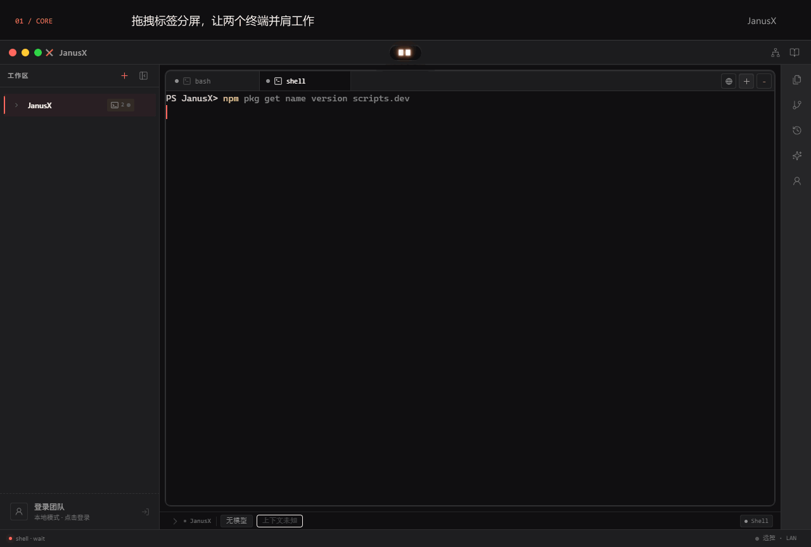
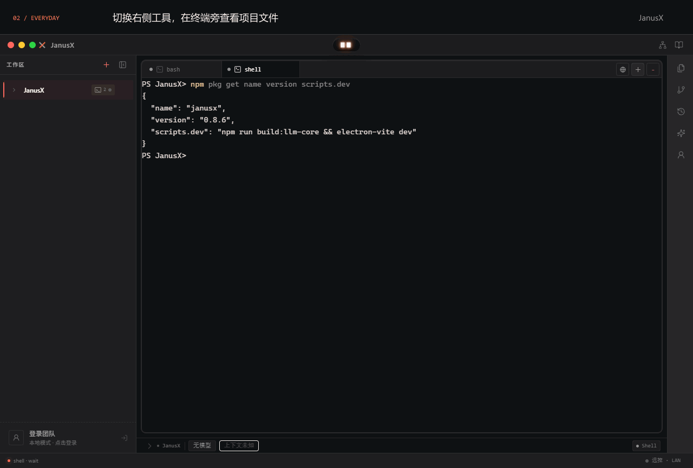
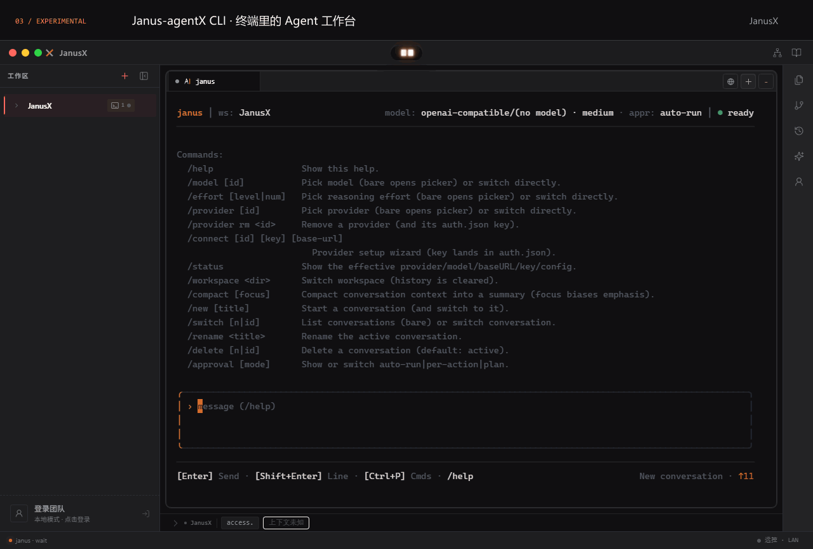
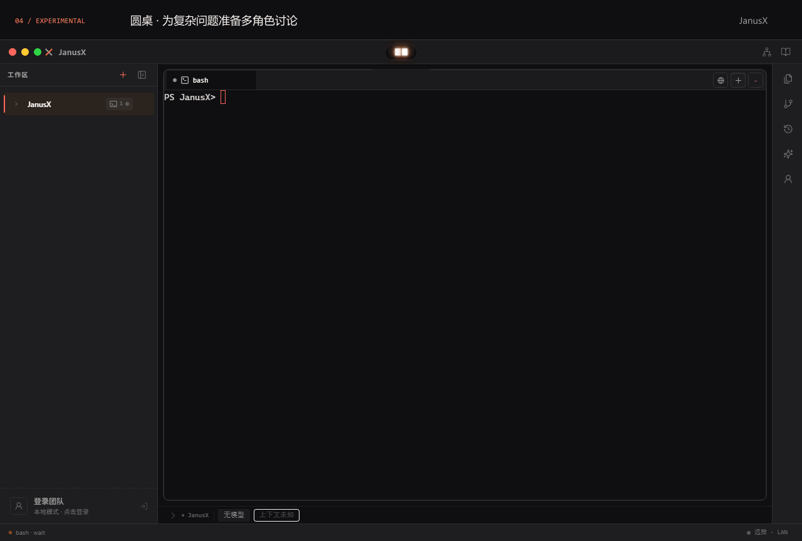
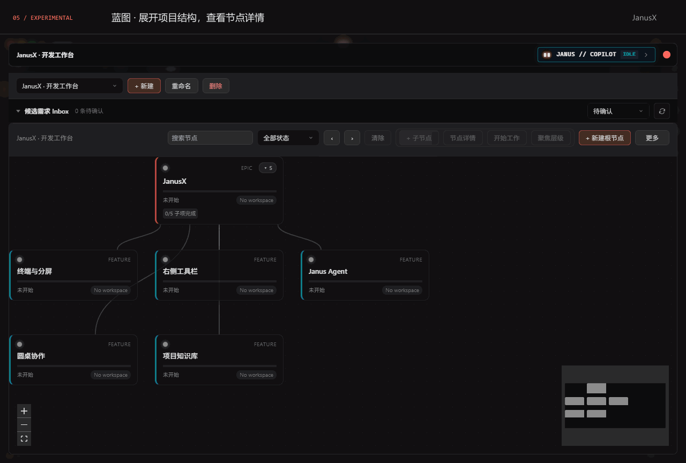
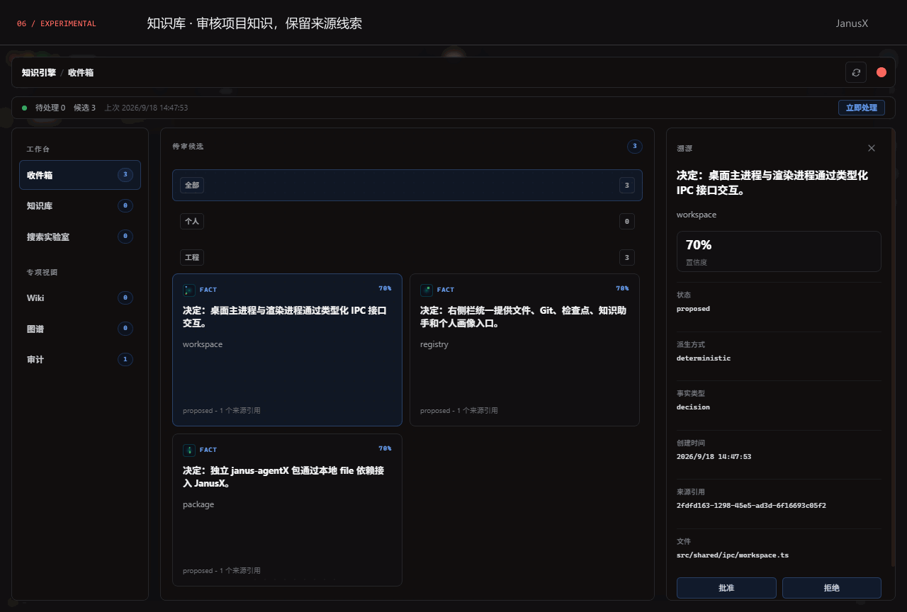

# JanusX

把项目、终端与 AI 编程助手放进同一个桌面工作区。

[下载安装](https://treex-x.github.io/JanusX/) · [版本发布](https://github.com/TreeX-X/JanusX/releases) · [使用与架构文档](wiki/README.md) · [反馈问题](https://github.com/TreeX-X/JanusX/issues)

JanusX 是面向 AI 辅助开发的开源桌面工作台。在项目之间切换，让多个终端并排运行，在右侧查看文件、Git 和检查点；也可以探索 Agent CLI、多角色圆桌、项目蓝图与知识库。



拖动终端标签到面板边缘即可分屏，拖动分隔线调整比例。这里一侧查看 JanusX 的真实提交记录，另一侧查看项目命令。[查看静态画面](wiki/assets/terminal-split.png)

[核心与基础功能](#核心与基础功能) · [创新实验功能](#创新实验功能) · [安装与开始使用](#安装与开始使用) · [从源码开发](#从源码开发)

## 核心与基础功能

### 多工作区、多终端、自由分屏

每个项目拥有自己的工作区与终端。左侧可切换项目、拖拽排序与分组；终端支持标签切换和上下、左右分屏。把标签拖到另一面板中央可以合并回标签页，适合一边运行项目，一边执行测试或使用 AI CLI。

终端入口提供 Shell、Janus、Claude、Codex、OpenCode、Pi。外部 CLI 的运行需要对应工具和登录配置，JanusX 负责把这些工作入口放进同一个桌面环境。

### 右侧栏：常用工具随手打开



文件与 Git 工具可以直接切换，面板宽度可调整、可收起。双击文件打开编辑器，再嵌入主窗口，就能在终端旁查看代码。[查看静态画面](wiki/assets/right-sidebar.png)

| 工具 | 用途 |
| --- | --- |
| 文件 | 浏览和搜索项目文件，打开代码与 Markdown 等文件 |
| Git | 查看分支、工作区变更与差异，处理版本控制操作 |
| 检查点 | 查看开发过程中的检查点记录与相关变更 |
| 知识助手 | 查询当前工作区已接受的知识，查看引用和上下文 |
| 个人画像 | 查看偏好、习惯和近况，进入待审核内容 |

### 文件编辑与项目运行

编辑器支持独立浮窗和嵌入主窗口，Markdown 支持源码、预览与双栏模式。右键工作区可打开「运行配置…」，管理项目启动方式，并使用分析、测试和启动入口。实际运行需要项目自身的命令配置与依赖。

## 创新实验功能

**以下能力处于实验阶段，交互和接口仍在演进。** 它们探索从单个终端到协作、规划和知识积累的工作方式。需要模型推理的操作须先配置可用的提供商、模型和 API Key。

### Janus-agentX CLI · 终端里的 Agent

[janus-agentX](https://github.com/TreeX-X/janus-agentX) 是可独立运行的 Agent 引擎与 `janus` 命令行，支持交互式 TUI、会话切换、工具调用、工作区文件操作、命令与 Git 操作；也提供单轮 `janus chat` 和 JSONL 事件输出，便于脚本集成。



先按 [CLI 仓库安装说明](https://github.com/TreeX-X/janus-agentX#安装) 安装 `janus`，再从 Janus 终端入口启动，也可在系统终端独立运行。GIF 展示本地帮助与命令面板；模型对话需要另行配置。[静态画面](wiki/assets/janus-cli.png)

### 圆桌 · 把一个问题交给多个角色讨论

双击顶部 **Janus Island → 圆桌** 进入。用户提出议题，主持人组织讨论，议题解决者和议题完善者参与推敲；讨论过程可查看角色工作状态、结果卡片，并导出讨论材料。



适合方案比较、需求澄清与设计讨论。GIF 展示议题准备界面，未运行模型讨论；实际讨论需要可用的模型配置。[静态画面](wiki/assets/roundtable.png)

### 蓝图 · 把项目拆成可查看的结构

点击标题栏的 **蓝图工作台**，用树状节点组织目标、功能、任务和问题，查看节点详情、进度与关联信息。节点聚焦和 Janus Copilot 为围绕具体任务工作提供入口。



GIF 中的节点是依据项目功能手动整理的展示蓝图。结构编辑可在本地体验；AI 分析和维护需要模型配置。[静态画面](wiki/assets/blueprint.png)

### 知识库 · 把项目经验变成可追溯的上下文

点击标题栏的 **知识库工作台**。采集内容先进入候选与审核流程，通过后进入知识库；可查询已接受的知识，并查看来源、文件引用和审核记录。工作台还提供 Wiki、关系图谱与检索入口。



适合积累架构决策、项目约定和开发经验。GIF 使用从仓库文档整理的本地条目，展示审核与浏览；自动提炼的效果取决于输入材料及模型配置。[静态画面](wiki/assets/knowledge.png)

所有 GIF 均录自真实桌面应用与 CLI。素材采用独立配置和 JanusX 源码副本，不包含个人凭据；实验功能的准备、编辑与审核画面不代表 AI 已完成任务。

## 安装与开始使用

前往 **[官方下载页](https://treex-x.github.io/JanusX/)**，选择 Windows 10 / 11 的 x64 安装包。

| 版本 | 适合场景 | 使用方式 |
| --- | --- | --- |
| 安装版 `*-x64-setup.exe` | 在电脑上日常使用 | 运行安装向导，选择安装目录，完成后启动 JanusX |
| 便携版 `*-x64-portable.exe` | 希望免安装运行 | 下载后直接运行 `.exe` |

目前公开下载面向 Windows；macOS 与 Linux 的构建命令见下方打包说明，公开安装包以 Releases 实际附件为准。普通用户无需安装 Node.js 或克隆源码。

1. 启动 JanusX；团队登录窗口可以选择「稍后再说，先用本地功能」。
2. 添加本地项目作为工作区，选择 **Shell** 打开终端，即可执行项目命令。
3. 需要 AI 功能时，再配置模型提供商与 API Key；使用 Claude、Codex 等外部 CLI 时，需准备对应工具及其登录配置。

## 从源码开发

仓库使用 npm workspaces，并通过 `file:../janus-agentX/packages/...` 引用同级的 [janus-agentX](https://github.com/TreeX-X/janus-agentX) 包。请先准备 Node.js 与 npm，并按以下目录结构克隆和构建依赖；仅克隆 JanusX 无法完成本地依赖安装。

```bash
git clone https://github.com/TreeX-X/janus-agentX.git
git clone https://github.com/TreeX-X/JanusX.git
cd janus-agentX
npm install
npm run build
cd ../JanusX
npm install
npm run dev
```

## 验证

```bash
npm run verify
```

统一检查包含工作区类型检查和测试、未使用符号检查、生产构建、包边界检查、国际化检查、lint，以及 Windows 上的真实 Electron 桌面冒烟。桌面冒烟覆盖启动、工作区、终端和项目 API。

也可以单独运行端到端检查：

```bash
npm run test:e2e:desktop
npm run test:e2e:island
```

## 打包

```bash
npm run package:win
npm run package:mac
npm run package:linux
```

打包产物位于 `release/<version>/`。平台打包需具备对应系统及构建环境。

架构与模块导航见 [Wiki](wiki/README.md)，优化状态与路线图见 [架构优化计划](wiki/06-architecture-optimization-plan.md)。贡献约定见 [CONTRIBUTING.md](CONTRIBUTING.md)。项目以 [MIT License](LICENSE) 开源。
