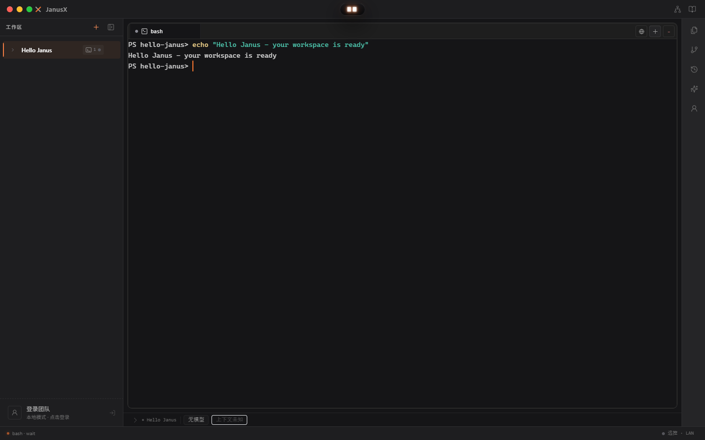
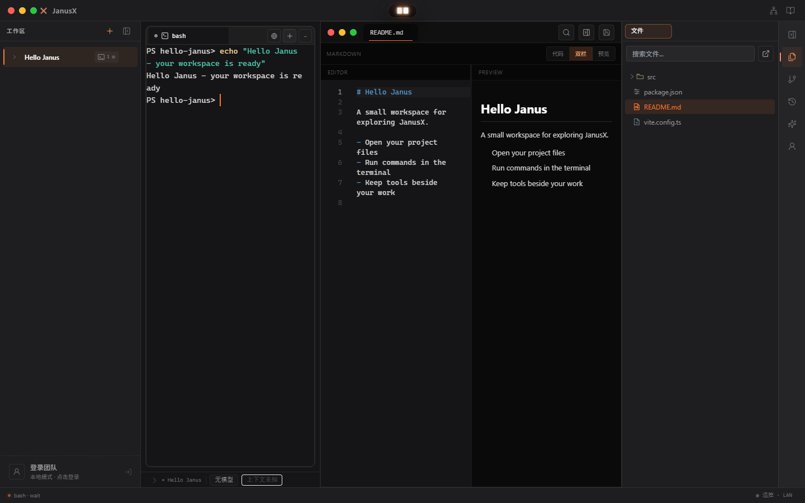
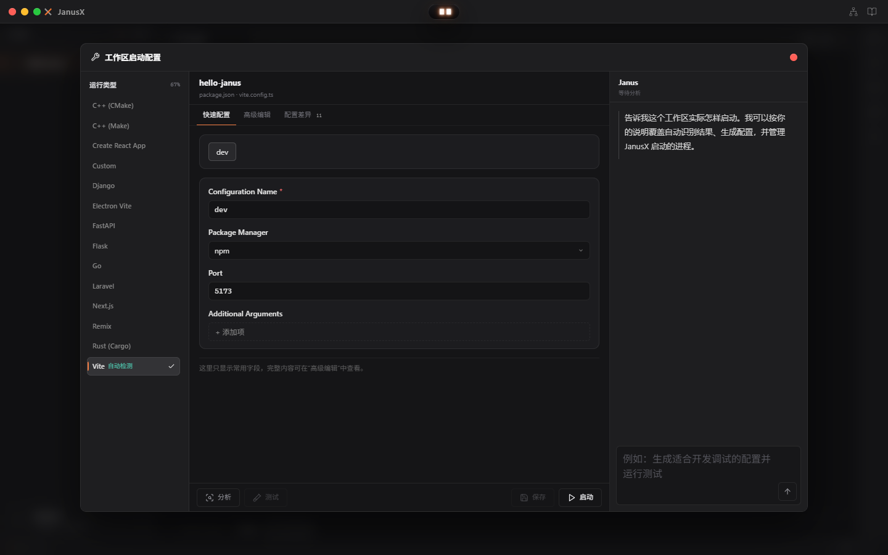

# JanusX

把项目、终端与 AI 编程助手放进同一个桌面工作区。

[下载安装](https://treex-x.github.io/JanusX/) · [版本发布](https://github.com/TreeX-X/JanusX/releases) · [使用与架构文档](wiki/README.md) · [反馈问题](https://github.com/TreeX-X/JanusX/issues)

JanusX 是基于 Electron 的开源桌面应用，提供工作区管理、持久化终端、文件编辑和项目运行工具，也集成了模型提供商、知识工作流、Office 工具与 Janus Blueprint 分析。



> 图片来自独立的 Hello Janus 示例项目，展示真实应用界面，不包含个人项目或模型凭据。

## 安装与开始使用

前往 **[官方下载页](https://treex-x.github.io/JanusX/)**，选择 Windows 10 / 11 的 x64 安装包。

| 版本 | 适合场景 | 使用方式 |
| --- | --- | --- |
| 安装版 `*-x64-setup.exe` | 在电脑上日常使用 | 运行安装向导，选择安装目录，完成后启动 JanusX |
| 便携版 `*-x64-portable.exe` | 希望免安装运行 | 下载后直接运行 `.exe` |

目前公开下载面向 Windows；macOS 与 Linux 的构建命令见下方打包说明，公开安装包以 Releases 实际附件为准。普通用户无需安装 Node.js 或克隆源码。

1. 启动 JanusX；团队登录窗口可以选择「稍后再说，先用本地功能」。
2. 添加本地项目作为工作区，选择 **Shell** 打开终端，即可执行项目命令。
3. 需要 AI 功能时，再配置模型提供商与 API Key；使用 Claude、Codex 等外部 CLI 时，需准备对应工具及其登录配置。

## 看看实际工作界面

### 工作区与终端一起管理

从左侧切换项目，在当前项目中使用 Shell 或 AI CLI。文件、Git 等工具集中在右侧工具栏，便于在开发过程中随时查看。

### 文件编辑紧邻终端

文件可以在独立窗口打开，也可以嵌入主窗口，在查看项目文件时保留终端上下文。



### 为项目配置运行方式

右键工作区打开「运行配置…」，查看项目运行相关设置，并使用分析、测试和启动入口。实际命令与运行结果取决于项目自身的配置和依赖。



## 从源码开发

仓库使用 npm workspaces，并通过 `file:../janus-agentX/packages/...` 引用同级的 [janus-agentX](https://github.com/TreeX-X/janus-agentX) 包。请先准备 Node.js 与 npm，并按以下目录结构克隆和构建依赖；仅克隆 JanusX 无法完成本地依赖安装。

```bash
git clone https://github.com/TreeX-X/janus-agentX.git
git clone https://github.com/TreeX-X/JanusX.git
cd janus-agentX
npm install
npm run build
cd ../JanusX
npm install
npm run dev
```

## 验证

```bash
npm run verify
```

统一检查包含工作区类型检查和测试、未使用符号检查、生产构建、包边界检查、国际化检查、lint，以及 Windows 上的真实 Electron 桌面冒烟。桌面冒烟覆盖启动、工作区、终端和项目 API。

也可以单独运行端到端检查：

```bash
npm run test:e2e:desktop
npm run test:e2e:island
```

## 打包

```bash
npm run package:win
npm run package:mac
npm run package:linux
```

打包产物位于 `release/<version>/`。平台打包需具备对应系统及构建环境。

架构与模块导航见 [Wiki](wiki/README.md)，优化状态与路线图见 [架构优化计划](wiki/06-architecture-optimization-plan.md)。贡献约定见 [CONTRIBUTING.md](CONTRIBUTING.md)。项目以 [MIT License](LICENSE) 开源。
