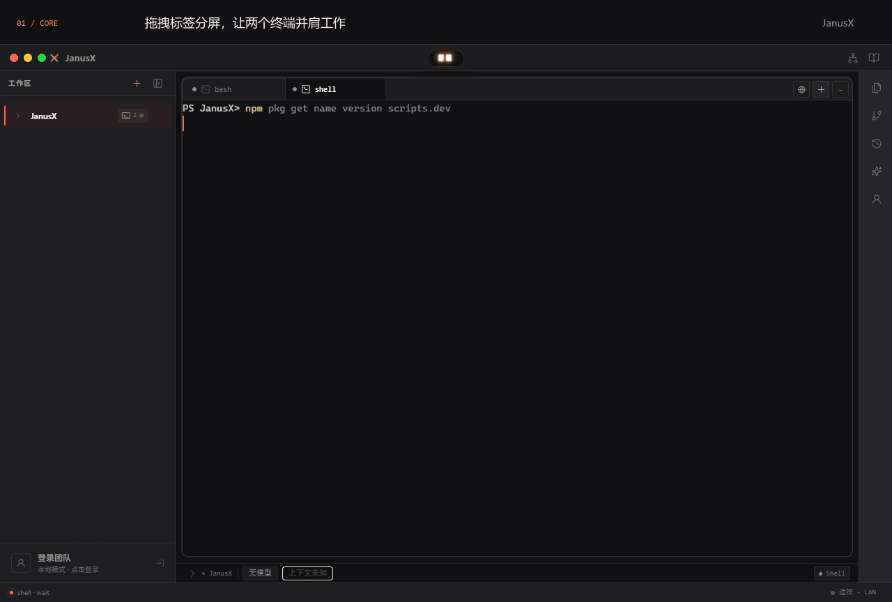
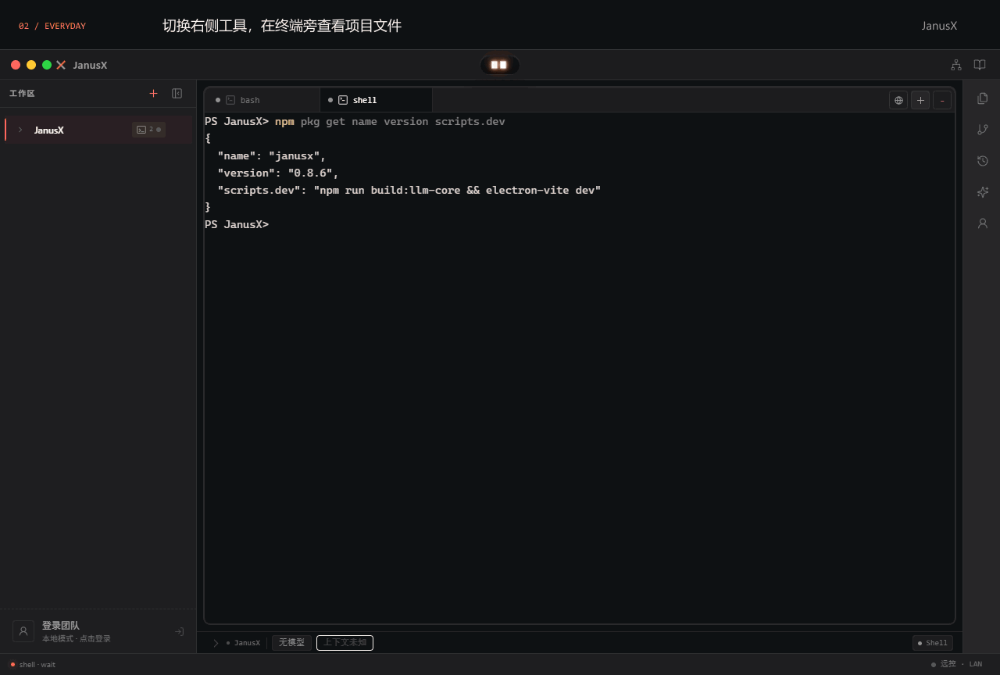
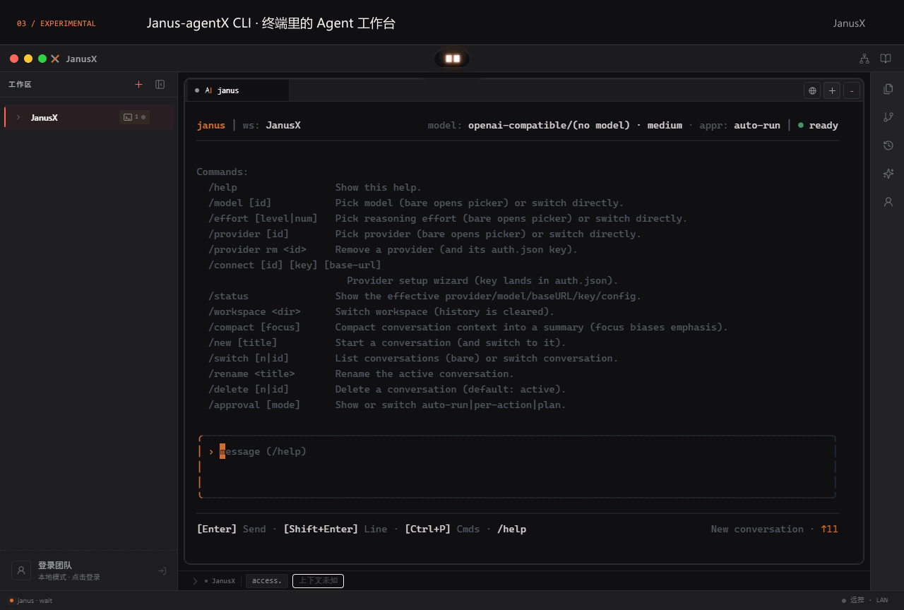
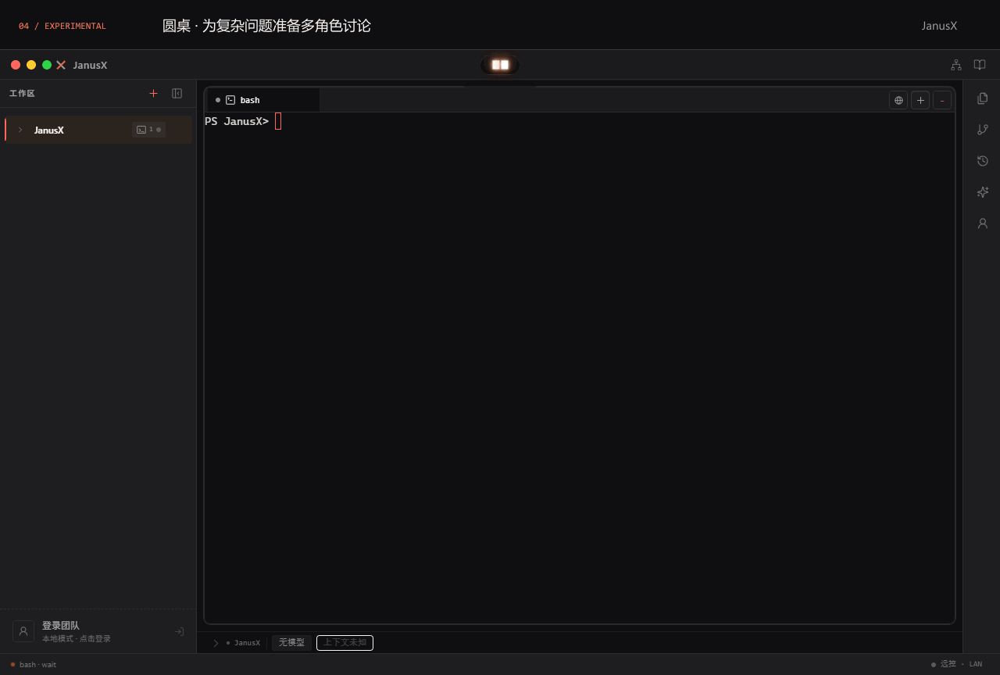
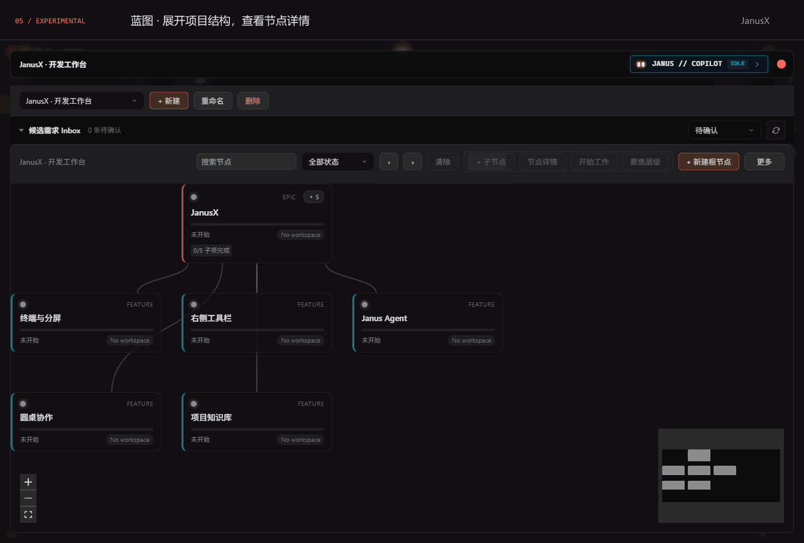
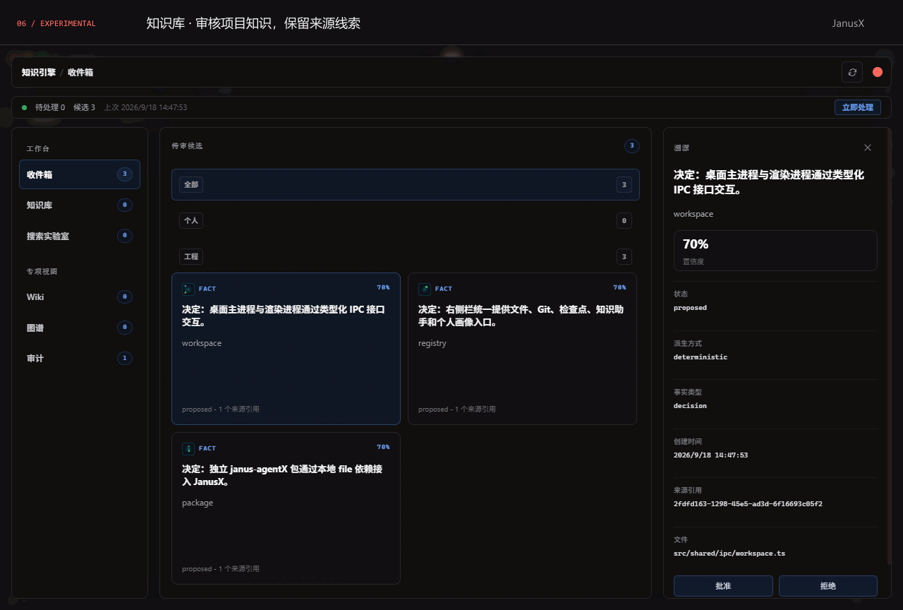

<div align="center">

# JanusX

### 把项目、终端与 AI 编程助手放进同一个桌面工作区

<p align="center">
  
</p>

**一个面向 AI 辅助开发的开源桌面工作台 —— 多项目切换、多终端分屏、文件 / Git / 检查点随手打开**

[](./LICENSE)
[](https://github.com/TreeX-X/JanusX/releases)
[](https://github.com/TreeX-X/JanusX/releases)
[](https://treex-x.github.io/JanusX/)


[下载安装](https://treex-x.github.io/JanusX/) · [版本发布](https://github.com/TreeX-X/JanusX/releases) · [使用与架构文档](wiki/README.md) · [反馈问题](https://github.com/TreeX-X/JanusX/issues)

</div>

---

## 这是什么？

JanusX 是面向 AI 辅助开发的**开源桌面工作台**。你仍然在本地写代码、用终端跑命令、用 AI CLI 做任务，但它们不再散落在各个窗口里：

- **多工作区**：每个项目拥有自己的工作区，左侧切换项目、拖拽排序与分组。
- **多终端、自由分屏**：终端支持标签切换和上下、左右分屏；标签可拖到另一面板合并，或拖到边缘分屏。
- **多 CLI 同处一室**：终端入口提供 Shell、Janus、Claude、Codex、OpenCode、Pi，一边运行项目，一边执行测试或使用 AI CLI。
- **右侧工具栏**：文件、Git、检查点、知识助手、个人画像随手打开，面板宽度可调、可收起。
- **编辑与运行**：编辑器支持独立浮窗和嵌入主窗口，Markdown 支持源码 / 预览 / 双栏；右键工作区可打开「运行配置…」管理启动、分析与测试入口。

<p align="center">
  
  <br/>
  <sub>左侧是 Janus-agentX，右侧是 Claude Code。拖动终端标签到面板边缘即可分屏，拖动分隔线调整比例</sub>
</p>

> GIF 展示两个 CLI 的真实启动界面与分屏操作，未运行模型任务。[查看静态画面](wiki/assets/terminal-split.png)

---

## 为什么需要它？

单个终端 + 浏览器 + 编辑器各干各的，真正的成本不是“工具不够强”，而是上下文来回切换。JanusX 把常见 friction 变成一个工作区里的默认布局：

| 痛点 | JanusX 的处理方式 |
|---|---|
| **项目切来切去，终端和状态全丢** | 每个项目独立工作区，终端、编辑器、运行配置跟随项目保留，左侧一键切换 |
| **一边跑服务，一边测、一边问 AI，窗口叠满** | 终端标签 + 上下 / 左右分屏，标签可拖拽合并或拆分，并排看运行日志与 AI CLI |
| **AI CLI 与项目各管各的** | Shell、Janus、Claude、Codex、OpenCode、Pi 同一终端面板，CLI 旁边就是代码与 Git |
| **找文件、看改动总要跳应用** | 右侧栏常驻文件、Git、检查点，文件双击打开、可嵌入主窗口对照看 |
| **启动方式口口相传** | 工作区「运行配置…」把启动、分析、测试入口收拢到一处，实际运行仍用项目自有命令 |

---

## 30 秒理解工作原理

```text
你
│
├─ 添加本地项目作为工作区
│
▼
JanusX 桌面工作台
├─ 左侧：切换 / 排序 / 分组项目
├─ 中间：终端（Shell / Janus / Claude / Codex / OpenCode / Pi）+ 编辑器
│   └─ 标签切换 · 上下 / 左右分屏 · 拖拽合并与拆分
├─ 右侧：文件 · Git · 检查点 · 知识助手 · 个人画像
└─ 标题栏：蓝图工作台 · 知识库工作台（实验功能，见文末）
```

<p align="center">
  
  <br/>
  <sub>Janus-agentX 保留在终端中，右侧随时切换文件与 Git 工具，双击文件可嵌入主窗口对照阅读</sub>
</p>

> [查看静态画面](wiki/assets/right-sidebar.png)

一句话：**JanusX 不替代你的 CLI 与模型配置，它把项目、终端、编辑器和常用工具收进同一个桌面布局，让并排工作成为默认。**

---

## 核心与基础功能

### 多工作区、多终端、自由分屏

每个项目拥有自己的工作区与终端。左侧可切换项目、拖拽排序与分组；终端支持标签切换和上下、左右分屏。把标签拖到另一面板中央可以合并回标签页，适合一边运行项目，一边执行测试或使用 AI CLI。

终端入口提供 Shell、Janus、Claude、Codex、OpenCode、Pi。Janus-agentX、Claude Code 等 CLI 需要先安装对应工具；执行模型任务前，还需完成各自的登录或模型配置。JanusX 负责把这些工作入口放进同一个桌面环境。

### 右侧栏：常用工具随手打开

| 工具 | 用途 |
| --- | --- |
| 文件 | 浏览和搜索项目文件，打开代码与 Markdown 等文件 |
| Git | 查看分支、工作区变更与差异，处理版本控制操作 |
| 检查点 | 查看开发过程中的检查点记录与相关变更 |
| 知识助手 | 查询当前工作区已接受的知识，查看引用和上下文 |
| 个人画像 | 查看偏好、习惯和近况，进入待审核内容 |

面板宽度可调整、可收起。双击文件打开编辑器，再嵌入主窗口，就能在 CLI 旁查看项目代码。

### 文件编辑与项目运行

编辑器支持独立浮窗和嵌入主窗口，Markdown 支持源码、预览与双栏模式。右键工作区可打开「运行配置…」，管理项目启动方式，并使用分析、测试和启动入口。实际运行需要项目自身的命令配置与依赖。

---

## 安装与开始使用

前往 **[官方下载页](https://treex-x.github.io/JanusX/)**，选择 Windows 10 / 11 的 x64 安装包。

| 版本 | 适合场景 | 使用方式 |
| --- | --- | --- |
| 安装版 `*-x64-setup.exe` | 在电脑上日常使用 | 运行安装向导，选择安装目录，完成后启动 JanusX |
| 便携版 `*-x64-portable.exe` | 希望免安装运行 | 下载后直接运行 `.exe` |

目前公开下载面向 Windows；macOS 与 Linux 的构建命令见下方打包说明，公开安装包以 Releases 实际附件为准。普通用户无需安装 Node.js 或克隆源码。

---

---

## 从源码开发

仓库使用 npm workspaces，并通过 `file:../janus-agentX/packages/...` 引用同级的 [janus-agentX](https://github.com/TreeX-X/janus-agentX) 包。请先准备 Node.js 与 npm，并按以下目录结构克隆和构建依赖；仅克隆 JanusX 无法完成本地依赖安装。

```bash
git clone https://github.com/TreeX-X/janus-agentX.git
git clone https://github.com/TreeX-X/JanusX.git
cd janus-agentX
npm install
npm run build
cd ../JanusX
npm install
npm run dev
```

### 验证

```bash
npm run verify
```

统一检查包含工作区类型检查和测试、未使用符号检查、生产构建、包边界检查、国际化检查、lint，以及 Windows 上的真实 Electron 桌面冒烟。桌面冒烟覆盖启动、工作区、终端和项目 API。

也可以单独运行端到端检查：

```bash
npm run test:e2e:desktop
npm run test:e2e:island
```

### 打包

```bash
npm run package:win
npm run package:mac
npm run package:linux
```

打包产物位于 `release/<version>/`。平台打包需具备对应系统及构建环境。

架构与模块导航见 [Wiki](wiki/README.md)，优化状态与路线图见 [架构优化计划](wiki/06-architecture-optimization-plan.md)。贡献约定见 [CONTRIBUTING.md](CONTRIBUTING.md)。

---

## 创新实验功能

> **以下能力处于实验阶段，交互和接口仍在演进。** 它们探索从单个终端到协作、规划和知识积累的工作方式。需要模型推理的操作须先配置可用的提供商、模型和 API Key。

<details>
<summary><b>Janus-agentX CLI · 终端里的 Agent</b></summary>

[janus-agentX](https://github.com/TreeX-X/janus-agentX) 是可独立运行的 Agent 引擎与 `janus` 命令行，支持交互式 TUI、会话切换、工具调用、工作区文件操作、命令与 Git 操作；也提供单轮 `janus chat` 和 JSONL 事件输出，便于脚本集成。

<p align="center">
  
</p>

先按 [CLI 仓库安装说明](https://github.com/TreeX-X/janus-agentX#安装) 安装 `janus`，再从 Janus 终端入口启动，也可在系统终端独立运行。GIF 展示本地帮助与命令面板；模型对话需要另行配置。[静态画面](wiki/assets/janus-cli.png)

</details>

<details>
<summary><b>圆桌 · 把一个问题交给多个角色讨论</b></summary>

双击顶部 **Janus Island → 圆桌** 进入。用户提出议题，主持人组织讨论，议题解决者和议题完善者参与推敲；讨论过程可查看角色工作状态、结果卡片，并导出讨论材料。

<p align="center">
  
</p>

适合方案比较、需求澄清与设计讨论。GIF 展示议题准备界面，未运行模型讨论；实际讨论需要可用的模型配置。[静态画面](wiki/assets/roundtable.png)

</details>

<details>
<summary><b>蓝图 · 把项目拆成可查看的结构</b></summary>

点击标题栏的 **蓝图工作台**，用树状节点组织目标、功能、任务和问题，查看节点详情、进度与关联信息。节点聚焦和 Janus Copilot 为围绕具体任务工作提供入口。

<p align="center">
  
</p>

GIF 中的节点是依据项目功能手动整理的展示蓝图。结构编辑可在本地体验；AI 分析和维护需要模型配置。[静态画面](wiki/assets/blueprint.png)

</details>

<details>
<summary><b>知识库 · 把项目经验变成可追溯的上下文</b></summary>

点击标题栏的 **知识库工作台**。采集内容先进入候选与审核流程，通过后进入知识库；可查询已接受的知识，并查看来源、文件引用和审核记录。工作台还提供 Wiki、关系图谱与检索入口。

<p align="center">
  
</p>

适合积累架构决策、项目约定和开发经验。GIF 使用从仓库文档整理的本地条目，展示审核与浏览；自动提炼的效果取决于输入材料及模型配置。[静态画面](wiki/assets/knowledge.png)

</details>

所有 GIF 均录自真实桌面应用与 CLI。素材采用独立配置和 JanusX 源码副本，不包含个人凭据；实验功能的准备、编辑与审核画面不代表 AI 已完成任务。

---

## 关于

JanusX 是一个真实投入社区使用的开源实验项目，目标是让 AI 辅助开发有一个顺手的桌面落点：项目、终端、AI CLI 与常用工具同处一室，稳定的基础体验在前，激进的协作实验在后。

欢迎讨论、建议与贡献。Fork 本仓库提交 Pull Request，或在 Issues 中分享你的使用场景与问题，贡献约定见 [CONTRIBUTING.md](CONTRIBUTING.md)。

公众号：**TreeX-AI** · 如果对你有帮助，欢迎 Star。

**友情链接**：[Linux.Do](https://linux.do/) —— 为技术爱好者和专业人士提供高质量讨论与资源分享的社区。

---

<div align="center">

[MIT License](./LICENSE) · 自由使用 / 修改 / 再分发 · Made by [@TreeX-X](https://github.com/TreeX-X)

</div>

## Star 历史

<a href="https://www.star-history.com/#TreeX-X/JanusX&Date">
  <picture>
    <source media="(prefers-color-scheme: dark)" srcset="https://api.star-history.com/chart?repos=TreeX-X/JanusX&type=date&theme=dark&legend=top-left" />
    <source media="(prefers-color-scheme: light)" srcset="https://api.star-history.com/chart?repos=TreeX-X/JanusX&type=date&theme=dark&legend=top-left" />
    
  </picture>
</a>
