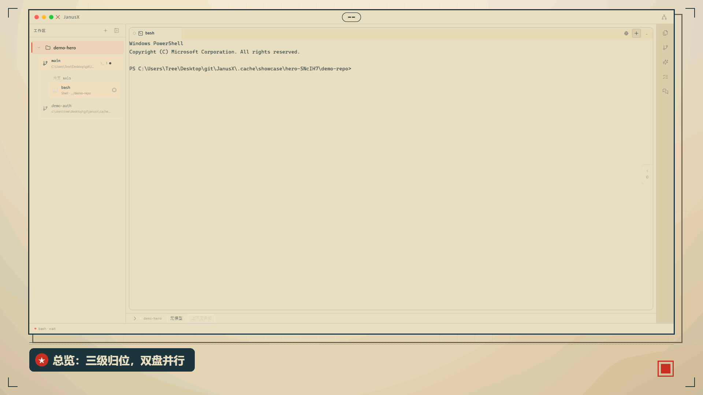
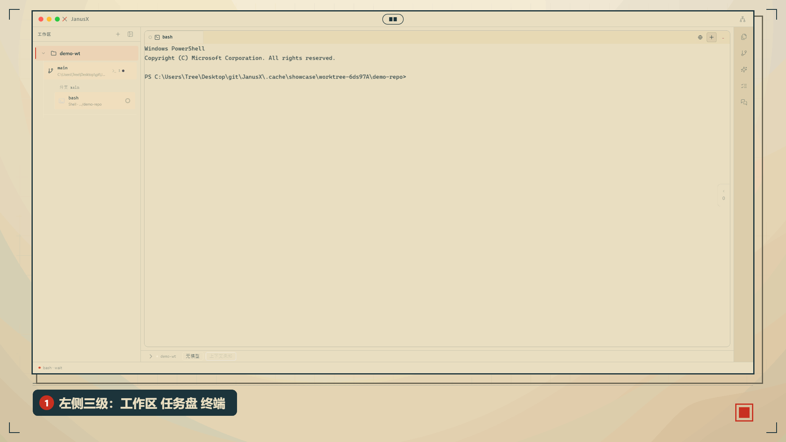
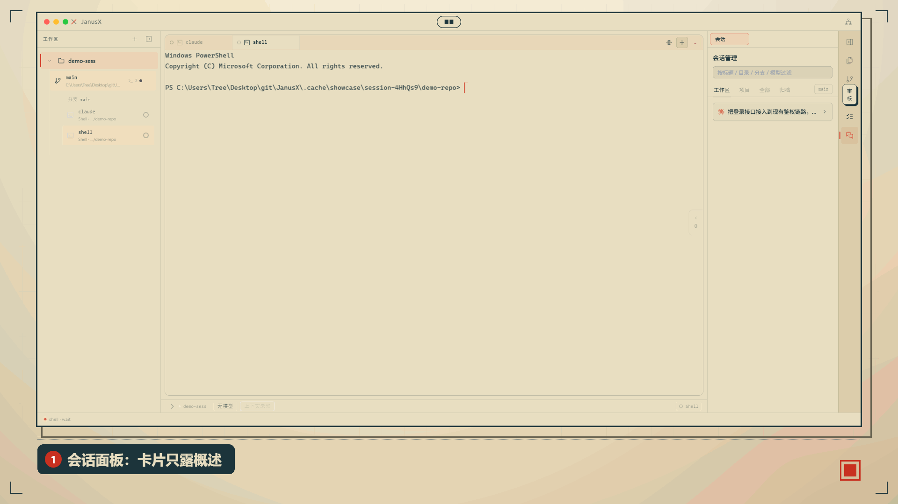
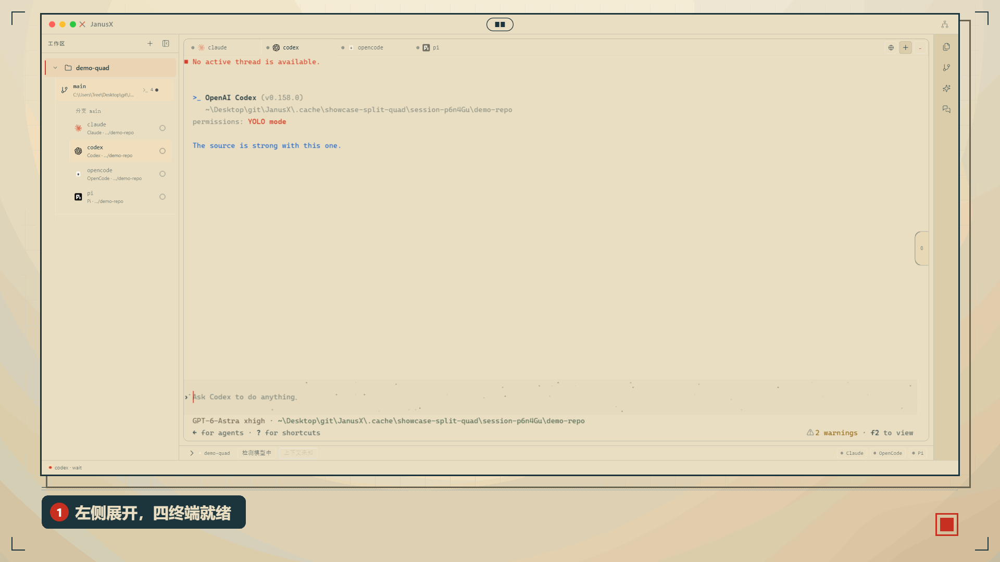
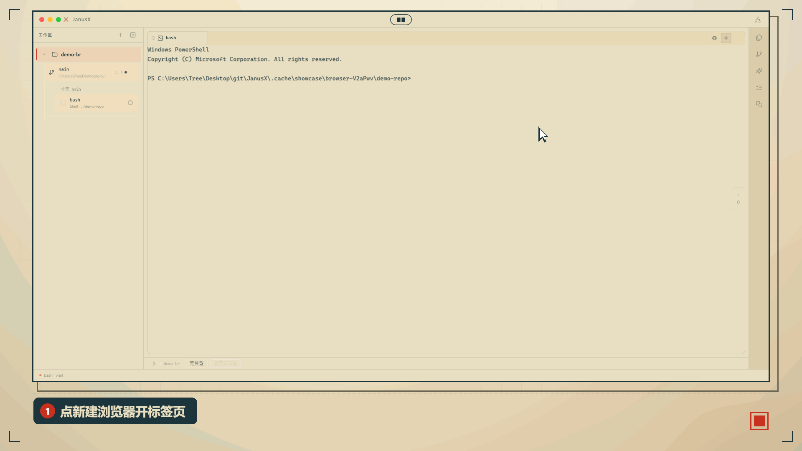
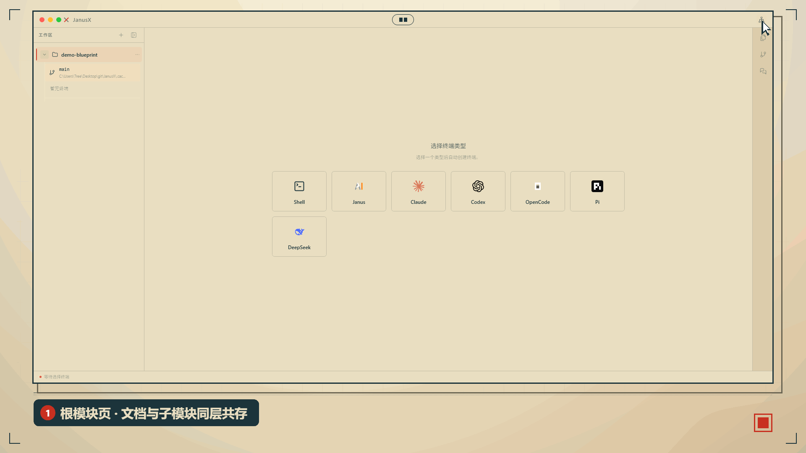
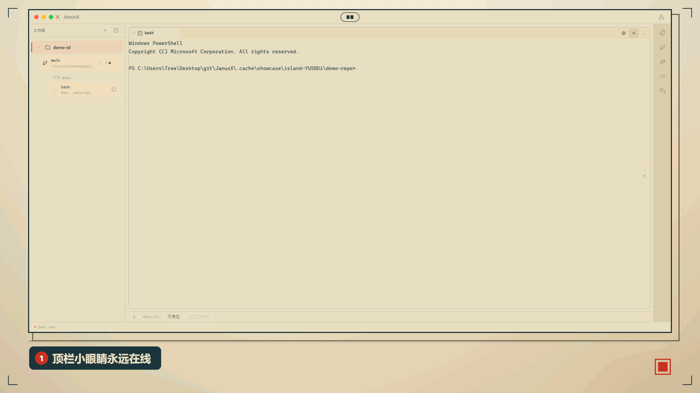
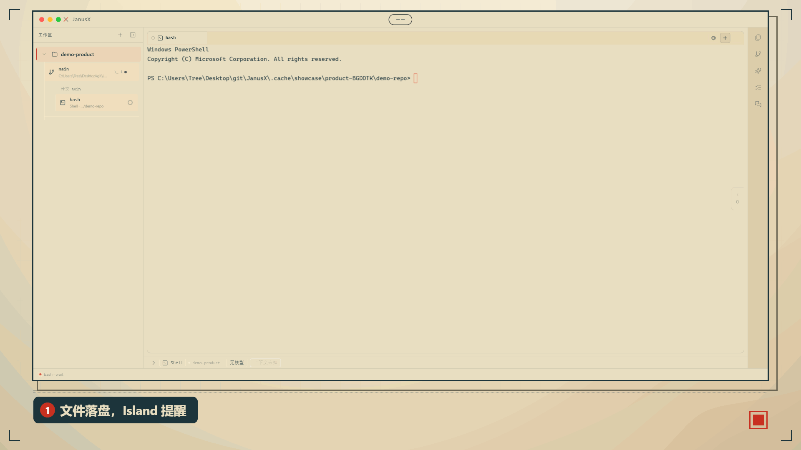

<p align="center">
  
  &nbsp;
  
</p>

<div align="center">

# JanusX

### 把项目、终端与 AI 编程助手放进同一个桌面工作区

**一个面向 AI 辅助开发的开源桌面工作台 —— 多项目切换、多终端分屏、文件 / Git / 检查点随手打开**

[](./LICENSE)
[](https://github.com/TreeX-X/JanusX/releases)
[](https://github.com/TreeX-X/JanusX/releases)
[](https://treex-x.github.io/JanusX/)


[下载安装](https://treex-x.github.io/JanusX/) · [版本发布](https://github.com/TreeX-X/JanusX/releases) · [使用与架构文档](wiki/README.md) · [反馈问题](https://github.com/TreeX-X/JanusX/issues)

> Second test Oct 10 (not v1.0 stable) · 10.10 二测（非正式版）

</div>

---

## 一眼看懂 JanusX

> 以下全部为 **新 planche 石板色主题**（纸 `#EFE4C5` / 墨 `#1C343B` / 朱红 `#D43D2A`）**真实应用录制**：
> 用 JanusX 构建产物拉起干净隔离环境，建示例 git 仓库，实地走一遍九项基础功能。
> 每张图都是「虚拟影棚背景 + 中央真实软件窗」，GIF 里的鼠标为操作轨迹回放（点击处带红圈），方便对照上手。

<p align="center">
  
  <br/>
  <sub>总览（真实录制）：左侧「工作区 → worktree → 终端」三级（main + feature/auth-retry 双盘），中间 PowerShell 跑通 `git log`，右侧文件树，顶栏 Island 胶囊在线</sub>
</p>

```text
你
│
├─ 添加本地项目作为工作区
│
▼
JanusX 桌面工作台（planche 石板色）
├─ 左侧：工作区 → worktree 分支 → 终端（三级归位，状态点一眼可见）…… 01
├─ 右侧：会话卡片（搜索 / scope / 时间线 / 还原点 diff）……………… 02
│        文件树（跟随当前 worktree scope）………………………………… 03
├─ 中间：终端分屏（拖标签到边缘分屏，拖回中央合并）…………………… 04
│        内置浏览器（地址栏 / 多标签 / 弹出或嵌入）……………………… 05
├─ 底部：Quick Note（编辑 / 分栏 / 预览，高度可拖）…………………… 06
├─ 顶栏：蓝图工作台（工具栏 + 画布 + Copilot）…………………………… 07
├─ 顶栏：Janus Island（胶囊 → peek 速览 → 监控与对话大窗）…………… 08
└─ 右侧：产物工作区（新增文件提醒 / 交互预览 / 多标签 / 重新加载）… 09
```

一句话：**JanusX 不替代你的 CLI 与模型配置，它把项目、终端、编辑器、浏览器、速记和常用工具收进同一个桌面布局，让并排工作成为默认。**

---

## 9 项基础功能演示

### 01 · 左侧工作区：Worktree 管理

一个项目，多条分支并行开工：`main` 跑服务、`feature/auth-retry` 改登录，各盘互不干扰。切换 worktree = 切换文件树 scope，终端自动按盘归位。

<p align="center">
  
  <br/>
  <sub>左侧三级巡览（工作区 → 任务盘 → 终端）→ ⋯ 更多操作「新建任务盘…」（逐字填表，真创建）→ 悬停分支行合并（看 diff，一键合回 origin/main）→ 切回主盘 git log 验证；徽标计数，状态看圆点</sub>
</p>

- **三级结构**：工作区 → worktree（分支 + 路径）→ 终端（`Janus / Shell / Claude / Codex / OpenCode / Pi`），状态圆点区分运行 / 等待 / 报错 / 空闲。
- **新建不断服务**：点 `＋` 或工作区行 `⋯` 菜单，输入分支名、选基线即可；`main` 的服务不受影响。
- **分组排序**：拖拽排序，悬停成组，分组可重命名 / 解散 / 移出。
- **收尾动作**：非主盘可 `Ship` 合回主线或删除，保留分支可留档。

---

### 02 · 右侧工作区：会话管理

每个 AI 对话都有始有终：卡片只露概述，点开看首次提示全文 + 近 2 轮预览，进详情窗读全量、看 diff、做恢复。内部会话自带还原点，外部 CLI 会话只读、可 Resume。

<p align="center">
  
  <br/>
  <sub>演示会话 2 轮次 2 还原点：scope 四档切换 → 搜索框逐字过滤 → 点开卡片看首次提示与两轮时间线 →「查看详情」进大窗读全量 → 还原点展开看 chain.ts 真实 Diff → 两段式恢复点到为止（不真恢复）</sub>
</p>

- **三层渐进**：L1 卡片（标题 + 模型 + 轮次 + 还原点数）→ L2 行内预览（首次提示全文 + 近 2 轮 + 还原点条）→ L3 中央大窗（全量时间线 + 右侧 diff 独立面板）。
- **还原点机制**：Agent 会话每轮绑定文件快照，详情窗内可看 diff、做两段式恢复（恢复前标明会被裁剪的后续还原点）。外部 CLI 会话只读 transcript、可 Resume；归档会话只读不可恢复。
- **Scope 与搜索**：`工作区 / 项目 / 全部 / 已归档` 四档，搜索框按标题 / 目录 / 分支 / 模型过滤；空 scope 会提示别处还有多少条。
- **外部与归档**：外部会话（软件外产生的 CLI 会话）无还原点、只读 transcript，Resume 走提供方自己的命令（如 `claude --resume`）；归档会话只读不可恢复。

---

### 03 · 文件树管理

文件树永远跟随当前 worktree：切盘自动刷新，搜得到、打得开、对得上。双击文件嵌入中部主窗，左边 CLI、右边代码，改一行对一行。

<p align="center">
  
  <br/>
  <sub>切盘自动跟随 scope（demo-auth 盘冒出 auth.ts，切回即收回）· 搜索框逐字过滤，改动行尾徽标计数 · 双击 chain.ts 弹出独立编辑窗 → 一键嵌入主窗，Monaco 高亮与终端左右对照</sub>
</p>

- **Scope 跟随**：`scope = 当前 worktree 路径`，切换 worktree 文件树自动跟随，不用来回找目录。
- **搜索与状态**：顶栏搜索框即输即过滤；有 Git 改动时行尾直接标出增删数。
- **双击嵌入**：双击文件嵌入中部主窗（Monaco，高亮与主题一致），与终端左右并排对照。

---

### 04 · 中部分屏：自由拖拽

一边跑服务，一边开新终端：Claude、Codex、OpenCode、Pi 四个 AI CLI 同处一室，拖标签到边缘即分屏，拖到底部即上下分屏，拖分隔线调比例。每个 worktree 独立一套终端。

<p align="center">
  
  <br/>
  <sub>Codex 标签拖到右边缘 → 左右分屏；OpenCode / Pi 依次拖到底部 → 田字格四路并行；拖分隔线调比例</sub>
</p>

- **拖拽语义**：落点中央 = 合并到本 pane，落点边缘 = 平分分屏；拖拽过程有落点预览，松手前自解释。
- **终端入口**：`Shell / Janus / Claude / Codex / OpenCode / Pi`，Janus-agentX、Claude Code 等需先安装对应工具并完成登录 / 模型配置。
- **上下文用量**：AI 终端 tab 上显示模型与上下文用量（Shell 显示"无模型"），悬停看明细。

---

### 05 · 内置浏览器

文档、预览、调试不跳应用：地址栏导航、前后退 / 刷新、多标签，作为分屏 tab 与终端并排。

<p align="center">
  
  <br/>
  <sub>点 🌐 新建浏览器 → 地址栏逐字输入回车打开两页 → 后退 / 前进 / 刷新走历史 → ＋ 新建标签页双页并存</sub>
</p>

- **双载体**：pane 内嵌与独立窗口共用同一套 tab 条 + 导航 + 地址栏；网页本体由主进程 WebContentsView 承载。
- **Agent 可控**：徽标亮起时 Janus 可读页面状态，帮你断言预览结果；拖拽标签页期间原生视图自动让位，落点才能命中。

---

### 06 · 底部 Markdown：Quick Note

底部速记抽屉常驻中部：编辑 / 分栏 / 预览一键切，横条上下拖调高度。今日收尾、联调记录随手写，GFM 任务列表实时渲染。

<p align="center">
  
  <br/>
  <sub>底部抽屉切到 Markdown → ＋ 新建笔记逐字书写 → 分栏左写右看 → 纯预览看 GFM 任务列表渲染</sub>
</p>

- **三视图**：编辑 / 预览 / 分栏（左写右看），自动保存，字数统计在底栏。
- **高度可拖**：拽住分隔条即可，窄 pane 下不挤占终端。
- **直达终端**：备忘可导出 `md / txt / html`，也可一键粘贴到终端执行。

---

### 07 · 蓝图：把项目拆成看得见的结构

在设置的创新功能中开启蓝图后，点击标题栏 **蓝图工作台**。顶部按工作区切换，**系统结构** 展示项目、模块与接口连接，**全部 Note** 展示规划和决策等记录；左侧阅读节点正文与关联信息，右侧 Janus Copilot 围绕当前焦点对话。

<p align="center">
  
  <br/>
  <sub>真实应用录制：打开项目与模块结构 → 查看文件对照模块的职责和接口 → 追溯关联决策 → 切换全部 Note → 聚焦模块并起草维护指令。示例 Note 保存在隔离演示仓库；指令未发送，不调用模型。</sub>
</p>

- **三列布局**：节点预览（目标 / 验收项 / 关联文件）· 项目规划图（parent / 接口 / 跨工作区边）· Janus 对话（带着当前焦点的一批 Note）。
- **接口契约**：模块声明`提供 / 需要`的接口，悬空需求与闲置供给在图上一眼看出。
- **单一控制面**：画布不承载写操作。对话框上方一条动作栏，三个主动作：`整理 Note` 把讨论整理成可审批提案（一次点击可全批非删除项，删除需单独确认）、`目标终端` 选派发目标、`派发` 让 Janus 整理涉及 Note 并写成实施简报预填进终端。需求正文以 Note 为准，经提案审批落盘。
- **只读优先**：结构编辑本地可体验；AI 分析和维护需要模型配置。蓝图存为标准 harness note，规划与证据分离又可绑定。

---

### 08 · Island 对话：顶栏小眼睛，随叫随到

顶栏小眼睛永远在线：双击展开监控与对话大窗——左侧核心可视化（当前终端之眼 + 身份 / 工作区 / 状态 / 引擎），右侧任务总览与产物工作区；`监控 / 对话` 双 tab 切换。

<p align="center">
  
  <br/>
  <sub>双击 Island → 监控大窗展开 → 核心可视化随终端状态而动 → 身份 / 工作区 / 状态 / 引擎一目了然</sub>
</p>

- **三态呈现**：`collapsed 胶囊 → peek 速览（一切就绪 / 通知胶囊）→ expanded 监控与对话大窗`。
- **手势**：单击对话 · 双击展开 · 长按跑项目 · 下滑切蓝图（手势与 code 对照 `JanusIsland` / `useIslandGesture`）。
- **工程上下文**：当前工作区与终端状态自动带入（演示中为 `demo-login` · `WAIT` · `SHELL`），不用反复说明环境。

---

### 09 · 产物工作区：就地查看交付成果

文件生成后，点击 Island 提醒即可打开右侧产物工作区；也可双击 Island，在监控页的产物列表中选择文件。HTML 页面可直接交互，多个文件以标签保留，方便来回对照。

<p align="center">
  
  <br/>
  <sub>本地示例文件实录：新增 HTML 触发提醒 → 点击打开并拖宽预览 → 查看验收明细 → 从监控列表打开 JSON 结果 → 切换标签 → 修改报告并从磁盘重新加载；无需模型调用</sub>
</p>

- **本次工作成果**：列表收集本次打开工作区后新增或修改的文件，新文件通过 Island 提醒直达预览。
- **就地预览**：支持 HTML、Markdown、图片、文本及 Office 文件；本演示使用 HTML 与 JSON。
- **对照与刷新**：标签切换、拖动面板宽度；文件修改后可点击「从磁盘重新加载」查看内容。

演示的步骤与字幕按功能独立维护，背景、鼠标和节奏共用配置。录制与合成命令见 [演示脚本说明](scripts/showcase/README.md)。

---

## 为什么需要它？

单个终端 + 浏览器 + 编辑器各干各的，真正的成本不是“工具不够强”，而是上下文来回切换。JanusX 把常见 friction 变成一个工作区里的默认布局：

| 痛点 | JanusX 的处理方式 |
|---|---|
| **项目切来切去，终端和状态全丢** | 每个项目独立工作区，终端、编辑器、运行配置跟随项目保留，左侧一键切换（01） |
| **一边跑服务，一边测、一边问 AI，窗口叠满** | 终端标签 + 上下 / 左右分屏，标签可拖拽合并或拆分，并排看运行日志与 AI CLI（04） |
| **AI CLI 与项目各管各的** | Shell、Janus、Claude、Codex、OpenCode、Pi 同一终端面板，CLI 旁边就是代码与 Git（04） |
| **找文件、看改动总要跳应用** | 文件树跟随 worktree（03），会话时间线自带还原点 diff（02），浏览器与速记都在窗内（05/06） |
| **启动方式口口相传** | 工作区「运行配置…」把启动、分析、测试入口收拢到一处，实际运行仍用项目自有命令 |
| **规划只存在嘴里和文档里** | 蓝图把目标拆成节点、接口与进度（07），Island 带着上下文直接开聊（08） |

---

## 安装与开始使用

前往 **[官方下载页](https://treex-x.github.io/JanusX/)**，选择 Windows 10 / 11 的 x64 安装包。

| 版本 | 适合场景 | 使用方式 |
| --- | --- | --- |
| 安装版 `*-x64-setup.exe` | 在电脑上日常使用 | 运行安装向导，选择安装目录，完成后启动 JanusX |
| 便携版 `*-x64-portable.exe` | 希望免安装运行 | 下载后直接运行 `.exe` |

目前公开下载面向 Windows；macOS 与 Linux 的构建命令见下方打包说明，公开安装包以 Releases 实际附件为准。普通用户无需安装 Node.js 或克隆源码。

**第一次打开做什么？** 添加本地项目作为工作区 → 在左侧看到它 → 新建一个终端（Shell 跑服务、Janus/Claude 问问题）→ 双击文件嵌入对照 → 需要并行改分支时新建 worktree → 对话有进展时去右侧看看还原点。

---

## 从源码开发

仓库使用 npm workspaces，并通过 `file:../janus-agentX/packages/...` 引用同级的 [janus-agentX](https://github.com/TreeX-X/janus-agentX) 包。请先准备 Node.js 与 npm，并按以下目录结构克隆和构建依赖；仅克隆 JanusX 无法完成本地依赖安装。

```bash
git clone https://github.com/TreeX-X/janus-agentX.git
git clone https://github.com/TreeX-X/JanusX.git
cd janus-agentX
npm install
npm run build
cd ../JanusX
npm install
npm run dev
```

### 验证

```bash
npm run verify
```

统一检查包含工作区类型检查和测试、未使用符号检查、生产构建、包边界检查、国际化检查、lint，以及 Windows 上的真实 Electron 桌面冒烟。桌面冒烟覆盖启动、工作区、终端和项目 API。

也可以单独运行端到端检查：

```bash
npm run test:e2e:desktop
npm run test:e2e:island
```

### 打包

```bash
npm run package:win
npm run package:mac
npm run package:linux
```

打包产物位于 `release/<version>/`。平台打包需具备对应系统及构建环境。

架构与模块导航见 [Wiki](wiki/README.md)，优化状态与路线图见 [架构优化计划](wiki/06-architecture-optimization-plan.md)。贡献约定见 [CONTRIBUTING.md](CONTRIBUTING.md)。

---

## 创新实验功能

> **以下能力处于实验阶段，交互和接口仍在演进。** 它们探索从单个终端到协作、规划和知识积累的工作方式。需要模型推理的操作须先配置可用的提供商、模型和 API Key。基础功能演示见上文，实验功能保留历史素材供参考。

<details>
<summary><b>Janus-agentX CLI · 终端里的 Agent</b></summary>

[janus-agentX](https://github.com/TreeX-X/janus-agentX) 是可独立运行的 Agent 引擎与 `janus` 命令行，支持交互式 TUI、会话切换、工具调用、工作区文件操作、命令与 Git 操作；也提供单轮 `janus chat` 和 JSONL 事件输出，便于脚本集成。

先按 [CLI 仓库安装说明](https://github.com/TreeX-X/janus-agentX#安装) 安装 `janus`，再从 Janus 终端入口启动，也可在系统终端独立运行；模型对话需要另行配置。

</details>

<details>
<summary><b>圆桌 · 把一个问题交给多个角色讨论</b></summary>

双击顶部 **Janus Island → 圆桌** 进入。用户提出议题，主持人组织讨论，议题解决者和议题完善者参与推敲；讨论过程可查看角色工作状态、结果卡片，并导出讨论材料。

适合方案比较、需求澄清与设计讨论。实际讨论需要可用的模型配置。

</details>

<details>
<summary><b>蓝图 · 把项目拆成可查看的结构</b></summary>

点击标题栏的 **蓝图工作台**，用树状节点组织目标、功能、任务和问题，查看节点详情、进度与关联信息。节点聚焦和 Janus Copilot 为围绕具体任务工作提供入口。新的石板色演示见上文「07 · 蓝图」。

**创新功能**：

- **三列联动**：节点预览（目标 / 验收项 / 关联文件）· 项目规划图（parent / 接口 / 跨工作区边）· Janus 对话（带着当前焦点的一批 Note），点一个节点即三列联动。
- **接口契约可视化**：模块声明`提供 / 需要`的接口，悬空需求与闲置供给在图上一眼看出。
- **AI 驱动维护**：对话上下文跟着画布焦点走——选中节点读整棵子树，用搜索/状态/kind 筛选就读命中的那一批；Copilot 可分析节点、生成维护指令、提案 diff，对话确认后由 agent 核验指引宿主应用。
- **对话派发到终端**：点「派发」一次，Janus 依据本次对话整理出涉及的 Note 并写成实施简报（目标 / 步骤 / 验收 / 约束），预填进目标终端。终端就是审阅面——读、改、回车才开工；终端绑定到节点，关闭时自动触发该节点的最终分析。
- **规划证据分离**：蓝图存为标准 harness note，规划与证据分离又可绑定，支持跨工作区依赖追踪。

结构编辑可在本地体验；AI 分析和维护需要模型配置。

</details>

<details>
<summary><b>知识库 · 把项目经验变成可追溯的上下文</b></summary>

点击标题栏的 **知识库工作台**。采集内容先进入候选与审核流程，通过后进入知识库；可查询已接受的知识，并查看来源、文件引用和审核记录。工作台还提供 Wiki、关系图谱与检索入口。

适合积累架构决策、项目约定和开发经验。自动提炼的效果取决于输入材料及模型配置。

</details>

所有历史 GIF 均录自真实桌面应用与 CLI。素材采用独立配置和 JanusX 源码副本，不包含个人凭据；实验功能的准备、编辑与审核画面不代表 AI 已完成任务。
新版 showcase（`wiki/assets/showcase/`）同样录自真实应用界面（打包版 + 隔离演示仓库，无个人数据），仅加了虚拟背景装帧与鼠标轨迹回放；真实交互以应用内为准。演示仓库中的 `demo-login`、`feature/auth-retry`、`chain.ts` 等均为本次录制专用的示例内容。

---

## 关于

JanusX 是一个真实投入社区使用的开源实验项目，目标是让 AI 辅助开发有一个顺手的桌面落点：项目、终端、AI CLI 与常用工具同处一室，稳定的基础体验在前，激进的协作实验在后。

欢迎讨论、建议与贡献。Fork 本仓库提交 Pull Request，或在 Issues 中分享你的使用场景与问题，贡献约定见 [CONTRIBUTING.md](CONTRIBUTING.md)。

公众号：**TreeX-AI** · 如果对你有帮助，欢迎 Star。

**友情链接**：[Linux.Do](https://linux.do/) —— 为技术爱好者和专业人士提供高质量讨论与资源分享的社区。

---

## 支持

JanusX 免费开源（MIT），由独立开发者长期维护。

欢迎在[爱发电支持持续迭代](https://afdian.com/a/treexx)。

---

<div align="center">

[MIT License](./LICENSE) · 自由使用 / 修改 / 再分发 · Made by [@TreeX-X](https://github.com/TreeX-X)

</div>

## Star 历史

<a href="https://www.star-history.com/#TreeX-X/JanusX&Date">
  <picture>
    <source media="(prefers-color-scheme: dark)" srcset="https://api.star-history.com/chart?repos=TreeX-X/JanusX&type=date&theme=dark&legend=top-left" />
    <source media="(prefers-color-scheme: light)" srcset="https://api.star-history.com/chart?repos=TreeX-X/JanusX&type=date&theme=dark&legend=top-left" />
    
  </picture>
</a>
